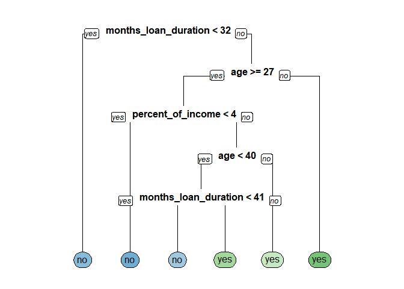

ch001(Tree-Based Method)
================
jakinpilla
2019-12-31

``` r
library(tidyverse)
library(broom)
library(gridExtra)
library(psych)
library(WVPlots)
library(mgcv)
library(ranger)
library(rpart)
library(rpart.plot)

read_csv('./data/credit.csv') %>%
  select(months_loan_duration,
         percent_of_income,
         years_at_residence,
         age,
         default) %>%
  sample_n(522) -> creditsub
```

Look at the data

``` r
str(creditsub)
```

    ## Classes 'spec_tbl_df', 'tbl_df', 'tbl' and 'data.frame': 522 obs. of  5 variables:
    ##  $ months_loan_duration: num  36 12 48 36 9 24 12 12 12 12 ...
    ##  $ percent_of_income   : num  4 2 4 3 1 4 4 4 4 4 ...
    ##  $ years_at_residence  : num  4 2 3 2 2 2 2 3 2 4 ...
    ##  $ age                 : num  40 27 26 46 26 28 38 33 23 20 ...
    ##  $ default             : chr  "yes" "no" "no" "no" ...
    ##  - attr(*, "spec")=
    ##   .. cols(
    ##   ..   checking_balance = col_character(),
    ##   ..   months_loan_duration = col_double(),
    ##   ..   credit_history = col_character(),
    ##   ..   purpose = col_character(),
    ##   ..   amount = col_double(),
    ##   ..   savings_balance = col_character(),
    ##   ..   employment_duration = col_character(),
    ##   ..   percent_of_income = col_double(),
    ##   ..   years_at_residence = col_double(),
    ##   ..   age = col_double(),
    ##   ..   other_credit = col_character(),
    ##   ..   housing = col_character(),
    ##   ..   existing_loans_count = col_double(),
    ##   ..   job = col_character(),
    ##   ..   dependents = col_double(),
    ##   ..   phone = col_character(),
    ##   ..   default = col_character()
    ##   .. )

Create the model

``` r
credit_model <- rpart(formula = default ~ ., 
                      data = creditsub, 
                      method = "class")
```

Display the results

``` r
rpart.plot(x = credit_model, yesno = 2, type = 0, extra = 0)
```

<!-- -->

``` r
read_csv('./data/credit.csv') -> credit
```

    ## Parsed with column specification:
    ## cols(
    ##   checking_balance = col_character(),
    ##   months_loan_duration = col_double(),
    ##   credit_history = col_character(),
    ##   purpose = col_character(),
    ##   amount = col_double(),
    ##   savings_balance = col_character(),
    ##   employment_duration = col_character(),
    ##   percent_of_income = col_double(),
    ##   years_at_residence = col_double(),
    ##   age = col_double(),
    ##   other_credit = col_character(),
    ##   housing = col_character(),
    ##   existing_loans_count = col_double(),
    ##   job = col_character(),
    ##   dependents = col_double(),
    ##   phone = col_character(),
    ##   default = col_character()
    ## )

Total number of rows in the credit data frame

``` r
n <- nrow(credit)
```

Number of rows for the training set (80% of the dataset)

``` r
n_train <- round(.8 * n) 
```

Create a vector of indices which is an 80% random sample

``` r
set.seed(123)
train_indices <- sample(1:n, n_train)
```

Subset the credit data frame to training indices only

``` r
credit_train <- credit[train_indices, ]  
```

Exclude the training indices to create the test set

``` r
credit_test <- credit[-train_indices, ]  
```

Train the model (to predict ‘default’)

``` r
credit_model <- rpart(formula = default ~ ., 
                      data = credit_train, 
                      method = "class")
```

Look at the model output

``` r
print(credit_model)
```

    ## n= 800 
    ## 
    ## node), split, n, loss, yval, (yprob)
    ##       * denotes terminal node
    ## 
    ##   1) root 800 238 no (0.70250000 0.29750000)  
    ##     2) checking_balance=> 200 DM,unknown 369  45 no (0.87804878 0.12195122) *
    ##     3) checking_balance=< 0 DM,1 - 200 DM 431 193 no (0.55220418 0.44779582)  
    ##       6) months_loan_duration< 20.5 231  84 no (0.63636364 0.36363636)  
    ##        12) credit_history=critical,good,poor 207  66 no (0.68115942 0.31884058)  
    ##          24) amount< 7341 200  60 no (0.70000000 0.30000000) *
    ##          25) amount>=7341 7   1 yes (0.14285714 0.85714286) *
    ##        13) credit_history=perfect,very good 24   6 yes (0.25000000 0.75000000) *
    ##       7) months_loan_duration>=20.5 200  91 yes (0.45500000 0.54500000)  
    ##        14) savings_balance=> 1000 DM,unknown 35   9 no (0.74285714 0.25714286)  
    ##          28) amount>=2079 26   2 no (0.92307692 0.07692308) *
    ##          29) amount< 2079 9   2 yes (0.22222222 0.77777778) *
    ##        15) savings_balance=< 100 DM,100 - 500 DM,500 - 1000 DM 165  65 yes (0.39393939 0.60606061)  
    ##          30) months_loan_duration< 47.5 132  60 yes (0.45454545 0.54545455)  
    ##            60) age>=29.5 77  35 no (0.54545455 0.45454545)  
    ##             120) amount>=2249 62  24 no (0.61290323 0.38709677)  
    ##               240) credit_history=critical,poor,very good 25   5 no (0.80000000 0.20000000) *
    ##               241) credit_history=good,perfect 37  18 yes (0.48648649 0.51351351)  
    ##                 482) age< 41 21   7 no (0.66666667 0.33333333) *
    ##                 483) age>=41 16   4 yes (0.25000000 0.75000000) *
    ##             121) amount< 2249 15   4 yes (0.26666667 0.73333333) *
    ##            61) age< 29.5 55  18 yes (0.32727273 0.67272727)  
    ##             122) months_loan_duration< 31.5 38  16 yes (0.42105263 0.57894737)  
    ##               244) amount>=3415 17   6 no (0.64705882 0.35294118) *
    ##               245) amount< 3415 21   5 yes (0.23809524 0.76190476) *
    ##             123) months_loan_duration>=31.5 17   2 yes (0.11764706 0.88235294) *
    ##          31) months_loan_duration>=47.5 33   5 yes (0.15151515 0.84848485) *

Generate predicted classes using the model object

``` r
class_prediction <- predict(object = credit_model,  
                            newdata = credit_test,   
                            type = "class")  

library(caret)
```

    ## Warning: package 'caret' was built under R version 3.5.3

    ## Loading required package: lattice

    ## 
    ## Attaching package: 'caret'

    ## The following object is masked from 'package:purrr':
    ## 
    ##     lift

Calculate the confusion matrix for the test set

``` r
confusionMatrix(data = class_prediction,       
                reference = as.factor(credit_test$default))
```

    ## Confusion Matrix and Statistics
    ## 
    ##           Reference
    ## Prediction  no yes
    ##        no  125  46
    ##        yes  13  16
    ##                                           
    ##                Accuracy : 0.705           
    ##                  95% CI : (0.6366, 0.7672)
    ##     No Information Rate : 0.69            
    ##     P-Value [Acc > NIR] : 0.3543          
    ##                                           
    ##                   Kappa : 0.192           
    ##                                           
    ##  Mcnemar's Test P-Value : 3.099e-05       
    ##                                           
    ##             Sensitivity : 0.9058          
    ##             Specificity : 0.2581          
    ##          Pos Pred Value : 0.7310          
    ##          Neg Pred Value : 0.5517          
    ##              Prevalence : 0.6900          
    ##          Detection Rate : 0.6250          
    ##    Detection Prevalence : 0.8550          
    ##       Balanced Accuracy : 0.5819          
    ##                                           
    ##        'Positive' Class : no              
    ## 

Train a gini-based model

``` r
credit_model1 <- rpart(formula = default ~ ., 
                       data = credit_train, 
                       method = "class",
                       parms = list(split = 'gini'))
```

Train an information-based model

``` r
credit_model2 <- rpart(formula = default ~ ., 
                       data = credit_train, 
                       method = "class",
                       parms = list(split = 'information'))
```

Generate predictions on the validation set using the gini model

``` r
pred1 <- predict(object = credit_model1, 
                 newdata = credit_test,
                 type = 'class')    
```

Generate predictions on the validation set using the information model

``` r
pred2 <- predict(object = credit_model2, 
                 newdata = credit_test,
                 type = 'class')

ce <- function(actual, predicted) {
  return(mean(actual != predicted))
}
```

Compare classification error

``` r
ce(actual = credit_test$default, 
   predicted = pred1)
```

    ## [1] 0.295

``` r
ce(actual = credit_test$default, 
   predicted = pred2)  
```

    ## [1] 0.275
