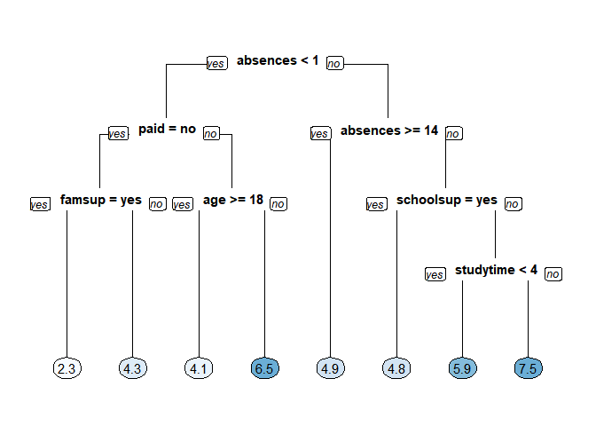
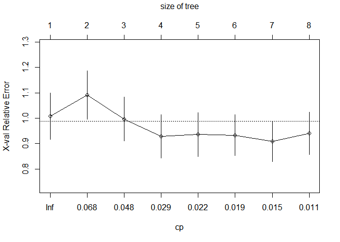
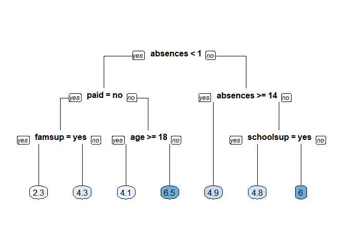

ch002
================
jakinpilla
2020-01-01

``` r
library(tidyverse)
library(broom)
library(gridExtra)
library(psych)
library(WVPlots)
library(mgcv)
library(ranger)
library(rpart)
library(rpart.plot)
library(Metrics)


grade <- read_csv('./data/grade.csv')
```

Look at the data

``` r
str(grade)
```

    ## Classes 'spec_tbl_df', 'tbl_df', 'tbl' and 'data.frame': 395 obs. of  8 variables:
    ##  $ final_grade: num  3 3 5 7.5 5 7.5 5.5 3 9.5 7.5 ...
    ##  $ age        : num  18 17 15 15 16 16 16 17 15 15 ...
    ##  $ address    : chr  "U" "U" "U" "U" ...
    ##  $ studytime  : num  2 2 2 3 2 2 2 2 2 2 ...
    ##  $ schoolsup  : chr  "yes" "no" "yes" "no" ...
    ##  $ famsup     : chr  "no" "yes" "no" "yes" ...
    ##  $ paid       : chr  "no" "no" "yes" "yes" ...
    ##  $ absences   : num  6 4 10 2 4 10 0 6 0 0 ...
    ##  - attr(*, "spec")=
    ##   .. cols(
    ##   ..   final_grade = col_double(),
    ##   ..   age = col_double(),
    ##   ..   address = col_character(),
    ##   ..   studytime = col_double(),
    ##   ..   schoolsup = col_character(),
    ##   ..   famsup = col_character(),
    ##   ..   paid = col_character(),
    ##   ..   absences = col_double()
    ##   .. )

Set seed and create assignment

``` r
set.seed(1)
assignment <- sample(1:3, size = nrow(grade), prob = c(.7, .15, .15), replace = TRUE)
```

Create a train, validation and tests from the original data frame

``` r
grade_train <- grade[assignment == 1, ]    #' subset grade to training indices only
grade_valid <- grade[assignment == 2, ]  #' subset grade to validation indices only
grade_test <- grade[assignment == 3, ]   #' subset grade to test indices only
```

Train the model

``` r
grade_model <- rpart(formula = final_grade ~ ., 
                     data = grade_train, 
                     method = "anova")
```

Look at the model output

``` r
print(grade_model)
```

    ## n= 282 
    ## 
    ## node), split, n, deviance, yval
    ##       * denotes terminal node
    ## 
    ##  1) root 282 1519.49700 5.271277  
    ##    2) absences< 0.5 82  884.18600 4.323171  
    ##      4) paid=no 50  565.50500 3.430000  
    ##        8) famsup=yes 22  226.36360 2.272727 *
    ##        9) famsup=no 28  286.52680 4.339286 *
    ##      5) paid=yes 32  216.46880 5.718750  
    ##       10) age>=17.5 10   82.90000 4.100000 *
    ##       11) age< 17.5 22   95.45455 6.454545 *
    ##    3) absences>=0.5 200  531.38000 5.660000  
    ##      6) absences>=13.5 42  111.61900 4.904762 *
    ##      7) absences< 13.5 158  389.43670 5.860759  
    ##       14) schoolsup=yes 23   50.21739 4.847826 *
    ##       15) schoolsup=no 135  311.60000 6.033333  
    ##         30) studytime< 3.5 127  276.30710 5.940945 *
    ##         31) studytime>=3.5 8   17.00000 7.500000 *

Plot the tree model

``` r
rpart.plot(x = grade_model, yesno = 2, type = 0, extra = 0)
```

<!-- -->

Generate predictions on a test set

``` r
pred <- predict(object = grade_model,   #' model object 
                newdata = grade_test)  #' test dataset
```

Compute the RMSE

``` r
rmse(actual = grade_test$final_grade, 
     predicted = pred)
```

    ## [1] 2.278249

Plot the “CP Table”

``` r
plotcp(grade_model)
```

<!-- -->

Print the “CP Table”

``` r
print(grade_model$cptable)
```

    ##           CP nsplit rel error    xerror       xstd
    ## 1 0.06839852      0 1.0000000 1.0080595 0.09215642
    ## 2 0.06726713      1 0.9316015 1.0920667 0.09543723
    ## 3 0.03462630      2 0.8643344 0.9969520 0.08632297
    ## 4 0.02508343      3 0.8297080 0.9291298 0.08571411
    ## 5 0.01995676      4 0.8046246 0.9357838 0.08560120
    ## 6 0.01817661      5 0.7846679 0.9337462 0.08087153
    ## 7 0.01203879      6 0.7664912 0.9092646 0.07982862
    ## 8 0.01000000      7 0.7544525 0.9407895 0.08399125

Retrieve optimal cp value based on cross-validated error

``` r
opt_index <- which.min(grade_model$cptable[, "xerror"])
cp_opt <- grade_model$cptable[opt_index, "CP"]
```

Prune the model (to optimized cp value)

``` r
grade_model_opt <- prune(tree = grade_model, 
                         cp = cp_opt)
```

Plot the optimized model

``` r
rpart.plot(x = grade_model_opt, yesno = 2, type = 0, extra = 0)
```

<!-- -->

Establish a list of possible values for minsplit and maxdepth

``` r
minsplit <- seq(1, 4, 1)
maxdepth <- seq(1, 6, 1)
```

Create a data frame containing all combinations

``` r
hyper_grid <- expand.grid(minsplit = minsplit, maxdepth = maxdepth)
```

Check out the grid

``` r
head(hyper_grid)
```

    ##   minsplit maxdepth
    ## 1        1        1
    ## 2        2        1
    ## 3        3        1
    ## 4        4        1
    ## 5        1        2
    ## 6        2        2

Print the number of grid combinations

``` r
nrow(hyper_grid)
```

    ## [1] 24

Number of potential models in the grid

``` r
num_models <- nrow(hyper_grid)
```

Create an empty list to store models

``` r
grade_models <- list()
```

Write a loop over the rows of hyper\_grid to train the grid of models

``` r
for (i in 1:num_models) {
  
  #' Get minsplit, maxdepth values at row i
  minsplit <- hyper_grid$minsplit[i]
  maxdepth <- hyper_grid$maxdepth[i]
  
  #' Train a model and store in the list
  grade_models[[i]] <- rpart(formula = final_grade ~ ., 
                             data = grade_train, 
                             method = "anova",
                             minsplit = minsplit,
                             maxdepth = maxdepth)
}

grade_models
```

    ## [[1]]
    ## n= 282 
    ## 
    ## node), split, n, deviance, yval
    ##       * denotes terminal node
    ## 
    ## 1) root 282 1519.497 5.271277 *
    ## 
    ## [[2]]
    ## n= 282 
    ## 
    ## node), split, n, deviance, yval
    ##       * denotes terminal node
    ## 
    ## 1) root 282 1519.497 5.271277  
    ##   2) absences< 0.5 82  884.186 4.323171 *
    ##   3) absences>=0.5 200  531.380 5.660000 *
    ## 
    ## [[3]]
    ## n= 282 
    ## 
    ## node), split, n, deviance, yval
    ##       * denotes terminal node
    ## 
    ## 1) root 282 1519.497 5.271277  
    ##   2) absences< 0.5 82  884.186 4.323171 *
    ##   3) absences>=0.5 200  531.380 5.660000 *
    ## 
    ## [[4]]
    ## n= 282 
    ## 
    ## node), split, n, deviance, yval
    ##       * denotes terminal node
    ## 
    ## 1) root 282 1519.497 5.271277  
    ##   2) absences< 0.5 82  884.186 4.323171 *
    ##   3) absences>=0.5 200  531.380 5.660000 *
    ## 
    ## [[5]]
    ## n= 282 
    ## 
    ## node), split, n, deviance, yval
    ##       * denotes terminal node
    ## 
    ## 1) root 282 1519.497 5.271277 *
    ## 
    ## [[6]]
    ## n= 282 
    ## 
    ## node), split, n, deviance, yval
    ##       * denotes terminal node
    ## 
    ## 1) root 282 1519.4970 5.271277  
    ##   2) absences< 0.5 82  884.1860 4.323171  
    ##     4) paid=no 50  565.5050 3.430000 *
    ##     5) paid=yes 32  216.4688 5.718750 *
    ##   3) absences>=0.5 200  531.3800 5.660000  
    ##     6) absences>=13.5 42  111.6190 4.904762 *
    ##     7) absences< 13.5 158  389.4367 5.860759 *
    ## 
    ## [[7]]
    ## n= 282 
    ## 
    ## node), split, n, deviance, yval
    ##       * denotes terminal node
    ## 
    ## 1) root 282 1519.4970 5.271277  
    ##   2) absences< 0.5 82  884.1860 4.323171  
    ##     4) paid=no 50  565.5050 3.430000 *
    ##     5) paid=yes 32  216.4688 5.718750 *
    ##   3) absences>=0.5 200  531.3800 5.660000  
    ##     6) absences>=13.5 42  111.6190 4.904762 *
    ##     7) absences< 13.5 158  389.4367 5.860759 *
    ## 
    ## [[8]]
    ## n= 282 
    ## 
    ## node), split, n, deviance, yval
    ##       * denotes terminal node
    ## 
    ## 1) root 282 1519.4970 5.271277  
    ##   2) absences< 0.5 82  884.1860 4.323171  
    ##     4) paid=no 50  565.5050 3.430000 *
    ##     5) paid=yes 32  216.4688 5.718750 *
    ##   3) absences>=0.5 200  531.3800 5.660000  
    ##     6) absences>=13.5 42  111.6190 4.904762 *
    ##     7) absences< 13.5 158  389.4367 5.860759 *
    ## 
    ## [[9]]
    ## n= 282 
    ## 
    ## node), split, n, deviance, yval
    ##       * denotes terminal node
    ## 
    ## 1) root 282 1519.497 5.271277 *
    ## 
    ## [[10]]
    ## n= 282 
    ## 
    ## node), split, n, deviance, yval
    ##       * denotes terminal node
    ## 
    ##  1) root 282 1519.49700 5.271277  
    ##    2) absences< 0.5 82  884.18600 4.323171  
    ##      4) paid=no 50  565.50500 3.430000  
    ##        8) famsup=yes 22  226.36360 2.272727 *
    ##        9) famsup=no 28  286.52680 4.339286 *
    ##      5) paid=yes 32  216.46880 5.718750  
    ##       10) age>=17.5 10   82.90000 4.100000 *
    ##       11) age< 17.5 22   95.45455 6.454545 *
    ##    3) absences>=0.5 200  531.38000 5.660000  
    ##      6) absences>=13.5 42  111.61900 4.904762 *
    ##      7) absences< 13.5 158  389.43670 5.860759  
    ##       14) schoolsup=yes 23   50.21739 4.847826 *
    ##       15) schoolsup=no 135  311.60000 6.033333 *
    ## 
    ## [[11]]
    ## n= 282 
    ## 
    ## node), split, n, deviance, yval
    ##       * denotes terminal node
    ## 
    ##  1) root 282 1519.49700 5.271277  
    ##    2) absences< 0.5 82  884.18600 4.323171  
    ##      4) paid=no 50  565.50500 3.430000  
    ##        8) famsup=yes 22  226.36360 2.272727 *
    ##        9) famsup=no 28  286.52680 4.339286 *
    ##      5) paid=yes 32  216.46880 5.718750  
    ##       10) age>=17.5 10   82.90000 4.100000 *
    ##       11) age< 17.5 22   95.45455 6.454545 *
    ##    3) absences>=0.5 200  531.38000 5.660000  
    ##      6) absences>=13.5 42  111.61900 4.904762 *
    ##      7) absences< 13.5 158  389.43670 5.860759  
    ##       14) schoolsup=yes 23   50.21739 4.847826 *
    ##       15) schoolsup=no 135  311.60000 6.033333 *
    ## 
    ## [[12]]
    ## n= 282 
    ## 
    ## node), split, n, deviance, yval
    ##       * denotes terminal node
    ## 
    ##  1) root 282 1519.49700 5.271277  
    ##    2) absences< 0.5 82  884.18600 4.323171  
    ##      4) paid=no 50  565.50500 3.430000  
    ##        8) famsup=yes 22  226.36360 2.272727 *
    ##        9) famsup=no 28  286.52680 4.339286 *
    ##      5) paid=yes 32  216.46880 5.718750  
    ##       10) age>=17.5 10   82.90000 4.100000 *
    ##       11) age< 17.5 22   95.45455 6.454545 *
    ##    3) absences>=0.5 200  531.38000 5.660000  
    ##      6) absences>=13.5 42  111.61900 4.904762 *
    ##      7) absences< 13.5 158  389.43670 5.860759  
    ##       14) schoolsup=yes 23   50.21739 4.847826 *
    ##       15) schoolsup=no 135  311.60000 6.033333 *
    ## 
    ## [[13]]
    ## n= 282 
    ## 
    ## node), split, n, deviance, yval
    ##       * denotes terminal node
    ## 
    ## 1) root 282 1519.497 5.271277 *
    ## 
    ## [[14]]
    ## n= 282 
    ## 
    ## node), split, n, deviance, yval
    ##       * denotes terminal node
    ## 
    ##  1) root 282 1519.49700 5.271277  
    ##    2) absences< 0.5 82  884.18600 4.323171  
    ##      4) paid=no 50  565.50500 3.430000  
    ##        8) famsup=yes 22  226.36360 2.272727 *
    ##        9) famsup=no 28  286.52680 4.339286  
    ##         18) age< 19.5 27  264.00000 4.166667 *
    ##         19) age>=19.5 1    0.00000 9.000000 *
    ##      5) paid=yes 32  216.46880 5.718750  
    ##       10) age>=17.5 10   82.90000 4.100000  
    ##         20) famsup=yes 8   61.37500 3.375000 *
    ##         21) famsup=no 2    0.50000 7.000000 *
    ##       11) age< 17.5 22   95.45455 6.454545 *
    ##    3) absences>=0.5 200  531.38000 5.660000  
    ##      6) absences>=13.5 42  111.61900 4.904762 *
    ##      7) absences< 13.5 158  389.43670 5.860759  
    ##       14) schoolsup=yes 23   50.21739 4.847826 *
    ##       15) schoolsup=no 135  311.60000 6.033333  
    ##         30) studytime< 3.5 127  276.30710 5.940945 *
    ##         31) studytime>=3.5 8   17.00000 7.500000 *
    ## 
    ## [[15]]
    ## n= 282 
    ## 
    ## node), split, n, deviance, yval
    ##       * denotes terminal node
    ## 
    ##  1) root 282 1519.49700 5.271277  
    ##    2) absences< 0.5 82  884.18600 4.323171  
    ##      4) paid=no 50  565.50500 3.430000  
    ##        8) famsup=yes 22  226.36360 2.272727 *
    ##        9) famsup=no 28  286.52680 4.339286  
    ##         18) age< 19.5 27  264.00000 4.166667 *
    ##         19) age>=19.5 1    0.00000 9.000000 *
    ##      5) paid=yes 32  216.46880 5.718750  
    ##       10) age>=17.5 10   82.90000 4.100000  
    ##         20) famsup=yes 8   61.37500 3.375000 *
    ##         21) famsup=no 2    0.50000 7.000000 *
    ##       11) age< 17.5 22   95.45455 6.454545 *
    ##    3) absences>=0.5 200  531.38000 5.660000  
    ##      6) absences>=13.5 42  111.61900 4.904762 *
    ##      7) absences< 13.5 158  389.43670 5.860759  
    ##       14) schoolsup=yes 23   50.21739 4.847826 *
    ##       15) schoolsup=no 135  311.60000 6.033333  
    ##         30) studytime< 3.5 127  276.30710 5.940945 *
    ##         31) studytime>=3.5 8   17.00000 7.500000 *
    ## 
    ## [[16]]
    ## n= 282 
    ## 
    ## node), split, n, deviance, yval
    ##       * denotes terminal node
    ## 
    ##  1) root 282 1519.49700 5.271277  
    ##    2) absences< 0.5 82  884.18600 4.323171  
    ##      4) paid=no 50  565.50500 3.430000  
    ##        8) famsup=yes 22  226.36360 2.272727 *
    ##        9) famsup=no 28  286.52680 4.339286  
    ##         18) age< 19.5 27  264.00000 4.166667 *
    ##         19) age>=19.5 1    0.00000 9.000000 *
    ##      5) paid=yes 32  216.46880 5.718750  
    ##       10) age>=17.5 10   82.90000 4.100000  
    ##         20) famsup=yes 8   61.37500 3.375000 *
    ##         21) famsup=no 2    0.50000 7.000000 *
    ##       11) age< 17.5 22   95.45455 6.454545 *
    ##    3) absences>=0.5 200  531.38000 5.660000  
    ##      6) absences>=13.5 42  111.61900 4.904762 *
    ##      7) absences< 13.5 158  389.43670 5.860759  
    ##       14) schoolsup=yes 23   50.21739 4.847826 *
    ##       15) schoolsup=no 135  311.60000 6.033333  
    ##         30) studytime< 3.5 127  276.30710 5.940945 *
    ##         31) studytime>=3.5 8   17.00000 7.500000 *
    ## 
    ## [[17]]
    ## n= 282 
    ## 
    ## node), split, n, deviance, yval
    ##       * denotes terminal node
    ## 
    ## 1) root 282 1519.497 5.271277 *
    ## 
    ## [[18]]
    ## n= 282 
    ## 
    ## node), split, n, deviance, yval
    ##       * denotes terminal node
    ## 
    ##  1) root 282 1519.49700 5.271277  
    ##    2) absences< 0.5 82  884.18600 4.323171  
    ##      4) paid=no 50  565.50500 3.430000  
    ##        8) famsup=yes 22  226.36360 2.272727 *
    ##        9) famsup=no 28  286.52680 4.339286  
    ##         18) age< 19.5 27  264.00000 4.166667  
    ##           36) age>=15.5 22  239.87500 3.750000 *
    ##           37) age< 15.5 5    3.50000 6.000000 *
    ##         19) age>=19.5 1    0.00000 9.000000 *
    ##      5) paid=yes 32  216.46880 5.718750  
    ##       10) age>=17.5 10   82.90000 4.100000  
    ##         20) famsup=yes 8   61.37500 3.375000 *
    ##         21) famsup=no 2    0.50000 7.000000 *
    ##       11) age< 17.5 22   95.45455 6.454545 *
    ##    3) absences>=0.5 200  531.38000 5.660000  
    ##      6) absences>=13.5 42  111.61900 4.904762 *
    ##      7) absences< 13.5 158  389.43670 5.860759  
    ##       14) schoolsup=yes 23   50.21739 4.847826 *
    ##       15) schoolsup=no 135  311.60000 6.033333  
    ##         30) studytime< 3.5 127  276.30710 5.940945 *
    ##         31) studytime>=3.5 8   17.00000 7.500000 *
    ## 
    ## [[19]]
    ## n= 282 
    ## 
    ## node), split, n, deviance, yval
    ##       * denotes terminal node
    ## 
    ##  1) root 282 1519.49700 5.271277  
    ##    2) absences< 0.5 82  884.18600 4.323171  
    ##      4) paid=no 50  565.50500 3.430000  
    ##        8) famsup=yes 22  226.36360 2.272727 *
    ##        9) famsup=no 28  286.52680 4.339286  
    ##         18) age< 19.5 27  264.00000 4.166667  
    ##           36) age>=15.5 22  239.87500 3.750000 *
    ##           37) age< 15.5 5    3.50000 6.000000 *
    ##         19) age>=19.5 1    0.00000 9.000000 *
    ##      5) paid=yes 32  216.46880 5.718750  
    ##       10) age>=17.5 10   82.90000 4.100000  
    ##         20) famsup=yes 8   61.37500 3.375000 *
    ##         21) famsup=no 2    0.50000 7.000000 *
    ##       11) age< 17.5 22   95.45455 6.454545 *
    ##    3) absences>=0.5 200  531.38000 5.660000  
    ##      6) absences>=13.5 42  111.61900 4.904762 *
    ##      7) absences< 13.5 158  389.43670 5.860759  
    ##       14) schoolsup=yes 23   50.21739 4.847826 *
    ##       15) schoolsup=no 135  311.60000 6.033333  
    ##         30) studytime< 3.5 127  276.30710 5.940945 *
    ##         31) studytime>=3.5 8   17.00000 7.500000 *
    ## 
    ## [[20]]
    ## n= 282 
    ## 
    ## node), split, n, deviance, yval
    ##       * denotes terminal node
    ## 
    ##  1) root 282 1519.49700 5.271277  
    ##    2) absences< 0.5 82  884.18600 4.323171  
    ##      4) paid=no 50  565.50500 3.430000  
    ##        8) famsup=yes 22  226.36360 2.272727 *
    ##        9) famsup=no 28  286.52680 4.339286  
    ##         18) age< 19.5 27  264.00000 4.166667  
    ##           36) age>=15.5 22  239.87500 3.750000 *
    ##           37) age< 15.5 5    3.50000 6.000000 *
    ##         19) age>=19.5 1    0.00000 9.000000 *
    ##      5) paid=yes 32  216.46880 5.718750  
    ##       10) age>=17.5 10   82.90000 4.100000  
    ##         20) famsup=yes 8   61.37500 3.375000 *
    ##         21) famsup=no 2    0.50000 7.000000 *
    ##       11) age< 17.5 22   95.45455 6.454545 *
    ##    3) absences>=0.5 200  531.38000 5.660000  
    ##      6) absences>=13.5 42  111.61900 4.904762 *
    ##      7) absences< 13.5 158  389.43670 5.860759  
    ##       14) schoolsup=yes 23   50.21739 4.847826 *
    ##       15) schoolsup=no 135  311.60000 6.033333  
    ##         30) studytime< 3.5 127  276.30710 5.940945 *
    ##         31) studytime>=3.5 8   17.00000 7.500000 *
    ## 
    ## [[21]]
    ## n= 282 
    ## 
    ## node), split, n, deviance, yval
    ##       * denotes terminal node
    ## 
    ## 1) root 282 1519.497 5.271277 *
    ## 
    ## [[22]]
    ## n= 282 
    ## 
    ## node), split, n, deviance, yval
    ##       * denotes terminal node
    ## 
    ##  1) root 282 1519.49700 5.271277  
    ##    2) absences< 0.5 82  884.18600 4.323171  
    ##      4) paid=no 50  565.50500 3.430000  
    ##        8) famsup=yes 22  226.36360 2.272727 *
    ##        9) famsup=no 28  286.52680 4.339286  
    ##         18) age< 19.5 27  264.00000 4.166667  
    ##           36) age>=15.5 22  239.87500 3.750000 *
    ##           37) age< 15.5 5    3.50000 6.000000 *
    ##         19) age>=19.5 1    0.00000 9.000000 *
    ##      5) paid=yes 32  216.46880 5.718750  
    ##       10) age>=17.5 10   82.90000 4.100000  
    ##         20) famsup=yes 8   61.37500 3.375000 *
    ##         21) famsup=no 2    0.50000 7.000000 *
    ##       11) age< 17.5 22   95.45455 6.454545 *
    ##    3) absences>=0.5 200  531.38000 5.660000  
    ##      6) absences>=13.5 42  111.61900 4.904762 *
    ##      7) absences< 13.5 158  389.43670 5.860759  
    ##       14) schoolsup=yes 23   50.21739 4.847826 *
    ##       15) schoolsup=no 135  311.60000 6.033333  
    ##         30) studytime< 3.5 127  276.30710 5.940945 *
    ##         31) studytime>=3.5 8   17.00000 7.500000 *
    ## 
    ## [[23]]
    ## n= 282 
    ## 
    ## node), split, n, deviance, yval
    ##       * denotes terminal node
    ## 
    ##  1) root 282 1519.49700 5.271277  
    ##    2) absences< 0.5 82  884.18600 4.323171  
    ##      4) paid=no 50  565.50500 3.430000  
    ##        8) famsup=yes 22  226.36360 2.272727 *
    ##        9) famsup=no 28  286.52680 4.339286  
    ##         18) age< 19.5 27  264.00000 4.166667  
    ##           36) age>=15.5 22  239.87500 3.750000 *
    ##           37) age< 15.5 5    3.50000 6.000000 *
    ##         19) age>=19.5 1    0.00000 9.000000 *
    ##      5) paid=yes 32  216.46880 5.718750  
    ##       10) age>=17.5 10   82.90000 4.100000  
    ##         20) famsup=yes 8   61.37500 3.375000 *
    ##         21) famsup=no 2    0.50000 7.000000 *
    ##       11) age< 17.5 22   95.45455 6.454545 *
    ##    3) absences>=0.5 200  531.38000 5.660000  
    ##      6) absences>=13.5 42  111.61900 4.904762 *
    ##      7) absences< 13.5 158  389.43670 5.860759  
    ##       14) schoolsup=yes 23   50.21739 4.847826 *
    ##       15) schoolsup=no 135  311.60000 6.033333  
    ##         30) studytime< 3.5 127  276.30710 5.940945 *
    ##         31) studytime>=3.5 8   17.00000 7.500000 *
    ## 
    ## [[24]]
    ## n= 282 
    ## 
    ## node), split, n, deviance, yval
    ##       * denotes terminal node
    ## 
    ##  1) root 282 1519.49700 5.271277  
    ##    2) absences< 0.5 82  884.18600 4.323171  
    ##      4) paid=no 50  565.50500 3.430000  
    ##        8) famsup=yes 22  226.36360 2.272727 *
    ##        9) famsup=no 28  286.52680 4.339286  
    ##         18) age< 19.5 27  264.00000 4.166667  
    ##           36) age>=15.5 22  239.87500 3.750000 *
    ##           37) age< 15.5 5    3.50000 6.000000 *
    ##         19) age>=19.5 1    0.00000 9.000000 *
    ##      5) paid=yes 32  216.46880 5.718750  
    ##       10) age>=17.5 10   82.90000 4.100000  
    ##         20) famsup=yes 8   61.37500 3.375000 *
    ##         21) famsup=no 2    0.50000 7.000000 *
    ##       11) age< 17.5 22   95.45455 6.454545 *
    ##    3) absences>=0.5 200  531.38000 5.660000  
    ##      6) absences>=13.5 42  111.61900 4.904762 *
    ##      7) absences< 13.5 158  389.43670 5.860759  
    ##       14) schoolsup=yes 23   50.21739 4.847826 *
    ##       15) schoolsup=no 135  311.60000 6.033333  
    ##         30) studytime< 3.5 127  276.30710 5.940945 *
    ##         31) studytime>=3.5 8   17.00000 7.500000 *

library(purrr) ?map2 hyper\_grid %\>% map2(\~rpart(formula =
final\_grade \~ ., data = grade\_train, method = “anova”, minsplit = .x,
maxdepth = .y)) Number of potential models in the grid

``` r
num_models <- length(grade_models)
```

Create an empty vector to store RMSE values

``` r
rmse_values <- c()
```

Write a loop over the models to compute validation RMSE

``` r
for (i in 1:num_models) {
  
  #' Retrieve the i^th model from the list
  model <- grade_models[[i]]
  
  #' Generate predictions on grade_valid 
  pred <- predict(object = model,
                  newdata = grade_valid)
  
  #' Compute validation RMSE and add to the 
  rmse_values[i] <- rmse(actual = grade_valid$final_grade, 
                         predicted = pred)
}
```

Identify the model with smallest validation set RMSE

``` r
best_model <- grade_models[[which.min(rmse_values)]]
```

Print the model paramters of the best model

``` r
best_model$control
```

    ## $minsplit
    ## [1] 2
    ## 
    ## $minbucket
    ## [1] 1
    ## 
    ## $cp
    ## [1] 0.01
    ## 
    ## $maxcompete
    ## [1] 4
    ## 
    ## $maxsurrogate
    ## [1] 5
    ## 
    ## $usesurrogate
    ## [1] 2
    ## 
    ## $surrogatestyle
    ## [1] 0
    ## 
    ## $maxdepth
    ## [1] 1
    ## 
    ## $xval
    ## [1] 10

Compute test set RMSE on best\_model

``` r
pred <- predict(object = best_model,
                newdata = grade_test)

rmse(actual = grade_test$final_grade, 
     predicted = pred)
```

    ## [1] 2.124109
