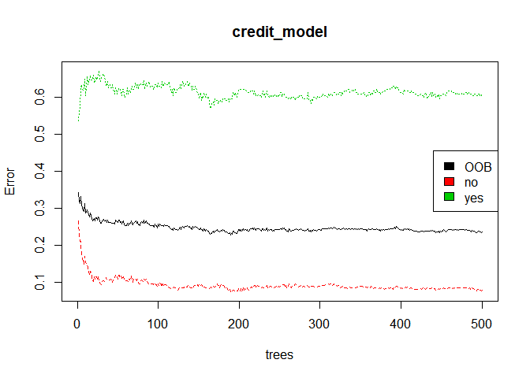
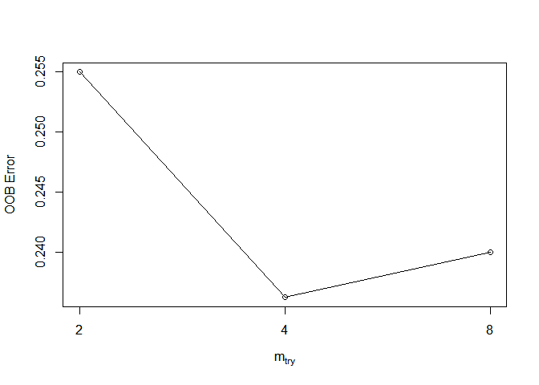

ch004
================
jakinpilla
2020-01-01

``` r
library(tidyverse)
library(broom)
library(gridExtra)
library(psych)
library(WVPlots)
library(mgcv)
library(ranger)
library(rpart)
library(rpart.plot)
library(Metrics)
library(ipred)
library(caret)
library(randomForest)


read_csv('./data/credit.csv') -> credit
```

Total number of rows in the credit data frame

``` r
n <- nrow(credit)
```

Number of rows for the training set (80% of the dataset)

``` r
n_train <- round(.8 * n) 
```

Create a vector of indices which is an 80% random sample

``` r
set.seed(123)
train_indices <- sample(1:n, n_train)
```

Subset the credit data frame to training indices only

``` r
credit_train <- credit[train_indices, ]  
```

’ Exclude the training indices to create the test set

``` r
credit_test <- credit[-train_indices, ]  
```

Bagging is a randomized model, so let’s set a seed (123) for
reproducibility

``` r
set.seed(123)
credit_train %>% str()
```

    ## Classes 'tbl_df', 'tbl' and 'data.frame':    800 obs. of  17 variables:
    ##  $ checking_balance    : chr  "1 - 200 DM" "unknown" "unknown" "unknown" ...
    ##  $ months_loan_duration: num  48 48 24 24 9 11 18 24 24 12 ...
    ##  $ credit_history      : chr  "poor" "critical" "good" "good" ...
    ##  $ purpose             : chr  "car0" "car" "furniture/appliances" "car" ...
    ##  $ amount              : num  7582 2751 3235 7814 745 ...
    ##  $ savings_balance     : chr  "100 - 500 DM" "unknown" "500 - 1000 DM" "< 100 DM" ...
    ##  $ employment_duration : chr  "unemployed" "> 7 years" "> 7 years" "4 - 7 years" ...
    ##  $ percent_of_income   : num  2 4 3 3 3 4 4 4 3 2 ...
    ##  $ years_at_residence  : num  4 3 2 3 2 4 4 3 1 4 ...
    ##  $ age                 : num  31 38 26 38 28 35 26 34 32 34 ...
    ##  $ other_credit        : chr  "none" "none" "none" "none" ...
    ##  $ housing             : chr  "other" "own" "own" "own" ...
    ##  $ existing_loans_count: num  1 2 1 1 1 2 1 2 1 2 ...
    ##  $ job                 : chr  "management" "skilled" "management" "management" ...
    ##  $ dependents          : num  1 2 1 1 1 1 2 2 2 1 ...
    ##  $ phone               : chr  "yes" "yes" "yes" "yes" ...
    ##  $ default             : chr  "no" "no" "no" "no" ...

``` r
credit_train %>%
  mutate_if(is.character, as.factor) -> credit_train
```

Train a Random Forest

``` r
set.seed(1)  #' for reproducibility
credit_model <- randomForest(formula = default ~ ., 
                             data = credit_train)
```

Print the model output

``` r
print(credit_model)
```

    ## 
    ## Call:
    ##  randomForest(formula = default ~ ., data = credit_train) 
    ##                Type of random forest: classification
    ##                      Number of trees: 500
    ## No. of variables tried at each split: 4
    ## 
    ##         OOB estimate of  error rate: 23.62%
    ## Confusion matrix:
    ##      no yes class.error
    ## no  518  44  0.07829181
    ## yes 145  93  0.60924370

Grab OOB error matrix & take a look

``` r
err <- credit_model$err.rate
head(err)
```

    ##            OOB        no       yes
    ## [1,] 0.3414634 0.2657005 0.5375000
    ## [2,] 0.3183761 0.2255193 0.5572519
    ## [3,] 0.3136594 0.2099057 0.5739645
    ## [4,] 0.3318519 0.2092050 0.6294416
    ## [5,] 0.3073713 0.1699605 0.6338028
    ## [6,] 0.3012048 0.1628352 0.6222222

Look at final OOB error rate (last row in err matrix)

``` r
oob_err <- err[nrow(err), "OOB"]
print(oob_err)
```

    ##     OOB 
    ## 0.23625

Plot the model trained in the previous exercise

``` r
plot(credit_model)
legend(x = "right", 
       legend = colnames(err),
       fill = 1:ncol(err))
```

<!-- -->

``` r
credit_test %>%
  mutate_if(is.character, as.factor) -> credit_test
```

Generate predicted classes using the model object

``` r
class_prediction <- predict(object = credit_model,   #' model object 
                            newdata = credit_test,  #' test dataset
                            type = "class") #' return classification labels
```

Calculate the confusion matrix for the test set

``` r
cm <- confusionMatrix(data = class_prediction,       #' predicted classes
                      reference = credit_test$default)  #' actual classes
print(cm)
```

    ## Confusion Matrix and Statistics
    ## 
    ##           Reference
    ## Prediction  no yes
    ##        no  130  41
    ##        yes   8  21
    ##                                           
    ##                Accuracy : 0.755           
    ##                  95% CI : (0.6894, 0.8129)
    ##     No Information Rate : 0.69            
    ##     P-Value [Acc > NIR] : 0.02614         
    ##                                           
    ##                   Kappa : 0.329           
    ##                                           
    ##  Mcnemar's Test P-Value : 4.844e-06       
    ##                                           
    ##             Sensitivity : 0.9420          
    ##             Specificity : 0.3387          
    ##          Pos Pred Value : 0.7602          
    ##          Neg Pred Value : 0.7241          
    ##              Prevalence : 0.6900          
    ##          Detection Rate : 0.6500          
    ##    Detection Prevalence : 0.8550          
    ##       Balanced Accuracy : 0.6404          
    ##                                           
    ##        'Positive' Class : no              
    ## 

Compare test set accuracy to OOB accuracy

``` r
paste0("Test Accuracy: ", cm$overall[1])
```

    ## [1] "Test Accuracy: 0.755"

``` r
paste0("OOB Accuracy: ", 1 - oob_err)
```

    ## [1] "OOB Accuracy: 0.76375"

Generate predictions on the test set

``` r
pred <- predict(object = credit_model,
                newdata = credit_test,
                type = "prob")
```

`pred` is a matrix

``` r
class(pred)
```

    ## [1] "matrix" "votes"

Look at the pred format

``` r
head(pred)
```

    ##      no   yes
    ## 1 0.926 0.074
    ## 2 0.302 0.698
    ## 3 0.394 0.606
    ## 4 0.820 0.180
    ## 5 0.748 0.252
    ## 6 0.646 0.354

Compute the AUC (`actual` must be a binary 1/0 numeric vector)

``` r
auc(actual = ifelse(credit_test$default == "yes", 1, 0), 
    predicted = pred[,"yes"])                    
```

    ## [1] 0.7989715

Execute the tuning process

``` r
set.seed(1)              
res <- tuneRF(x = subset(credit_train, select = -default),
              y = credit_train$default,
              ntreeTry = 500)
```

    ## mtry = 4  OOB error = 23.62% 
    ## Searching left ...
    ## mtry = 2     OOB error = 25.5% 
    ## -0.07936508 0.05 
    ## Searching right ...
    ## mtry = 8     OOB error = 24% 
    ## -0.01587302 0.05

<!-- -->

Look at results

``` r
print(res)
```

    ##       mtry OOBError
    ## 2.OOB    2  0.25500
    ## 4.OOB    4  0.23625
    ## 8.OOB    8  0.24000

Find the mtry value that minimizes OOB Error

``` r
mtry_opt <- res[,"mtry"][which.min(res[,"OOBError"])]
print(mtry_opt)
```

    ## 4.OOB 
    ##     4

If you just want to return the best RF model (rather than results) you
can set `doBest = TRUE` in `tuneRF()` to return the best RF model
instead of a set performance matrix. Establish a list of possible values
for mtry, nodesize and sampsize

``` r
mtry <- seq(4, ncol(credit_train) * 0.8, 2)
nodesize <- seq(3, 8, 2)
sampsize <- nrow(credit_train) * c(0.7, 0.8)
```

Create a data frame containing all combinations

``` r
hyper_grid <- expand.grid(mtry = mtry, nodesize = nodesize, sampsize = sampsize)
```

Create an empty vector to store OOB error values

``` r
oob_err <- c()
```

Write a loop over the rows of hyper\_grid to train the grid of models

``` r
for (i in 1:nrow(hyper_grid)) {
  
  #' Train a Random Forest model
  model <- randomForest(formula = default ~ ., 
                        data = credit_train,
                        mtry = hyper_grid$mtry[i],
                        nodesize = hyper_grid$nodesize[i],
                        sampsize = hyper_grid$sampsize[i])
  
  #' Store OOB error for the model                      
  oob_err[i] <- model$err.rate[nrow(model$err.rate), "OOB"]
}
```

Identify optimal set of hyperparmeters based on OOB error

``` r
opt_i <- which.min(oob_err)
print(hyper_grid[opt_i,])
```

    ##    mtry nodesize sampsize
    ## 19   10        3      640
