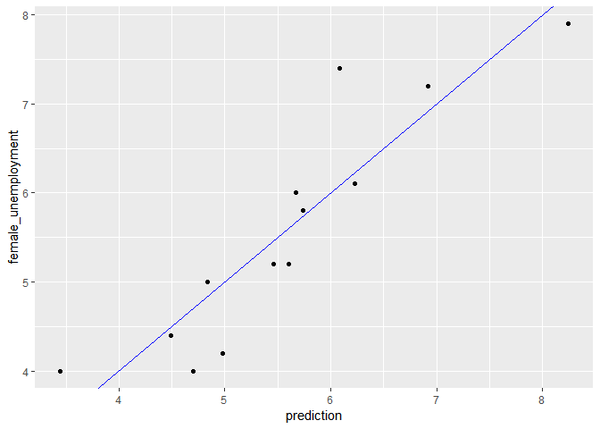

ch001
================
Daniel\_Kim
2019 12 15

``` r
unemployee <- read_csv('./data/s_data.csv')
unemployee
```

    ## # A tibble: 13 x 2
    ##        X     Y
    ##    <dbl> <dbl>
    ##  1  2.90  4   
    ##  2  6.70  7.40
    ##  3  4.90  5   
    ##  4  7.90  7.20
    ##  5  9.80  7.90
    ##  6  6.90  6.10
    ##  7  6.10  6   
    ##  8  6.20  5.80
    ##  9  6     5.20
    ## 10  5.10  4.20
    ## 11  4.70  4   
    ## 12  4.40  4.40
    ## 13  5.80  5.20

``` r
summary(unemployee)
```

    ##        X               Y        
    ##  Min.   :2.900   Min.   :4.000  
    ##  1st Qu.:4.900   1st Qu.:4.400  
    ##  Median :6.000   Median :5.200  
    ##  Mean   :5.954   Mean   :5.569  
    ##  3rd Qu.:6.700   3rd Qu.:6.100  
    ##  Max.   :9.800   Max.   :7.900

Set formula…

``` r
fmla <- Y ~ X
```

``` r
fmla
```

    ## Y ~ X

``` r
unemployee_model <- lm(fmla, data = unemployee)
```

Call summary() on unemployment\_model to get more details

``` r
summary(unemployee_model)
```

    ## 
    ## Call:
    ## lm(formula = fmla, data = unemployee)
    ## 
    ## Residuals:
    ##      Min       1Q   Median       3Q      Max 
    ## -0.77621 -0.34050 -0.09004  0.27911  1.31254 
    ## 
    ## Coefficients:
    ##             Estimate Std. Error t value Pr(>|t|)    
    ## (Intercept)  1.43411    0.60340   2.377   0.0367 *  
    ## X            0.69453    0.09767   7.111 1.97e-05 ***
    ## ---
    ## Signif. codes:  0 '***' 0.001 '**' 0.01 '*' 0.05 '.' 0.1 ' ' 1
    ## 
    ## Residual standard error: 0.5803 on 11 degrees of freedom
    ## Multiple R-squared:  0.8213, Adjusted R-squared:  0.8051 
    ## F-statistic: 50.56 on 1 and 11 DF,  p-value: 1.966e-05

Call glance() on unemployment\_model to see the details in a tidier form

``` r
glance(unemployee_model)
```

    ## # A tibble: 1 x 11
    ##   r.squared adj.r.squared sigma statistic p.value    df logLik   AIC   BIC
    ##       <dbl>         <dbl> <dbl>     <dbl>   <dbl> <int>  <dbl> <dbl> <dbl>
    ## 1     0.821         0.805 0.580      50.6 1.97e-5     2  -10.3  26.6  28.3
    ## # ... with 2 more variables: deviance <dbl>, df.residual <int>

Call wrapFTest() on unemployment\_model to see the most relevant details

``` r
wrapFTest(unemployee_model)
```

    ## [1] "F Test summary: (R2=0.8213, F(1,11)=50.56, p=1.966e-05)."

unemployment is in your workspace

``` r
unemployment <- unemployee %>%
  rename(male_unemployment = X, female_unemployment = Y)
summary(unemployment)
```

    ##  male_unemployment female_unemployment
    ##  Min.   :2.900     Min.   :4.000      
    ##  1st Qu.:4.900     1st Qu.:4.400      
    ##  Median :6.000     Median :5.200      
    ##  Mean   :5.954     Mean   :5.569      
    ##  3rd Qu.:6.700     3rd Qu.:6.100      
    ##  Max.   :9.800     Max.   :7.900

``` r
unemployee_model <- lm(female_unemployment ~ male_unemployment, data = unemployment)
```

newrates is in your workspace

``` r
newrates <- data.frame(male_unemployment = 5)
newrates
```

    ##   male_unemployment
    ## 1                 5

Predict female unemployment in the unemployment data set

``` r
unemployment$prediction <- predict(unemployee_model, unemployment)
```

Make a plot to compare predictions to actual (prediction on x axis).

``` r
ggplot(unemployment, aes(x = prediction, y = female_unemployment)) + 
  geom_point() +
  geom_abline(color = "blue")
```

<!-- -->

Predict female unemployment rate when male unemployment is 5%

``` r
pred <- predict(unemployee_model, newrates)
```

Print it

``` r
pred
```

    ##        1 
    ## 4.906757

### Multivariate linear regression (Part 1)

``` r
bloodpressure <- readRDS('./data/bloodpressure.rds')
```

``` r
summary(bloodpressure)
```

    ##  blood_pressure       age            weight   
    ##  Min.   :128.0   Min.   :46.00   Min.   :167  
    ##  1st Qu.:140.0   1st Qu.:56.50   1st Qu.:186  
    ##  Median :153.0   Median :64.00   Median :194  
    ##  Mean   :150.1   Mean   :62.45   Mean   :195  
    ##  3rd Qu.:160.5   3rd Qu.:69.50   3rd Qu.:209  
    ##  Max.   :168.0   Max.   :74.00   Max.   :220

``` r
fmla <- blood_pressure ~ age + weight
```

``` r
bloodpressure_model <- lm(fmla, data = bloodpressure)
```

``` r
bloodpressure
```

    ##    blood_pressure age weight
    ## 1             132  52    173
    ## 2             143  59    184
    ## 3             153  67    194
    ## 4             162  73    211
    ## 5             154  64    196
    ## 6             168  74    220
    ## 7             137  54    188
    ## 8             149  61    188
    ## 9             159  65    207
    ## 10            128  46    167
    ## 11            166  72    217

``` r
summary(bloodpressure_model)
```

    ## 
    ## Call:
    ## lm(formula = fmla, data = bloodpressure)
    ## 
    ## Residuals:
    ##     Min      1Q  Median      3Q     Max 
    ## -3.4640 -1.1949 -0.4078  1.8511  2.6981 
    ## 
    ## Coefficients:
    ##             Estimate Std. Error t value Pr(>|t|)   
    ## (Intercept)  30.9941    11.9438   2.595  0.03186 * 
    ## age           0.8614     0.2482   3.470  0.00844 **
    ## weight        0.3349     0.1307   2.563  0.03351 * 
    ## ---
    ## Signif. codes:  0 '***' 0.001 '**' 0.01 '*' 0.05 '.' 0.1 ' ' 1
    ## 
    ## Residual standard error: 2.318 on 8 degrees of freedom
    ## Multiple R-squared:  0.9768, Adjusted R-squared:  0.9711 
    ## F-statistic: 168.8 on 2 and 8 DF,  p-value: 2.874e-07

Predict blood pressure using bloodpressure\_model

``` r
bloodpressure$prediction <- predict(bloodpressure_model, data = bloodpressure)
```

Plot the result…

``` r
ggplot(bloodpressure, aes(prediction, blood_pressure)) +
  geom_point() +
  geom_abline(color = 'blue')
```

<!-- -->

### Collinearity

Collinearity – when variables are partially correlated. Coefficients
might change sign
