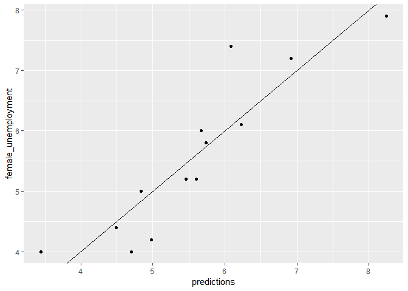
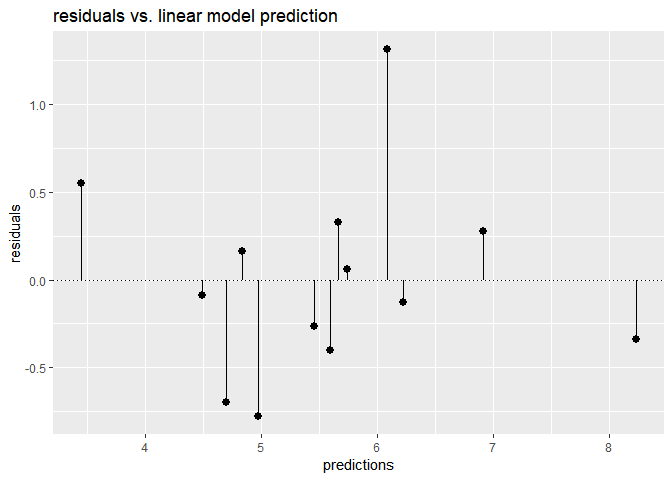
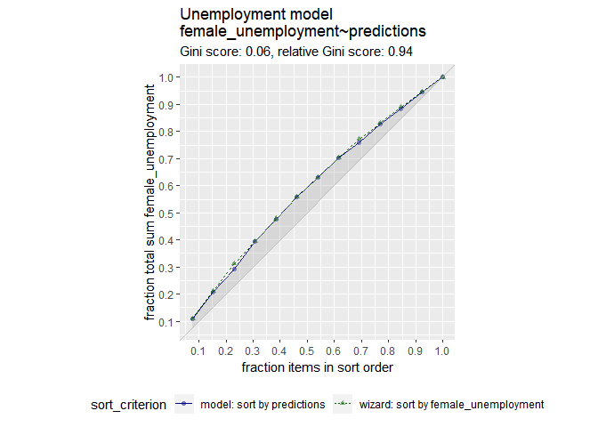
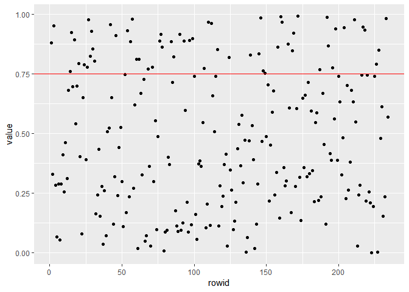
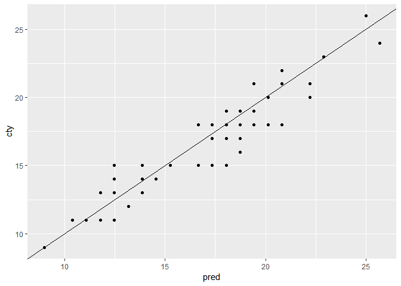

ch002
================
Daniel\_Kim
2019 12 15

``` r
load('unemp.RData')
```

``` r
summary(unemployment)
```

    ##  male_unemployment female_unemployment  predictions   
    ##  Min.   :2.900     Min.   :4.000       Min.   :3.448  
    ##  1st Qu.:4.900     1st Qu.:4.400       1st Qu.:4.837  
    ##  Median :6.000     Median :5.200       Median :5.601  
    ##  Mean   :5.954     Mean   :5.569       Mean   :5.569  
    ##  3rd Qu.:6.700     3rd Qu.:6.100       3rd Qu.:6.087  
    ##  Max.   :9.800     Max.   :7.900       Max.   :8.240

``` r
summary(unemployee_model)
```

    ## 
    ## Call:
    ## lm(formula = female_unemployment ~ male_unemployment, data = unemployment)
    ## 
    ## Residuals:
    ##      Min       1Q   Median       3Q      Max 
    ## -0.77621 -0.34050 -0.09004  0.27911  1.31254 
    ## 
    ## Coefficients:
    ##                   Estimate Std. Error t value Pr(>|t|)    
    ## (Intercept)        1.43411    0.60340   2.377   0.0367 *  
    ## male_unemployment  0.69453    0.09767   7.111 1.97e-05 ***
    ## ---
    ## Signif. codes:  0 '***' 0.001 '**' 0.01 '*' 0.05 '.' 0.1 ' ' 1
    ## 
    ## Residual standard error: 0.5803 on 11 degrees of freedom
    ## Multiple R-squared:  0.8213, Adjusted R-squared:  0.8051 
    ## F-statistic: 50.56 on 1 and 11 DF,  p-value: 1.966e-05

Make predictions from the model

``` r
unemployment$predictions <- predict(unemployee_model, data = unemployment)
```

Fill in the blanks to plot predictions (on x-axis) versus the
female\_unemployment rates

``` r
ggplot(unemployment, aes(x = predictions, y = female_unemployment)) + 
  geom_point() + 
  geom_abline()
```

<!-- -->

Calculate residuals

``` r
unemployment$residuals <- unemployment$female_unemployment - unemployment$predictions
```

To plot predictions (on x-axis) versus the residuals with
`geom_pointrange()`

``` r
ggplot(unemployment, aes(x = predictions, y = residuals)) + 
  geom_pointrange(aes(ymin = 0, ymax = residuals)) + 
  geom_hline(yintercept = 0, linetype = 3) + 
  ggtitle("residuals vs. linear model prediction")
```

<!-- -->

``` r
summary(unemployment)
```

    ##  male_unemployment female_unemployment  predictions      residuals       
    ##  Min.   :2.900     Min.   :4.000       Min.   :3.448   Min.   :-0.77621  
    ##  1st Qu.:4.900     1st Qu.:4.400       1st Qu.:4.837   1st Qu.:-0.34050  
    ##  Median :6.000     Median :5.200       Median :5.601   Median :-0.09004  
    ##  Mean   :5.954     Mean   :5.569       Mean   :5.569   Mean   : 0.00000  
    ##  3rd Qu.:6.700     3rd Qu.:6.100       3rd Qu.:6.087   3rd Qu.: 0.27911  
    ##  Max.   :9.800     Max.   :7.900       Max.   :8.240   Max.   : 1.31254

unemployment\_model is in the workspace

``` r
summary(unemployee_model)
```

    ## 
    ## Call:
    ## lm(formula = female_unemployment ~ male_unemployment, data = unemployment)
    ## 
    ## Residuals:
    ##      Min       1Q   Median       3Q      Max 
    ## -0.77621 -0.34050 -0.09004  0.27911  1.31254 
    ## 
    ## Coefficients:
    ##                   Estimate Std. Error t value Pr(>|t|)    
    ## (Intercept)        1.43411    0.60340   2.377   0.0367 *  
    ## male_unemployment  0.69453    0.09767   7.111 1.97e-05 ***
    ## ---
    ## Signif. codes:  0 '***' 0.001 '**' 0.01 '*' 0.05 '.' 0.1 ' ' 1
    ## 
    ## Residual standard error: 0.5803 on 11 degrees of freedom
    ## Multiple R-squared:  0.8213, Adjusted R-squared:  0.8051 
    ## F-statistic: 50.56 on 1 and 11 DF,  p-value: 1.966e-05

Load the package WVPlots

``` r
# install.packages('WVPlots')
library(WVPlots)
```

    ## Warning: package 'WVPlots' was built under R version 3.5.3

Plot the Gain Curve

``` r
GainCurvePlot(unemployment, 'predictions', 'female_unemployment', "Unemployment model")
```

<!-- -->

When the predictions sort in exactly the same order, the relative Gini
coefficient is 1. When the model sorts poorly, the relative Gini
coefficient is close to zero, or even negative.

### RMSE

For convenience put the residuals in the variable res

``` r
res <- unemployment$residuals
```

Calculate RMSE, assign it to the variable rmse and print it

``` r
(rmse <- sqrt(mean(res^2)))
```

    ## [1] 0.5337612

Calculate the standard deviation of female\_unemployment and print it

``` r
(sd_unemployment <- sd(unemployment$female_unemployment))
```

    ## [1] 1.314271

### R-Squared

variance explained…

r\_squared = 1 - SSR/SST

SSR = sum{(y - y\_hat)^2}

SST = sum{(y - y\_mean)^2}

Calculate mean female\_unemployment: fe\_mean. Print it

``` r
(fe_mean <- mean(unemployment$female_unemployment))
```

    ## [1] 5.569231

Calculate total sum of squares: tss. Print it

``` r
(tss <- sum((unemployment$female_unemployment - fe_mean)^2))
```

    ## [1] 20.72769

Calculate residual sum of squares: rss. Print it

``` r
(rss <- sum((unemployment$female_unemployment - unemployment$predictions)^2))
```

    ## [1] 3.703714

Calculate R-squared: rsq. Print it. Is it a good fit?

``` r
(rsq <- 1 - rss/tss)
```

    ## [1] 0.8213157

``` r
glance(unemployee_model)
```

    ## # A tibble: 1 x 11
    ##   r.squared adj.r.squared sigma statistic p.value    df logLik   AIC   BIC
    ##       <dbl>         <dbl> <dbl>     <dbl>   <dbl> <int>  <dbl> <dbl> <dbl>
    ## 1     0.821         0.805 0.580      50.6 1.97e-5     2  -10.3  26.6  28.3
    ## # ... with 2 more variables: deviance <dbl>, df.residual <int>

Get R-squared from glance. Print it

``` r
(rsq_glance <- glance(unemployee_model)$r.squared)
```

    ## [1] 0.8213157

Get the correlation between the prediction and true outcome: rho and
print it

``` r
(rho <- cor(unemployment$predictions, unemployment$female_unemployment))
```

    ## [1] 0.9062647

Square rho: rho2 and print it

``` r
(rho2 <- rho^2)
```

    ## [1] 0.8213157

Get R-squared from glance and print it

``` r
(rsq_glance <- glance(unemployee_model)$r.squared)
```

    ## [1] 0.8213157

Loading data…

``` r
data('mpg')
```

``` r
summary(mpg)
```

    ##  manufacturer          model               displ            year     
    ##  Length:234         Length:234         Min.   :1.600   Min.   :1999  
    ##  Class :character   Class :character   1st Qu.:2.400   1st Qu.:1999  
    ##  Mode  :character   Mode  :character   Median :3.300   Median :2004  
    ##                                        Mean   :3.472   Mean   :2004  
    ##                                        3rd Qu.:4.600   3rd Qu.:2008  
    ##                                        Max.   :7.000   Max.   :2008  
    ##       cyl           trans               drv                 cty       
    ##  Min.   :4.000   Length:234         Length:234         Min.   : 9.00  
    ##  1st Qu.:4.000   Class :character   Class :character   1st Qu.:14.00  
    ##  Median :6.000   Mode  :character   Mode  :character   Median :17.00  
    ##  Mean   :5.889                                         Mean   :16.86  
    ##  3rd Qu.:8.000                                         3rd Qu.:19.00  
    ##  Max.   :8.000                                         Max.   :35.00  
    ##       hwy             fl               class          
    ##  Min.   :12.00   Length:234         Length:234        
    ##  1st Qu.:18.00   Class :character   Class :character  
    ##  Median :24.00   Mode  :character   Mode  :character  
    ##  Mean   :23.44                                        
    ##  3rd Qu.:27.00                                        
    ##  Max.   :44.00

``` r
dim(mpg)
```

    ## [1] 234  11

Use nrow to get the number of rows in mpg (N) and print it

``` r
(N <- nrow(mpg))
```

    ## [1] 234

Calculate how many rows 75% of N should be and print it Hint: use
round() to get an integer

``` r
(target <- round(N*0.75))
```

    ## [1] 176

Create the vector of N uniform random variables: gp

``` r
gp <- runif(N)
```

``` r
gp %>%
  as_tibble() %>%
  rowid_to_column() %>%
  ggplot(aes(rowid, value)) + geom_point() + geom_hline(yintercept = .75, col = 'red')
```

    ## Warning: Calling `as_tibble()` on a vector is discouraged, because the behavior is likely to change in the future. Use `tibble::enframe(name = NULL)` instead.
    ## This warning is displayed once per session.

<!-- -->

``` r
# ?geom_hline
```

``` r
sum(gp < .75)
```

    ## [1] 174

``` r
sum(gp >= .75)
```

    ## [1] 60

Use gp to create the training set: mpg\_train (75% of data) and
mpg\_test (25% of data)

``` r
mpg_train <- mpg[gp < .75, ]
mpg_test <- mpg[gp >= .75, ]
```

Use nrow() to examine mpg\_train and mpg\_test

``` r
nrow(mpg_train)
```

    ## [1] 174

``` r
nrow(mpg_test)
```

    ## [1] 60

mpg\_train is in the workspace

``` r
summary(mpg_train)
```

    ##  manufacturer          model               displ            year     
    ##  Length:174         Length:174         Min.   :1.600   Min.   :1999  
    ##  Class :character   Class :character   1st Qu.:2.400   1st Qu.:1999  
    ##  Mode  :character   Mode  :character   Median :3.300   Median :1999  
    ##                                        Mean   :3.399   Mean   :2003  
    ##                                        3rd Qu.:4.600   3rd Qu.:2008  
    ##                                        Max.   :6.500   Max.   :2008  
    ##       cyl           trans               drv                 cty       
    ##  Min.   :4.000   Length:174         Length:174         Min.   : 9.00  
    ##  1st Qu.:4.000   Class :character   Class :character   1st Qu.:14.00  
    ##  Median :6.000   Mode  :character   Mode  :character   Median :16.00  
    ##  Mean   :5.839                                         Mean   :16.95  
    ##  3rd Qu.:8.000                                         3rd Qu.:19.75  
    ##  Max.   :8.000                                         Max.   :35.00  
    ##       hwy             fl               class          
    ##  Min.   :12.00   Length:174         Length:174        
    ##  1st Qu.:18.00   Class :character   Class :character  
    ##  Median :24.00   Mode  :character   Mode  :character  
    ##  Mean   :23.43                                        
    ##  3rd Qu.:27.00                                        
    ##  Max.   :44.00

Create a formula to express cty as a function of hwy: fmla and print it.

``` r
(fmla <- cty ~ hwy)
```

    ## cty ~ hwy

Now use lm() to build a model mpg\_model from mpg\_train that predicts
cty from hwy

``` r
mpg_model <- lm(fmla, data = mpg_train)
```

Use summary() to examine the model

``` r
summary(mpg_model)
```

    ## 
    ## Call:
    ## lm(formula = fmla, data = mpg_train)
    ## 
    ## Residuals:
    ##     Min      1Q  Median      3Q     Max 
    ## -3.0396 -0.7351  0.0026  0.5693  4.3960 
    ## 
    ## Coefficients:
    ##             Estimate Std. Error t value Pr(>|t|)    
    ## (Intercept)   0.6508     0.3751   1.735   0.0845 .  
    ## hwy           0.6956     0.0155  44.861   <2e-16 ***
    ## ---
    ## Signif. codes:  0 '***' 0.001 '**' 0.01 '*' 0.05 '.' 0.1 ' ' 1
    ## 
    ## Residual standard error: 1.23 on 172 degrees of freedom
    ## Multiple R-squared:  0.9213, Adjusted R-squared:  0.9208 
    ## F-statistic:  2012 on 1 and 172 DF,  p-value: < 2.2e-16

predict cty from hwy for the training set

``` r
mpg_train$pred <- predict(mpg_model, newdata = mpg_train)
```

predict cty from hwy for the test set

``` r
mpg_test$pred <- predict(mpg_model, newdata = mpg_test)
```

define functions…

``` r
r_squared  <- function(predcol, ycol) {
  tss = sum( (ycol - mean(ycol))^2 )
  rss = sum( (predcol - ycol)^2 )
  1 - rss / tss
}

rmse <- function(predcol, ycol) {
  res = predcol - ycol
  sqrt(mean(res)^2)
}
```

Evaluate the rmse on both training and test data and print them

``` r
(rmse_train <- rmse(mpg_train$cty, mpg_train$pred))
```

    ## [1] 7.156708e-15

``` r
(rmse_test <- rmse(mpg_test$cty, mpg_test$pred))
```

    ## [1] 0.3730599

Evaluate the r-squared on both training and test data.and print them

``` r
(rsq_train <- r_squared(mpg_train$pred, mpg_train$cty))
```

    ## [1] 0.9212632

``` r
(rsq_test <- r_squared(mpg_test$pred, mpg_test$cty))
```

    ## [1] 0.882351

Plot the predictions (on the x-axis) against the outcome (cty) on the
test data

``` r
ggplot(mpg_test, aes(x = pred, y = cty)) + 
  geom_point() + 
  geom_abline()
```

<!-- -->

Load the package vtreat

``` r
# install.packages('vtreat')
library(vtreat)
```

    ## Warning: package 'vtreat' was built under R version 3.5.3

mpg is in the workspace

``` r
summary(mpg)
```

    ##  manufacturer          model               displ            year     
    ##  Length:234         Length:234         Min.   :1.600   Min.   :1999  
    ##  Class :character   Class :character   1st Qu.:2.400   1st Qu.:1999  
    ##  Mode  :character   Mode  :character   Median :3.300   Median :2004  
    ##                                        Mean   :3.472   Mean   :2004  
    ##                                        3rd Qu.:4.600   3rd Qu.:2008  
    ##                                        Max.   :7.000   Max.   :2008  
    ##       cyl           trans               drv                 cty       
    ##  Min.   :4.000   Length:234         Length:234         Min.   : 9.00  
    ##  1st Qu.:4.000   Class :character   Class :character   1st Qu.:14.00  
    ##  Median :6.000   Mode  :character   Mode  :character   Median :17.00  
    ##  Mean   :5.889                                         Mean   :16.86  
    ##  3rd Qu.:8.000                                         3rd Qu.:19.00  
    ##  Max.   :8.000                                         Max.   :35.00  
    ##       hwy             fl               class          
    ##  Min.   :12.00   Length:234         Length:234        
    ##  1st Qu.:18.00   Class :character   Class :character  
    ##  Median :24.00   Mode  :character   Mode  :character  
    ##  Mean   :23.44                                        
    ##  3rd Qu.:27.00                                        
    ##  Max.   :44.00

Get the number of rows in mpg

``` r
nRows <- nrow(mpg)
```

Implement the 3-fold cross-fold plan with vtreat

``` r
splitPlan <- kWayCrossValidation(nRows, 3, NULL, NULL)
```

Examine the split plan

``` r
splitPlan
```

    ## [[1]]
    ## [[1]]$train
    ##   [1]   1   2   4   5   6   8   9  10  11  12  13  14  15  16  17  19  20
    ##  [18]  21  22  23  25  27  28  29  31  32  33  35  36  37  39  41  44  47
    ##  [35]  48  49  50  51  52  54  57  59  60  61  62  63  65  66  67  69  70
    ##  [52]  71  73  75  78  79  80  81  82  83  86  88  89  90  93  94  95 101
    ##  [69] 103 104 105 106 108 109 112 113 115 117 118 121 123 126 127 129 130
    ##  [86] 132 134 135 138 140 141 142 143 144 145 146 147 148 150 151 152 153
    ## [103] 154 155 156 160 161 162 165 167 168 171 173 174 175 177 178 179 180
    ## [120] 181 182 183 184 185 188 189 190 192 193 194 195 197 198 199 200 204
    ## [137] 205 206 207 208 209 210 211 213 217 221 222 224 225 226 227 230 231
    ## [154] 232 233 234
    ## 
    ## [[1]]$app
    ##  [1] 196 163  91 124 220  38 116  46  76  58 159 215 229  56 136  55  42
    ## [18]  97  74  40 107  18 186 202 110 219 212 216  85  43  98 158  26  99
    ## [35]   7 228 223 176 170 172  92 164 133 100 125  96 111 128  72 166 114
    ## [52] 149  64 122  24 169  84 139  87 131   3 191 203  53 137 102 214  77
    ## [69]  45  34  30 119 157  68 120 187 218 201
    ## 
    ## 
    ## [[2]]
    ## [[2]]$train
    ##   [1]   3   5   7   9  12  13  16  18  20  23  24  26  29  30  34  35  36
    ##  [18]  37  38  40  41  42  43  44  45  46  47  48  49  50  53  55  56  57
    ##  [35]  58  62  63  64  66  68  69  70  71  72  74  75  76  77  78  79  81
    ##  [52]  84  85  87  89  91  92  94  96  97  98  99 100 101 102 103 106 107
    ##  [69] 110 111 112 114 115 116 117 118 119 120 122 124 125 127 128 130 131
    ##  [86] 132 133 134 136 137 139 140 142 146 147 148 149 150 151 152 153 157
    ## [103] 158 159 161 162 163 164 166 168 169 170 172 173 174 175 176 178 179
    ## [120] 180 181 182 184 186 187 188 190 191 192 193 194 196 197 198 199 200
    ## [137] 201 202 203 206 210 212 214 215 216 218 219 220 223 225 228 229 230
    ## [154] 231 232 234
    ## 
    ## [[2]]$app
    ##  [1]  82  90  80 204 177  83  67 171 121 154 222 213 145  14 156 108 141
    ## [18] 224 221 144   8 209  31  39 211 113 217  27 189  95  61 155  19   2
    ## [35] 195  17   1  33 205 183  28  65 160 109 227  60  21 233 129  32  22
    ## [52]   4   6 105  15  10  11 207 104  93  25  51  86 138 226  54 165 126
    ## [69] 143 123 167  88 135  73  52  59 185 208
    ## 
    ## 
    ## [[3]]
    ## [[3]]$train
    ##   [1]   1   2   3   4   6   7   8  10  11  14  15  17  18  19  21  22  24
    ##  [18]  25  26  27  28  30  31  32  33  34  38  39  40  42  43  45  46  51
    ##  [35]  52  53  54  55  56  58  59  60  61  64  65  67  68  72  73  74  76
    ##  [52]  77  80  82  83  84  85  86  87  88  90  91  92  93  95  96  97  98
    ##  [69]  99 100 102 104 105 107 108 109 110 111 113 114 116 119 120 121 122
    ##  [86] 123 124 125 126 128 129 131 133 135 136 137 138 139 141 143 144 145
    ## [103] 149 154 155 156 157 158 159 160 163 164 165 166 167 169 170 171 172
    ## [120] 176 177 183 185 186 187 189 191 195 196 201 202 203 204 205 207 208
    ## [137] 209 211 212 213 214 215 216 217 218 219 220 221 222 223 224 226 227
    ## [154] 228 229 233
    ## 
    ## [[3]]$app
    ##  [1]  41 230  44 200 147 140  78 174  29 168  66 232 179 188 190  13 193
    ## [18]  69 173 231 130 106  94  16  75  36  81  49 151 234   9 178  50 162
    ## [35] 127   5  23  20 210 103 197 152  12  62 112  57 132 192 194  70 118
    ## [52] 153 182 148 101 199 175  63 180  47 142  48 161  35 146 115 198 206
    ## [69]  89 181 150  71  79 117 134  37 225 184
    ## 
    ## 
    ## attr(,"splitmethod")
    ## [1] "kwaycross"

splitPlan의 구조를 알아봅니다.

``` r
str(splitPlan)
```

    ## List of 3
    ##  $ :List of 2
    ##   ..$ train: int [1:156] 1 2 4 5 6 8 9 10 11 12 ...
    ##   ..$ app  : int [1:78] 196 163 91 124 220 38 116 46 76 58 ...
    ##  $ :List of 2
    ##   ..$ train: int [1:156] 3 5 7 9 12 13 16 18 20 23 ...
    ##   ..$ app  : int [1:78] 82 90 80 204 177 83 67 171 121 154 ...
    ##  $ :List of 2
    ##   ..$ train: int [1:156] 1 2 3 4 6 7 8 10 11 14 ...
    ##   ..$ app  : int [1:78] 41 230 44 200 147 140 78 174 29 168 ...
    ##  - attr(*, "splitmethod")= chr "kwaycross"

``` r
nrow(mpg)
```

    ## [1] 234

3개의 리스트가 있고 각각의 리스트에는 train 인덱스와 app 인덱스가 있습니다. 또한, 그 train 인덱스는 156개이고
test 인덱스는 78개입니다. test 78개각 3개의 리스트에 각각 담겨져 있는데 이들을 모두 합치면 전체 데이터의 수와 같게
됩니다.

``` r
78*3 == nrow(mpg)
```

    ## [1] TRUE

Run the 3-fold cross validation plan from splitPlan

``` r
k <- 3 # Number of folds
mpg$pred.cv <- 0 
for(i in 1:k) {
  split <- splitPlan[[i]]
  model <- lm(cty ~ hwy, data = mpg[split$train, ])
  mpg$pred.cv[split$app] <- predict(model, newdata = mpg[split$app, ])
}
```

``` r
mpg %>% head
```

    ## # A tibble: 6 x 12
    ##   manufacturer model displ  year   cyl trans drv     cty   hwy fl    class
    ##   <chr>        <chr> <dbl> <int> <int> <chr> <chr> <int> <int> <chr> <chr>
    ## 1 audi         a4      1.8  1999     4 auto~ f        18    29 p     comp~
    ## 2 audi         a4      1.8  1999     4 manu~ f        21    29 p     comp~
    ## 3 audi         a4      2    2008     4 manu~ f        20    31 p     comp~
    ## 4 audi         a4      2    2008     4 auto~ f        21    30 p     comp~
    ## 5 audi         a4      2.8  1999     6 auto~ f        16    26 p     comp~
    ## 6 audi         a4      2.8  1999     6 manu~ f        18    26 p     comp~
    ## # ... with 1 more variable: pred.cv <dbl>

Predict from a full model

``` r
mpg$pred <- predict(lm(cty ~ hwy, data = mpg))
```

Get the rmse of the full model’s predictions

``` r
rmse(mpg$pred, mpg$cty)
```

    ## [1] 1.841685e-14

Get the rmse of the cross-validation predictions

``` r
rmse(mpg$pred.cv, mpg$cty)
```

    ## [1] 0.001609376
