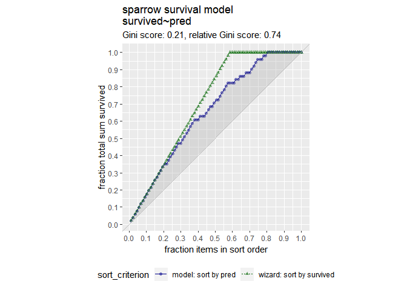

ch003
================
Daniel\_Kim
2019 12 15

### Catogorical Variables…

Call str on flowers to see the types of each column

``` r
# install.packages('Sleuth3')
library(Sleuth3)
```

    ## Warning: package 'Sleuth3' was built under R version 3.5.3

``` r
flowers <- case0901
flowers %>%
  mutate(Time = ifelse(Time == 1, "Late", "Early")) -> flowers
flowers %>% head
```

    ##   Flowers Time Intensity
    ## 1    62.3 Late       150
    ## 2    77.4 Late       150
    ## 3    55.3 Late       300
    ## 4    54.2 Late       300
    ## 5    49.6 Late       450
    ## 6    61.9 Late       450

Use unique() to see how many possible values Time takes

``` r
unique(flowers$Time)
```

    ## [1] "Late"  "Early"

Build a formula to express Flowers as a function of Intensity and Time:
fmla. Print it

``` r
(fmla <- as.formula("Flowers ~ Intensity + Time"))
```

    ## Flowers ~ Intensity + Time

Use fmla and model.matrix to see how the data is represented for
modeling

``` r
mmat <- model.matrix(fmla, flowers)
mmat
```

    ##    (Intercept) Intensity TimeLate
    ## 1            1       150        1
    ## 2            1       150        1
    ## 3            1       300        1
    ## 4            1       300        1
    ## 5            1       450        1
    ## 6            1       450        1
    ## 7            1       600        1
    ## 8            1       600        1
    ## 9            1       750        1
    ## 10           1       750        1
    ## 11           1       900        1
    ## 12           1       900        1
    ## 13           1       150        0
    ## 14           1       150        0
    ## 15           1       300        0
    ## 16           1       300        0
    ## 17           1       450        0
    ## 18           1       450        0
    ## 19           1       600        0
    ## 20           1       600        0
    ## 21           1       750        0
    ## 22           1       750        0
    ## 23           1       900        0
    ## 24           1       900        0
    ## attr(,"assign")
    ## [1] 0 1 2
    ## attr(,"contrasts")
    ## attr(,"contrasts")$Time
    ## [1] "contr.treatment"

Examine the first 20 lines of flowers

``` r
head(flowers, 20)
```

    ##    Flowers  Time Intensity
    ## 1     62.3  Late       150
    ## 2     77.4  Late       150
    ## 3     55.3  Late       300
    ## 4     54.2  Late       300
    ## 5     49.6  Late       450
    ## 6     61.9  Late       450
    ## 7     39.4  Late       600
    ## 8     45.7  Late       600
    ## 9     31.3  Late       750
    ## 10    44.9  Late       750
    ## 11    36.8  Late       900
    ## 12    41.9  Late       900
    ## 13    77.8 Early       150
    ## 14    75.6 Early       150
    ## 15    69.1 Early       300
    ## 16    78.0 Early       300
    ## 17    57.0 Early       450
    ## 18    71.1 Early       450
    ## 19    62.9 Early       600
    ## 20    52.2 Early       600

Examine the first 20 lines of mmat

``` r
head(mmat, 20)
```

    ##    (Intercept) Intensity TimeLate
    ## 1            1       150        1
    ## 2            1       150        1
    ## 3            1       300        1
    ## 4            1       300        1
    ## 5            1       450        1
    ## 6            1       450        1
    ## 7            1       600        1
    ## 8            1       600        1
    ## 9            1       750        1
    ## 10           1       750        1
    ## 11           1       900        1
    ## 12           1       900        1
    ## 13           1       150        0
    ## 14           1       150        0
    ## 15           1       300        0
    ## 16           1       300        0
    ## 17           1       450        0
    ## 18           1       450        0
    ## 19           1       600        0
    ## 20           1       600        0

Fit a model to predict Flowers from Intensity and Time : flower\_model

``` r
flower_model <- lm(fmla, data= flowers)
```

Use summary on mmat to remind yourself of its structure

``` r
summary(mmat)
```

    ##   (Intercept)   Intensity      TimeLate  
    ##  Min.   :1    Min.   :150   Min.   :0.0  
    ##  1st Qu.:1    1st Qu.:300   1st Qu.:0.0  
    ##  Median :1    Median :525   Median :0.5  
    ##  Mean   :1    Mean   :525   Mean   :0.5  
    ##  3rd Qu.:1    3rd Qu.:750   3rd Qu.:1.0  
    ##  Max.   :1    Max.   :900   Max.   :1.0

Use summary to examine flower\_model

``` r
summary(flower_model)
```

    ## 
    ## Call:
    ## lm(formula = fmla, data = flowers)
    ## 
    ## Residuals:
    ##    Min     1Q Median     3Q    Max 
    ## -9.652 -4.139 -1.558  5.632 12.165 
    ## 
    ## Coefficients:
    ##               Estimate Std. Error t value Pr(>|t|)    
    ## (Intercept)  83.464167   3.273772  25.495  < 2e-16 ***
    ## Intensity    -0.040471   0.005132  -7.886 1.04e-07 ***
    ## TimeLate    -12.158333   2.629557  -4.624 0.000146 ***
    ## ---
    ## Signif. codes:  0 '***' 0.001 '**' 0.01 '*' 0.05 '.' 0.1 ' ' 1
    ## 
    ## Residual standard error: 6.441 on 21 degrees of freedom
    ## Multiple R-squared:  0.7992, Adjusted R-squared:   0.78 
    ## F-statistic: 41.78 on 2 and 21 DF,  p-value: 4.786e-08

Predict the number of flowers on each plant

``` r
flowers$predictions <- predict(flower_model, flowers)
```

Plot predictions vs actual flowers (predictions on x-axis)

``` r
ggplot(flowers, aes(x = predictions, y = Flowers)) + 
  geom_point() +
  geom_abline(color = "blue") 
```

<!-- -->

### Interactions

Data alcohol loading…

``` r
# str(case1101)
alcohol <- case1101
str(alcohol)
```

    ## 'data.frame':    32 obs. of  5 variables:
    ##  $ Subject: int  1 2 3 4 5 6 7 8 9 10 ...
    ##  $ Metabol: num  0.6 0.6 1.5 0.4 0.1 0.2 0.3 0.3 0.4 1 ...
    ##  $ Gastric: num  1 1.6 1.5 2.2 1.1 1.2 0.9 0.8 1.5 0.9 ...
    ##  $ Sex    : Factor w/ 2 levels "Female","Male": 1 1 1 1 1 1 1 1 1 1 ...
    ##  $ Alcohol: Factor w/ 2 levels "Alcoholic","Non-alcoholic": 1 1 1 2 2 2 2 2 2 2 ...

``` r
summary(alcohol)
```

    ##     Subject         Metabol          Gastric          Sex    
    ##  Min.   : 1.00   Min.   : 0.100   Min.   :0.800   Female:18  
    ##  1st Qu.: 8.75   1st Qu.: 0.600   1st Qu.:1.200   Male  :14  
    ##  Median :16.50   Median : 1.700   Median :1.600              
    ##  Mean   :16.50   Mean   : 2.422   Mean   :1.863              
    ##  3rd Qu.:24.25   3rd Qu.: 2.925   3rd Qu.:2.200              
    ##  Max.   :32.00   Max.   :12.300   Max.   :5.200              
    ##           Alcohol  
    ##  Alcoholic    : 8  
    ##  Non-alcoholic:24  
    ##                    
    ##                    
    ##                    
    ## 

Create the formula with main effects only Gastric : 위, Metabol : 물질대사

``` r
(fmla_add <- Metabol ~ Gastric + Sex)
```

    ## Metabol ~ Gastric + Sex

Create the formula with interactions

``` r
(fmla_interaction <- Metabol ~ Gastric + Sex + Gastric:Sex)
```

    ## Metabol ~ Gastric + Sex + Gastric:Sex

Fit the main effects only model

``` r
model_add <- lm(fmla_add, data = alcohol)
```

Fit the interaction model

``` r
model_interaction <- lm(fmla_interaction, data =  alcohol)
```

Call summary on both models and compare

``` r
summary(model_add)
```

    ## 
    ## Call:
    ## lm(formula = fmla_add, data = alcohol)
    ## 
    ## Residuals:
    ##     Min      1Q  Median      3Q     Max 
    ## -2.2779 -0.6328 -0.0966  0.5783  4.5703 
    ## 
    ## Coefficients:
    ##             Estimate Std. Error t value Pr(>|t|)    
    ## (Intercept)  -1.9466     0.5198  -3.745 0.000796 ***
    ## Gastric       1.9656     0.2674   7.352 4.24e-08 ***
    ## SexMale       1.6174     0.5114   3.163 0.003649 ** 
    ## ---
    ## Signif. codes:  0 '***' 0.001 '**' 0.01 '*' 0.05 '.' 0.1 ' ' 1
    ## 
    ## Residual standard error: 1.331 on 29 degrees of freedom
    ## Multiple R-squared:  0.7654, Adjusted R-squared:  0.7492 
    ## F-statistic: 47.31 on 2 and 29 DF,  p-value: 7.41e-10

``` r
summary(model_interaction)
```

    ## 
    ## Call:
    ## lm(formula = fmla_interaction, data = alcohol)
    ## 
    ## Residuals:
    ##     Min      1Q  Median      3Q     Max 
    ## -2.4427 -0.6111 -0.0326  0.5436  3.8759 
    ## 
    ## Coefficients:
    ##                 Estimate Std. Error t value Pr(>|t|)  
    ## (Intercept)      -0.1973     0.8022  -0.246   0.8075  
    ## Gastric           0.8369     0.4839   1.730   0.0947 .
    ## SexMale          -0.9885     1.0724  -0.922   0.3645  
    ## Gastric:SexMale   1.5069     0.5591   2.695   0.0118 *
    ## ---
    ## Signif. codes:  0 '***' 0.001 '**' 0.01 '*' 0.05 '.' 0.1 ' ' 1
    ## 
    ## Residual standard error: 1.207 on 28 degrees of freedom
    ## Multiple R-squared:  0.8137, Adjusted R-squared:  0.7938 
    ## F-statistic: 40.77 on 3 and 28 DF,  p-value: 2.386e-10
