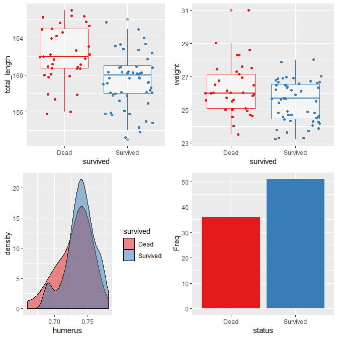
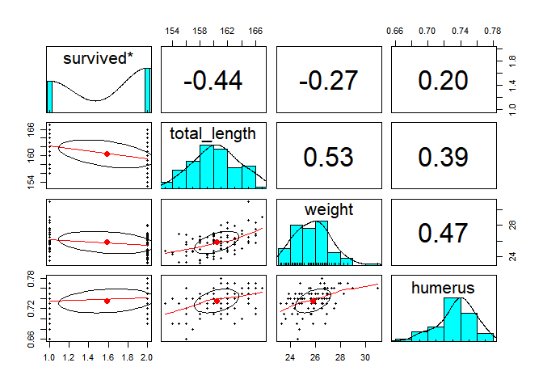
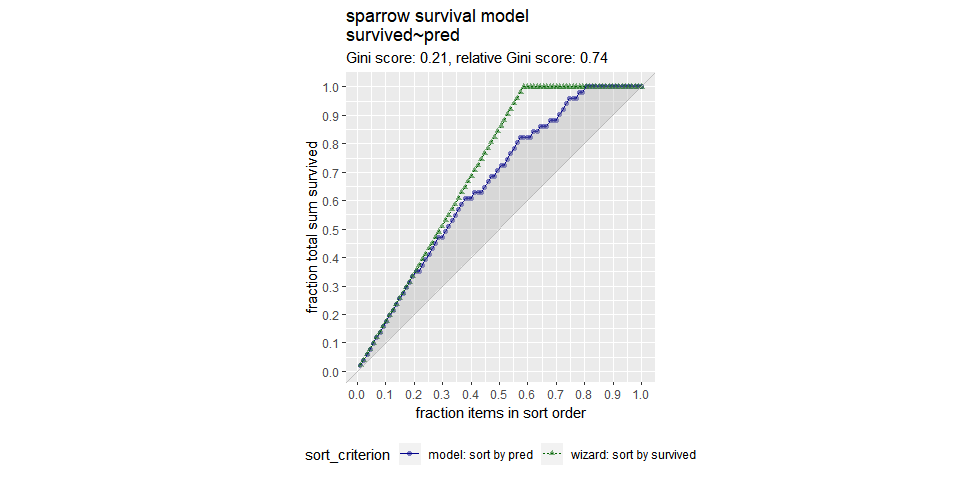
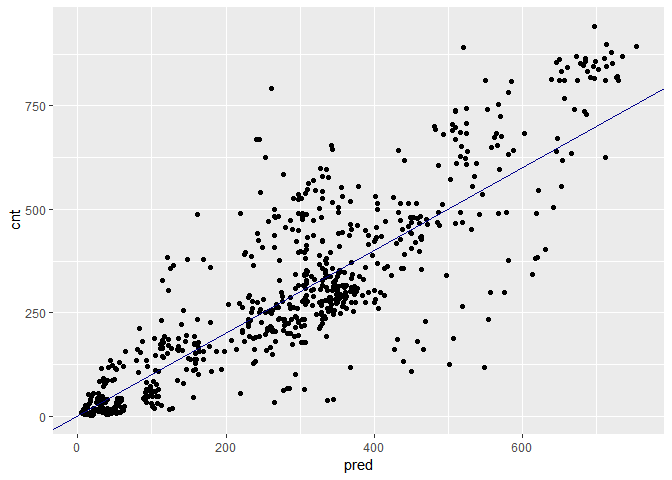
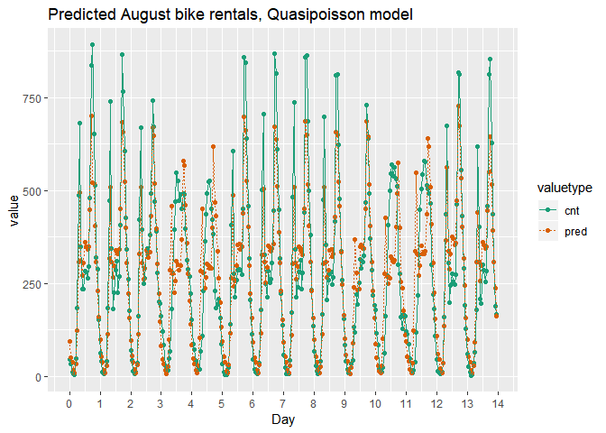
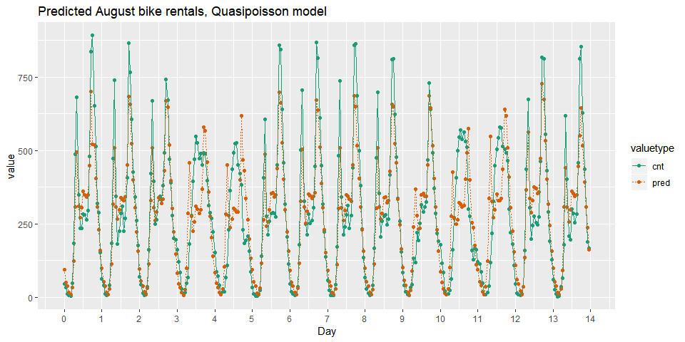
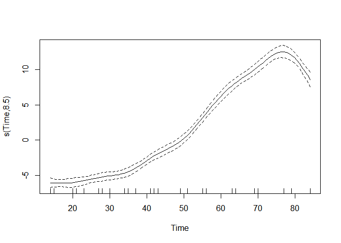
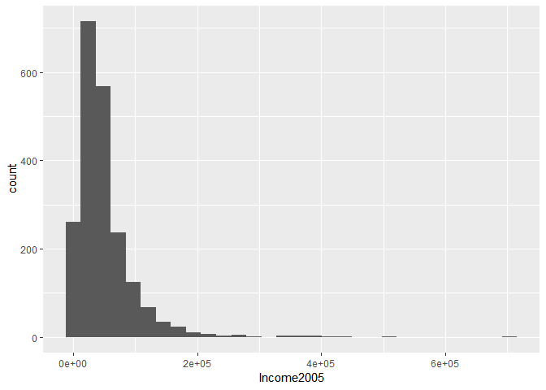

Advanced\_R(chap\_2)
================
jakinpilla
2019-12-19

  - [Logistic Regression](#logistic-regression)

``` r
library(tidyverse)
library(broom)
library(gridExtra)
library(psych)
library(WVPlots)
library(mgcv)
```

### Logistic Regression

#### Fit a model of sparrow survival probability

sparrow survival probability against severe winter storm

  - total\_length: length of the bird from tip of beak to tip of tail
    (mm)
  - weight: in grams
  - humerus : length of humerus (“upper arm bone” that connects the wing
    to the body) (inches) psedo r-square : deviance explained…

<!-- end list -->

``` r
sparrow <- readRDS('./data/sparrow.rds')
summary(sparrow)
```

    ##       status       age             total_length      wingspan    
    ##  Perished:36   Length:87          Min.   :153.0   Min.   :236.0  
    ##  Survived:51   Class :character   1st Qu.:158.0   1st Qu.:245.0  
    ##                Mode  :character   Median :160.0   Median :247.0  
    ##                                   Mean   :160.4   Mean   :247.5  
    ##                                   3rd Qu.:162.5   3rd Qu.:251.0  
    ##                                   Max.   :167.0   Max.   :256.0  
    ##      weight       beak_head        humerus           femur       
    ##  Min.   :23.2   Min.   :29.80   Min.   :0.6600   Min.   :0.6500  
    ##  1st Qu.:24.7   1st Qu.:31.40   1st Qu.:0.7250   1st Qu.:0.7000  
    ##  Median :25.8   Median :31.70   Median :0.7400   Median :0.7100  
    ##  Mean   :25.8   Mean   :31.64   Mean   :0.7353   Mean   :0.7134  
    ##  3rd Qu.:26.7   3rd Qu.:32.10   3rd Qu.:0.7500   3rd Qu.:0.7300  
    ##  Max.   :31.0   Max.   :33.00   Max.   :0.7800   Max.   :0.7600  
    ##     legbone          skull           sternum      
    ##  Min.   :1.010   Min.   :0.5600   Min.   :0.7700  
    ##  1st Qu.:1.110   1st Qu.:0.5900   1st Qu.:0.8300  
    ##  Median :1.130   Median :0.6000   Median :0.8500  
    ##  Mean   :1.131   Mean   :0.6032   Mean   :0.8511  
    ##  3rd Qu.:1.160   3rd Qu.:0.6100   3rd Qu.:0.8800  
    ##  Max.   :1.230   Max.   :0.6400   Max.   :0.9300

EDA

``` r
sparrow$survived <- ifelse(sparrow$status == 'Survived', 'Survived', 'Dead')
sparrow %>% str()
```

    ## 'data.frame':    87 obs. of  12 variables:
    ##  $ status      : Factor w/ 2 levels "Perished","Survived": 2 2 2 2 2 2 2 2 2 2 ...
    ##  $ age         : chr  "adult" "adult" "adult" "adult" ...
    ##  $ total_length: int  154 160 155 154 156 161 157 159 158 158 ...
    ##  $ wingspan    : int  241 252 243 245 247 253 251 247 247 252 ...
    ##  $ weight      : num  24.5 26.9 26.9 24.3 24.1 26.5 24.6 24.2 23.6 26.2 ...
    ##  $ beak_head   : num  31.2 30.8 30.6 31.7 31.5 31.8 31.1 31.4 29.8 32 ...
    ##  $ humerus     : num  0.69 0.74 0.73 0.74 0.71 0.78 0.74 0.73 0.7 0.75 ...
    ##  $ femur       : num  0.67 0.71 0.7 0.69 0.71 0.74 0.74 0.72 0.67 0.74 ...
    ##  $ legbone     : num  1.02 1.18 1.15 1.15 1.13 1.14 1.15 1.13 1.08 1.15 ...
    ##  $ skull       : num  0.59 0.6 0.6 0.58 0.57 0.61 0.61 0.61 0.6 0.61 ...
    ##  $ sternum     : num  0.83 0.84 0.85 0.84 0.82 0.89 0.86 0.79 0.82 0.86 ...
    ##  $ survived    : chr  "Survived" "Survived" "Survived" "Survived" ...

``` r
# sparrow %>% str()
```

``` r
sparrow %>% 
  ggplot(aes(survived, total_length, col = survived)) + 
  geom_boxplot(alpha = .5) +
  geom_jitter() + 
  theme(legend.position = "none") +
  scale_color_brewer(palette = 'Set1') -> p1

sparrow %>% 
  ggplot(aes(survived, weight, col = survived)) + 
  geom_boxplot(alpha = .5) +
  geom_jitter() + 
  theme(legend.position = "none") +
  scale_color_brewer(palette = 'Set1') -> p2

sparrow %>% 
  ggplot(aes(humerus, fill = survived)) + 
  geom_density(alpha = .5) +
  # theme(legend.position = "none") +
  scale_fill_brewer(palette = 'Set1') -> p3

sparrow$survived %>% table() %>% 
  as.data.frame() %>%
  rename(status = '.') -> data

data %>%
  ggplot(aes(status, Freq, fill = status)) + geom_bar(stat = 'identity') +
  theme(legend.position = "none") +
  scale_fill_brewer(palette = 'Set1') -> p4

grid.arrange(p1, p2, p3, p4, ncol = 2)
```

<!-- -->

show pairs graph…

``` r
sparrow %>%
  select(survived, total_length, weight, humerus) -> sparrow_1

pairs.panels(sparrow_1)
```

<!-- -->

Create the survived column

``` r
sparrow$survived <- ifelse(sparrow$status == 'Survived', T, F)
```

Create the formula

``` r
(fmla <- survived ~ total_length + weight + humerus)
```

    ## survived ~ total_length + weight + humerus

Fit the logistic regression model

``` r
sparrow_model <- glm(fmla, data = sparrow, family = binomial)
```

Call summary

``` r
summary(sparrow_model)
```

    ## 
    ## Call:
    ## glm(formula = fmla, family = binomial, data = sparrow)
    ## 
    ## Deviance Residuals: 
    ##     Min       1Q   Median       3Q      Max  
    ## -2.1117  -0.6026   0.2871   0.6577   1.7082  
    ## 
    ## Coefficients:
    ##              Estimate Std. Error z value Pr(>|z|)    
    ## (Intercept)   46.8813    16.9631   2.764 0.005715 ** 
    ## total_length  -0.5435     0.1409  -3.858 0.000115 ***
    ## weight        -0.5689     0.2771  -2.053 0.040060 *  
    ## humerus       75.4610    19.1586   3.939 8.19e-05 ***
    ## ---
    ## Signif. codes:  0 '***' 0.001 '**' 0.01 '*' 0.05 '.' 0.1 ' ' 1
    ## 
    ## (Dispersion parameter for binomial family taken to be 1)
    ## 
    ##     Null deviance: 118.008  on 86  degrees of freedom
    ## Residual deviance:  75.094  on 83  degrees of freedom
    ## AIC: 83.094
    ## 
    ## Number of Fisher Scoring iterations: 5

Call glance

``` r
(perf <- glance(sparrow_model))
```

    ## # A tibble: 1 x 7
    ##   null.deviance df.null logLik   AIC   BIC deviance df.residual
    ##           <dbl>   <int>  <dbl> <dbl> <dbl>    <dbl>       <int>
    ## 1          118.      86  -37.5  83.1  93.0     75.1          83

Calculate pseudo-R-squared

``` r
(pseudoR2 <- 1 - perf$deviance / perf$null.deviance)
```

    ## [1] 0.3636526

Make predictions

``` r
sparrow$pred <- predict(sparrow_model, type = 'response')
```

Look at gain curve

``` r
GainCurvePlot(sparrow, 'pred', 'survived', "sparrow survival model")
```

<!-- -->

``` r
### Poisson or quasipoisson
```

the average count per unit time is the same as the variance of the count

When the variance is much larger than the mean, the Poisson assumption
doesn’t apply, and one solution is to use quasipoisson regression, which
does not assume that variance=mean.

  - cnt: the number of bikes rented in that hour (the outcome)
  - hr: the hour of the day (0-23, as a factor)
  - holiday: TRUE/FALSE
  - workingday: TRUE if neither a holiday nor a weekend, else FALSE
  - weathersit: categorical, “Clear to partly cloudy”/“Light
    Precipitation”/“Misty”
  - temp: normalized temperature in Celsius
  - atemp: normalized “feeling” temperature in Celsius
  - hum: normalized humidity
  - windspeed: normalized windspeed
  - instant: the time index – number of hours since beginning of data
    set (not a variable)
  - mnth and yr: month and year indices (not variables)

<!-- end list -->

``` r
load('./data/Bikes.RData')

# bikesJuly is in the workspace
str(bikesJuly)
```

    ## 'data.frame':    744 obs. of  12 variables:
    ##  $ hr        : Factor w/ 24 levels "0","1","2","3",..: 1 2 3 4 5 6 7 8 9 10 ...
    ##  $ holiday   : logi  FALSE FALSE FALSE FALSE FALSE FALSE ...
    ##  $ workingday: logi  FALSE FALSE FALSE FALSE FALSE FALSE ...
    ##  $ weathersit: chr  "Clear to partly cloudy" "Clear to partly cloudy" "Clear to partly cloudy" "Clear to partly cloudy" ...
    ##  $ temp      : num  0.76 0.74 0.72 0.72 0.7 0.68 0.7 0.74 0.78 0.82 ...
    ##  $ atemp     : num  0.727 0.697 0.697 0.712 0.667 ...
    ##  $ hum       : num  0.66 0.7 0.74 0.84 0.79 0.79 0.79 0.7 0.62 0.56 ...
    ##  $ windspeed : num  0 0.1343 0.0896 0.1343 0.194 ...
    ##  $ cnt       : int  149 93 90 33 4 10 27 50 142 219 ...
    ##  $ instant   : int  13004 13005 13006 13007 13008 13009 13010 13011 13012 13013 ...
    ##  $ mnth      : int  7 7 7 7 7 7 7 7 7 7 ...
    ##  $ yr        : int  1 1 1 1 1 1 1 1 1 1 ...

``` r
# The outcome column
outcome <- c('cnt')

# The inputs to use
vars <- c("hr", "holiday", "workingday", "weathersit",  "temp", "atemp", "hum", "windspeed")
# bikesJuly %>% colnames()

# Create the formula string for bikes rented as a function of the inputs
(fmla <- paste(outcome, "~", paste(vars, collapse = " + ")))
```

    ## [1] "cnt ~ hr + holiday + workingday + weathersit + temp + atemp + hum + windspeed"

``` r
# Calculate the mean and variance of the outcome
(mean_bikes <- mean(bikesJuly$cnt))
```

    ## [1] 273.6653

``` r
(var_bikes <- var(bikesJuly$cnt))
```

    ## [1] 45863.84

``` r
# Fit the model
bike_model <- glm(fmla, data = bikesJuly, family = quasipoisson)

# Call glance
(perf <- glance(bike_model))
```

    ## # A tibble: 1 x 7
    ##   null.deviance df.null logLik   AIC   BIC deviance df.residual
    ##           <dbl>   <int>  <dbl> <dbl> <dbl>    <dbl>       <int>
    ## 1       133365.     743     NA    NA    NA   28775.         712

``` r
# Calculate pseudo-R-squared
(pseudoR2 <- 1 - perf$deviance / perf$null.deviance)
```

    ## [1] 0.7842393

Predict bike rentals on new data In this exercise you will use the model
you built in the previous exercise to make predictions for the month of
August. The data set bikesAugust has the same columns as bikesJuly.

Recall that you must specify type = “response” with predict() when
predicting counts from a glm poisson or quasipoisson model.

``` r
# Make predictions on August data
bikesAugust$pred  <- predict(bike_model, newdata = bikesAugust, type = 'response')

# Calculate the RMSE
bikesAugust %>% 
  mutate(residual = pred - cnt) %>%
  summarize(rmse  = sqrt(mean(residual^2)))
```

    ##       rmse
    ## 1 112.5815

``` r
# Plot predictions vs cnt (pred on x-axis)
ggplot(bikesAugust, aes(x = pred, y = cnt)) +
  geom_point() + 
  geom_abline(color = "darkblue")
```

<!-- -->

``` r
# Plot predictions and cnt by date/time
bikesAugust %>% 
  # set start to 0, convert unit to days
  mutate(instant = (instant - min(instant))/24) %>%  
  # gather cnt and pred into a value column
  gather(key = valuetype, value = value, cnt, pred) %>%
  filter(instant < 14) %>% # restric to first 14 days
  # plot value by instant
  ggplot(aes(x = instant, y = value, color = valuetype, linetype = valuetype)) + 
  geom_point() + 
  geom_line() + 
  scale_x_continuous("Day", breaks = 0:14, labels = 0:14) + 
  scale_color_brewer(palette = "Dark2") + 
  ggtitle("Predicted August bike rentals, Quasipoisson model")
```

<!-- -->

``` r
### GAM to learn non-linear trandform
```

Generalized Additive Models

Model soybean growth with GAM

In this exercise you will model the average leaf weight on a soybean
plant as a function of time (after planting). As you will see, the
soybean plant doesn’t grow at a steady rate, but rather has a “growth
spurt” that eventually tapers off. Hence, leaf weight is not well
described by a linear model.

``` r
load('./data/Soybean.RData')
model.lin <- lm(weight ~ Time, data = soybean_train)
```

soybean\_train is in the workspace

``` r
summary(soybean_train)
```

    ##       Plot     Variety   Year          Time           weight       
    ##  1988F6 : 10   F:161   1988:124   Min.   :14.00   Min.   : 0.0290  
    ##  1988F7 :  9   P:169   1989:102   1st Qu.:27.00   1st Qu.: 0.6663  
    ##  1988P1 :  9           1990:104   Median :42.00   Median : 3.5233  
    ##  1988P8 :  9                      Mean   :43.56   Mean   : 6.1645  
    ##  1988P2 :  9                      3rd Qu.:56.00   3rd Qu.:10.3808  
    ##  1988F3 :  8                      Max.   :84.00   Max.   :27.3700  
    ##  (Other):276

Plot weight vs Time (Time on x axis)

``` r
ggplot(soybean_train, aes(x = Time, y = weight)) + 
  geom_point() 
```

<!-- -->

Create the formula

``` r
(fmla.gam <- weight ~ s(Time) )
```

    ## weight ~ s(Time)

Fit the GAM Model

``` r
model.gam <- gam(fmla.gam, data = soybean_train, family= gaussian)
```

Call summary() on model.lin and look for R-squared

``` r
summary(model.lin)
```

    ## 
    ## Call:
    ## lm(formula = weight ~ Time, data = soybean_train)
    ## 
    ## Residuals:
    ##     Min      1Q  Median      3Q     Max 
    ## -9.3933 -1.7100 -0.3909  1.9056 11.4381 
    ## 
    ## Coefficients:
    ##              Estimate Std. Error t value Pr(>|t|)    
    ## (Intercept) -6.559283   0.358527  -18.30   <2e-16 ***
    ## Time         0.292094   0.007444   39.24   <2e-16 ***
    ## ---
    ## Signif. codes:  0 '***' 0.001 '**' 0.01 '*' 0.05 '.' 0.1 ' ' 1
    ## 
    ## Residual standard error: 2.778 on 328 degrees of freedom
    ## Multiple R-squared:  0.8244, Adjusted R-squared:  0.8238 
    ## F-statistic:  1540 on 1 and 328 DF,  p-value: < 2.2e-16

Call summary() on model.gam and look for R-squared

``` r
summary(model.gam)
```

    ## 
    ## Family: gaussian 
    ## Link function: identity 
    ## 
    ## Formula:
    ## weight ~ s(Time)
    ## 
    ## Parametric coefficients:
    ##             Estimate Std. Error t value Pr(>|t|)    
    ## (Intercept)   6.1645     0.1143   53.93   <2e-16 ***
    ## ---
    ## Signif. codes:  0 '***' 0.001 '**' 0.01 '*' 0.05 '.' 0.1 ' ' 1
    ## 
    ## Approximate significance of smooth terms:
    ##           edf Ref.df     F p-value    
    ## s(Time) 8.495   8.93 338.2  <2e-16 ***
    ## ---
    ## Signif. codes:  0 '***' 0.001 '**' 0.01 '*' 0.05 '.' 0.1 ' ' 1
    ## 
    ## R-sq.(adj) =  0.902   Deviance explained = 90.4%
    ## GCV = 4.4395  Scale est. = 4.3117    n = 330

Call plot() on model.gam

``` r
plot(model.gam)
```

<!-- -->

see soybean\_test

``` r
summary(soybean_test)
```

    ##       Plot    Variety   Year         Time           weight       
    ##  1988F8 : 4   F:43    1988:32   Min.   :14.00   Min.   : 0.0380  
    ##  1988P7 : 4   P:39    1989:26   1st Qu.:23.00   1st Qu.: 0.4248  
    ##  1989F8 : 4           1990:24   Median :41.00   Median : 3.0025  
    ##  1990F8 : 4                     Mean   :44.09   Mean   : 7.1576  
    ##  1988F4 : 3                     3rd Qu.:69.00   3rd Qu.:15.0113  
    ##  1988F2 : 3                     Max.   :84.00   Max.   :30.2717  
    ##  (Other):60

Get predictions from linear model

``` r
soybean_test$pred.lin <- predict(model.lin, newdata = soybean_test)
```

Get predictions from gam model

``` r
soybean_test$pred.gam <- as.numeric(predict(model.gam, newdata = soybean_test))
```

Gather the predictions into a “long” dataset

``` r
soybean_long <- soybean_test %>%
  gather(key = modeltype, value = pred, pred.lin, pred.gam)
```

Calculate the rmse

``` r
soybean_long %>%
  mutate(residual = weight - pred) %>%     # residuals
  group_by(modeltype) %>%                  # group by modeltype
  summarize(rmse = sqrt(mean(residual^2))) # calculate the RMSE
```

    ## # A tibble: 2 x 2
    ##   modeltype  rmse
    ##   <chr>     <dbl>
    ## 1 pred.gam   2.29
    ## 2 pred.lin   3.19

Compare the predictions against actual weights on the test data

``` r
soybean_long %>%
  ggplot(aes(x = Time)) +                          # the column for the x axis
  geom_point(aes(y = weight)) +                    # the y-column for the scatterplot
  geom_point(aes(y = pred, color = modeltype)) +   # the y-column for the point-and-line plot
  geom_line(aes(y = pred, color = modeltype, linetype = modeltype)) + # the y-column for the point-and-line plot
  scale_color_brewer(palette = "Dark2")
```

<!-- -->

The GAM learns the non-linear growth function of the soybean plants,
including the fact that weight is never negative.
