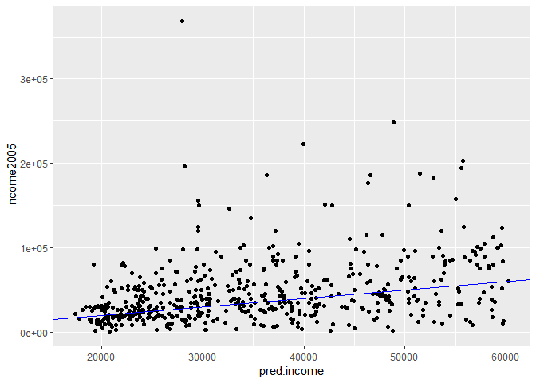
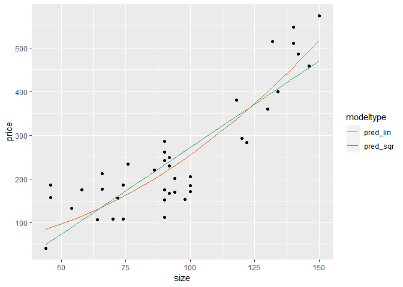

ch003
================
Daniel\_Kim
2019 12 15

### Catogorical Variables…

Call str on flowers to see the types of each column

``` r
# install.packages('Sleuth3')
library(Sleuth3)
```

    ## Warning: package 'Sleuth3' was built under R version 3.5.3

``` r
flowers <- case0901
flowers %>%
  mutate(Time = ifelse(Time == 1, "Late", "Early")) -> flowers
flowers %>% head
```

    ##   Flowers Time Intensity
    ## 1    62.3 Late       150
    ## 2    77.4 Late       150
    ## 3    55.3 Late       300
    ## 4    54.2 Late       300
    ## 5    49.6 Late       450
    ## 6    61.9 Late       450

Use unique() to see how many possible values Time takes

``` r
unique(flowers$Time)
```

    ## [1] "Late"  "Early"

Build a formula to express Flowers as a function of Intensity and Time:
fmla. Print it

``` r
(fmla <- as.formula("Flowers ~ Intensity + Time"))
```

    ## Flowers ~ Intensity + Time

Use fmla and model.matrix to see how the data is represented for
modeling

``` r
mmat <- model.matrix(fmla, flowers)
mmat
```

    ##    (Intercept) Intensity TimeLate
    ## 1            1       150        1
    ## 2            1       150        1
    ## 3            1       300        1
    ## 4            1       300        1
    ## 5            1       450        1
    ## 6            1       450        1
    ## 7            1       600        1
    ## 8            1       600        1
    ## 9            1       750        1
    ## 10           1       750        1
    ## 11           1       900        1
    ## 12           1       900        1
    ## 13           1       150        0
    ## 14           1       150        0
    ## 15           1       300        0
    ## 16           1       300        0
    ## 17           1       450        0
    ## 18           1       450        0
    ## 19           1       600        0
    ## 20           1       600        0
    ## 21           1       750        0
    ## 22           1       750        0
    ## 23           1       900        0
    ## 24           1       900        0
    ## attr(,"assign")
    ## [1] 0 1 2
    ## attr(,"contrasts")
    ## attr(,"contrasts")$Time
    ## [1] "contr.treatment"

Examine the first 20 lines of flowers

``` r
head(flowers, 20)
```

    ##    Flowers  Time Intensity
    ## 1     62.3  Late       150
    ## 2     77.4  Late       150
    ## 3     55.3  Late       300
    ## 4     54.2  Late       300
    ## 5     49.6  Late       450
    ## 6     61.9  Late       450
    ## 7     39.4  Late       600
    ## 8     45.7  Late       600
    ## 9     31.3  Late       750
    ## 10    44.9  Late       750
    ## 11    36.8  Late       900
    ## 12    41.9  Late       900
    ## 13    77.8 Early       150
    ## 14    75.6 Early       150
    ## 15    69.1 Early       300
    ## 16    78.0 Early       300
    ## 17    57.0 Early       450
    ## 18    71.1 Early       450
    ## 19    62.9 Early       600
    ## 20    52.2 Early       600

Examine the first 20 lines of mmat

``` r
head(mmat, 20)
```

    ##    (Intercept) Intensity TimeLate
    ## 1            1       150        1
    ## 2            1       150        1
    ## 3            1       300        1
    ## 4            1       300        1
    ## 5            1       450        1
    ## 6            1       450        1
    ## 7            1       600        1
    ## 8            1       600        1
    ## 9            1       750        1
    ## 10           1       750        1
    ## 11           1       900        1
    ## 12           1       900        1
    ## 13           1       150        0
    ## 14           1       150        0
    ## 15           1       300        0
    ## 16           1       300        0
    ## 17           1       450        0
    ## 18           1       450        0
    ## 19           1       600        0
    ## 20           1       600        0

Fit a model to predict Flowers from Intensity and Time : flower\_model

``` r
flower_model <- lm(fmla, data= flowers)
```

Use summary on mmat to remind yourself of its structure

``` r
summary(mmat)
```

    ##   (Intercept)   Intensity      TimeLate  
    ##  Min.   :1    Min.   :150   Min.   :0.0  
    ##  1st Qu.:1    1st Qu.:300   1st Qu.:0.0  
    ##  Median :1    Median :525   Median :0.5  
    ##  Mean   :1    Mean   :525   Mean   :0.5  
    ##  3rd Qu.:1    3rd Qu.:750   3rd Qu.:1.0  
    ##  Max.   :1    Max.   :900   Max.   :1.0

Use summary to examine flower\_model

``` r
summary(flower_model)
```

    ## 
    ## Call:
    ## lm(formula = fmla, data = flowers)
    ## 
    ## Residuals:
    ##    Min     1Q Median     3Q    Max 
    ## -9.652 -4.139 -1.558  5.632 12.165 
    ## 
    ## Coefficients:
    ##               Estimate Std. Error t value Pr(>|t|)    
    ## (Intercept)  83.464167   3.273772  25.495  < 2e-16 ***
    ## Intensity    -0.040471   0.005132  -7.886 1.04e-07 ***
    ## TimeLate    -12.158333   2.629557  -4.624 0.000146 ***
    ## ---
    ## Signif. codes:  0 '***' 0.001 '**' 0.01 '*' 0.05 '.' 0.1 ' ' 1
    ## 
    ## Residual standard error: 6.441 on 21 degrees of freedom
    ## Multiple R-squared:  0.7992, Adjusted R-squared:   0.78 
    ## F-statistic: 41.78 on 2 and 21 DF,  p-value: 4.786e-08

Predict the number of flowers on each plant

``` r
flowers$predictions <- predict(flower_model, flowers)
```

Plot predictions vs actual flowers (predictions on x-axis)

``` r
ggplot(flowers, aes(x = predictions, y = Flowers)) + 
  geom_point() +
  geom_abline(color = "blue") 
```

<!-- -->

### Interactions

Data alcohol loading…

``` r
# str(case1101)
alcohol <- case1101
str(alcohol)
```

    ## 'data.frame':    32 obs. of  5 variables:
    ##  $ Subject: int  1 2 3 4 5 6 7 8 9 10 ...
    ##  $ Metabol: num  0.6 0.6 1.5 0.4 0.1 0.2 0.3 0.3 0.4 1 ...
    ##  $ Gastric: num  1 1.6 1.5 2.2 1.1 1.2 0.9 0.8 1.5 0.9 ...
    ##  $ Sex    : Factor w/ 2 levels "Female","Male": 1 1 1 1 1 1 1 1 1 1 ...
    ##  $ Alcohol: Factor w/ 2 levels "Alcoholic","Non-alcoholic": 1 1 1 2 2 2 2 2 2 2 ...

``` r
summary(alcohol)
```

    ##     Subject         Metabol          Gastric          Sex    
    ##  Min.   : 1.00   Min.   : 0.100   Min.   :0.800   Female:18  
    ##  1st Qu.: 8.75   1st Qu.: 0.600   1st Qu.:1.200   Male  :14  
    ##  Median :16.50   Median : 1.700   Median :1.600              
    ##  Mean   :16.50   Mean   : 2.422   Mean   :1.863              
    ##  3rd Qu.:24.25   3rd Qu.: 2.925   3rd Qu.:2.200              
    ##  Max.   :32.00   Max.   :12.300   Max.   :5.200              
    ##           Alcohol  
    ##  Alcoholic    : 8  
    ##  Non-alcoholic:24  
    ##                    
    ##                    
    ##                    
    ## 

Create the formula with main effects only Gastric : 위, Metabol : 물질대사

``` r
(fmla_add <- Metabol ~ Gastric + Sex)
```

    ## Metabol ~ Gastric + Sex

Create the formula with interactions Gastric은 주요 영향 요인이지만 Sex는 아니므로 교호작용
항만 추가합니다.

``` r
(fmla_interaction <- Metabol ~ Gastric + Gastric:Sex)
```

    ## Metabol ~ Gastric + Gastric:Sex

Fit the main effects only model

``` r
model_add <- lm(fmla_add, data = alcohol)
```

Fit the interaction model

``` r
model_interaction <- lm(fmla_interaction, data =  alcohol)
```

Call summary on both models and compare

``` r
summary(model_add)
```

    ## 
    ## Call:
    ## lm(formula = fmla_add, data = alcohol)
    ## 
    ## Residuals:
    ##     Min      1Q  Median      3Q     Max 
    ## -2.2779 -0.6328 -0.0966  0.5783  4.5703 
    ## 
    ## Coefficients:
    ##             Estimate Std. Error t value Pr(>|t|)    
    ## (Intercept)  -1.9466     0.5198  -3.745 0.000796 ***
    ## Gastric       1.9656     0.2674   7.352 4.24e-08 ***
    ## SexMale       1.6174     0.5114   3.163 0.003649 ** 
    ## ---
    ## Signif. codes:  0 '***' 0.001 '**' 0.01 '*' 0.05 '.' 0.1 ' ' 1
    ## 
    ## Residual standard error: 1.331 on 29 degrees of freedom
    ## Multiple R-squared:  0.7654, Adjusted R-squared:  0.7492 
    ## F-statistic: 47.31 on 2 and 29 DF,  p-value: 7.41e-10

``` r
summary(model_interaction)
```

    ## 
    ## Call:
    ## lm(formula = fmla_interaction, data = alcohol)
    ## 
    ## Residuals:
    ##     Min      1Q  Median      3Q     Max 
    ## -2.4656 -0.5091  0.0143  0.5660  4.0668 
    ## 
    ## Coefficients:
    ##                 Estimate Std. Error t value Pr(>|t|)    
    ## (Intercept)      -0.7504     0.5310  -1.413 0.168236    
    ## Gastric           1.1489     0.3450   3.331 0.002372 ** 
    ## Gastric:SexMale   1.0422     0.2412   4.321 0.000166 ***
    ## ---
    ## Signif. codes:  0 '***' 0.001 '**' 0.01 '*' 0.05 '.' 0.1 ' ' 1
    ## 
    ## Residual standard error: 1.204 on 29 degrees of freedom
    ## Multiple R-squared:  0.8081, Adjusted R-squared:  0.7948 
    ## F-statistic: 61.05 on 2 and 29 DF,  p-value: 4.033e-11

Create the splitting plan for 3-fold cross validation

``` r
set.seed(34245)  # set the seed for reproducibility
splitPlan <- kWayCrossValidation(nrow(alcohol), 3, NULL, NULL)
```

Sample code: Get cross-val predictions for main-effects only model

``` r
alcohol$pred_add <- 0  # initialize the prediction vector
for(i in 1:3) {
  split <- splitPlan[[i]]
  model_add <- lm(fmla_add, data = alcohol[split$train, ])
  alcohol$pred_add[split$app] <- predict(model_add, newdata = alcohol[split$app, ])
}
```

Get the cross-val predictions for the model with interactions

``` r
alcohol$pred_interaction <- 0 # initialize the prediction vector
for(i in 1:3) {
  split <- splitPlan[[i]]
  model_interaction <- lm(fmla_interaction, data = alcohol[split$train, ])
  alcohol$pred_interaction[split$app] <- predict(model_interaction, newdata = alcohol[split$app, ])
}
```

Get RMSE

``` r
alcohol %>% 
  gather(key = modeltype, value = pred, pred_add, pred_interaction) %>%
  mutate(residuals = Metabol - pred) %>%      
  group_by(modeltype) %>%
  summarize(rmse = sqrt(mean(residuals^2))) # residuals^2 에 유의할 것...
```

    ## # A tibble: 2 x 2
    ##   modeltype         rmse
    ##   <chr>            <dbl>
    ## 1 pred_add          1.64
    ## 2 pred_interaction  1.38

### Transforming the response before modeling…

``` r
load('./data/Income.RData')
```

Examine Income2005 in the training set

``` r
income_train <- incometrain
income_test <- incometest
```

``` r
str(income_train)
```

    ## 'data.frame':    2069 obs. of  7 variables:
    ##  $ Subject   : int  2 6 8 9 16 17 18 20 21 22 ...
    ##  $ Arith     : int  8 30 13 21 17 29 30 17 29 27 ...
    ##  $ Word      : int  15 35 35 28 30 33 35 28 33 31 ...
    ##  $ Parag     : int  6 15 12 10 12 13 14 14 13 14 ...
    ##  $ Math      : int  6 23 4 13 17 21 23 20 25 22 ...
    ##  $ AFQT      : num  6.84 99.39 44.02 59.68 50.28 ...
    ##  $ Income2005: int  5500 65000 36000 65000 71000 43000 120000 64000 253043 45300 ...

$Income2005 : Percentile on the Armed Forces Qualifying Test…

``` r
summary(income_train$Income2005)
```

    ##    Min. 1st Qu.  Median    Mean 3rd Qu.    Max. 
    ##      63   23000   39000   49894   61500  703637

``` r
ggplot(income_train, aes(Income2005)) + geom_histogram()
```

    ## `stat_bin()` using `bins = 30`. Pick better value with `binwidth`.

<!-- -->

Write the formula for log income as a function of the tests and print it

``` r
(fmla.log <- log(Income2005) ~ Arith + Word + Parag + Math + AFQT)
```

    ## log(Income2005) ~ Arith + Word + Parag + Math + AFQT

Fit the linear model

``` r
model.log <-  lm(fmla.log, data = income_train)
```

Make predictions on income\_test

``` r
income_test$logpred <- predict(model.log, income_test)
```

``` r
summary(income_test$logpred)
```

    ##    Min. 1st Qu.  Median    Mean 3rd Qu.    Max. 
    ##   9.766  10.133  10.423  10.419  10.705  11.006

Convert the predictions to monetary units

``` r
income_test$pred.income <- exp(income_test$logpred)
```

``` r
summary(income_test$pred.income)
```

    ##    Min. 1st Qu.  Median    Mean 3rd Qu.    Max. 
    ##   17432   25167   33615   35363   44566   60217

``` r
head(income_test)
```

    ##    Subject Arith Word Parag Math   AFQT Income2005  logpred pred.income
    ## 3        7    14   27     8   11 47.412      19000 10.26270    28644.09
    ## 6       13    30   29    13   24 72.313       8000 10.94457    56645.76
    ## 22      47    26   33    13   16 75.473      66309 10.70252    44467.93
    ## 27      62    12   25    10   10 36.384      30000 10.14495    25462.26
    ## 30      73    18   34    13   18 81.527     186135 10.50110    36355.63
    ## 31      78    25   35    14   21 85.347      14657 10.75679    46947.82

Plot predicted income (x axis) vs income

``` r
ggplot(income_test, aes(x = pred.income, y = Income2005)) + 
  geom_point() + 
  geom_abline(color = "blue")
```

<!-- -->

setting fmla.abs

``` r
fmla.abs <- Income2005 ~ Arith + Word + Parag + Math + AFQT
```

``` r
fmla.abs
```

    ## Income2005 ~ Arith + Word + Parag + Math + AFQT

model.abs

``` r
model.abs <- lm(fmla.abs, data = income_train)
```

``` r
summary(model.abs)
```

    ## 
    ## Call:
    ## lm(formula = fmla.abs, data = income_train)
    ## 
    ## Residuals:
    ##    Min     1Q Median     3Q    Max 
    ## -78728 -24137  -6979  11964 648573 
    ## 
    ## Coefficients:
    ##             Estimate Std. Error t value Pr(>|t|)    
    ## (Intercept)  17516.7     6420.1   2.728  0.00642 ** 
    ## Arith         1552.3      303.4   5.116 3.41e-07 ***
    ## Word          -132.3      265.0  -0.499  0.61754    
    ## Parag        -1155.1      618.3  -1.868  0.06189 .  
    ## Math           725.5      372.0   1.950  0.05127 .  
    ## AFQT           177.8      144.1   1.234  0.21734    
    ## ---
    ## Signif. codes:  0 '***' 0.001 '**' 0.01 '*' 0.05 '.' 0.1 ' ' 1
    ## 
    ## Residual standard error: 45500 on 2063 degrees of freedom
    ## Multiple R-squared:  0.1165, Adjusted R-squared:  0.1144 
    ## F-statistic:  54.4 on 5 and 2063 DF,  p-value: < 2.2e-16

Add predictions to the test set

``` r
income_test <- income_test %>%
  mutate(pred.absmodel = predict(model.abs, income_test),        # predictions from model.abs
         pred.logmodel = exp(predict(model.log, income_test)))   # predictions from model.log
```

Gather the predictions and calculate residuals and relative error

``` r
income_test %>% 
  gather(key = modeltype, value = pred, pred.absmodel, pred.logmodel) %>% head
```

    ##   Subject Arith Word Parag Math   AFQT Income2005  logpred pred.income
    ## 1       7    14   27     8   11 47.412      19000 10.26270    28644.09
    ## 2      13    30   29    13   24 72.313       8000 10.94457    56645.76
    ## 3      47    26   33    13   16 75.473      66309 10.70252    44467.93
    ## 4      62    12   25    10   10 36.384      30000 10.14495    25462.26
    ## 5      73    18   34    13   18 81.527     186135 10.50110    36355.63
    ## 6      78    25   35    14   21 85.347      14657 10.75679    46947.82
    ##       modeltype     pred
    ## 1 pred.absmodel 42844.33
    ## 2 pred.absmodel 75499.27
    ## 3 pred.absmodel 63518.71
    ## 4 pred.absmodel 35008.29
    ## 5 pred.absmodel 53495.03
    ## 6 pred.absmodel 65929.34

``` r
income_long <- income_test %>% 
  gather(key = modeltype, value = pred, pred.absmodel, pred.logmodel) %>%
  mutate(residual = pred - Income2005,   # residuals
         relerr   = residual / Income2005)   # relative error
```

``` r
head(income_long)
```

    ##   Subject Arith Word Parag Math   AFQT Income2005  logpred pred.income
    ## 1       7    14   27     8   11 47.412      19000 10.26270    28644.09
    ## 2      13    30   29    13   24 72.313       8000 10.94457    56645.76
    ## 3      47    26   33    13   16 75.473      66309 10.70252    44467.93
    ## 4      62    12   25    10   10 36.384      30000 10.14495    25462.26
    ## 5      73    18   34    13   18 81.527     186135 10.50110    36355.63
    ## 6      78    25   35    14   21 85.347      14657 10.75679    46947.82
    ##       modeltype     pred    residual      relerr
    ## 1 pred.absmodel 42844.33   23844.331  1.25496480
    ## 2 pred.absmodel 75499.27   67499.273  8.43740912
    ## 3 pred.absmodel 63518.71   -2790.294 -0.04208017
    ## 4 pred.absmodel 35008.29    5008.293  0.16694309
    ## 5 pred.absmodel 53495.03 -132639.974 -0.71260093
    ## 6 pred.absmodel 65929.34   51272.342  3.49814708

Calculate RMSE and relative RMSE and compare

``` r
income_long %>% 
  group_by(modeltype) %>%      # group by modeltype
  summarize(rmse     = sqrt(mean(residual^2)),    # RMSE
            rmse.rel = sqrt(mean(relerr^2)))    # Root mean squared relative error
```

    ## # A tibble: 2 x 3
    ##   modeltype       rmse rmse.rel
    ##   <chr>          <dbl>    <dbl>
    ## 1 pred.absmodel 37448.     3.18
    ## 2 pred.logmodel 39235.     2.22

`houseprice` data loading…

``` r
houseprice <- readRDS('./data/houseprice.rds')
summary(houseprice)
```

    ##       size           price      
    ##  Min.   : 44.0   Min.   : 42.0  
    ##  1st Qu.: 73.5   1st Qu.:164.5  
    ##  Median : 91.0   Median :203.5  
    ##  Mean   : 94.3   Mean   :249.2  
    ##  3rd Qu.:118.5   3rd Qu.:287.8  
    ##  Max.   :150.0   Max.   :573.0

Create the formula for price as a function of squared size

``` r
(fmla_sqr <- price ~ I(size^2))
```

    ## price ~ I(size^2)

Fit a model of price as a function of squared size (use fmla\_sqr)

``` r
model_sqr <- lm(fmla_sqr, data = houseprice)
```

Fit a model of price as a linear function of size

``` r
model_lin <- lm(price ~ size, data = houseprice)
```

Make predictions and compare

``` r
houseprice %>% 
    mutate(pred_lin = predict(model_lin, houseprice),       # predictions from linear model
           pred_sqr = predict(model_sqr, houseprice)) %>%   # predictions from quadratic model 
    gather(key = modeltype, value = pred, pred_lin, pred_sqr) %>% # gather the predictions
    ggplot(aes(x = size)) + 
       geom_point(aes(y = price)) +                   # actual prices
       geom_line(aes(y = pred, color = modeltype)) + # the predictions
       scale_color_brewer(palette = "Dark2")
```

<!-- -->

Create a splitting plan for 3-fold cross validation

``` r
set.seed(34245)  # set the seed for reproducibility
splitPlan <- kWayCrossValidation(nrow(houseprice), 3, NULL, NULL)
```

Sample code: get cross-val predictions for price \~ size

``` r
houseprice$pred_lin <- 0  # initialize the prediction vector
for(i in 1:3) {
  split <- splitPlan[[i]]
  model_lin <- lm(price ~ size, data = houseprice[split$train,])
  houseprice$pred_lin[split$app] <- predict(model_lin, newdata = houseprice[split$app,])
}
```

Get cross-val predictions for price as a function of size^2 (use
fmla\_sqr)

``` r
houseprice$pred_sqr <- 0 # initialize the prediction vector
for(i in 1:3) {
  split <- splitPlan[[i]]
  model_sqr <- lm(price ~ I(size^2), data = houseprice[split$train, ])
  houseprice$pred_sqr[split$app] <- predict(model_sqr, newdata = houseprice[split$app, ])
}
```

Gather the predictions and calculate the residuals

``` r
houseprice_long <- houseprice %>%
  gather(key = modeltype, value = pred, pred_lin, pred_sqr) %>%
  mutate(residuals = pred - price)
```

Compare the cross-validated RMSE for the two models

``` r
houseprice_long %>% 
  group_by(modeltype) %>% # group by modeltype
  summarize(rmse = sqrt(mean(residuals^2)))
```

    ## # A tibble: 2 x 2
    ##   modeltype  rmse
    ##   <chr>     <dbl>
    ## 1 pred_lin   74.3
    ## 2 pred_sqr   63.7
