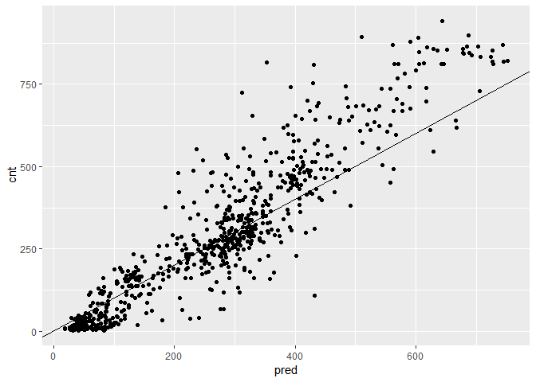
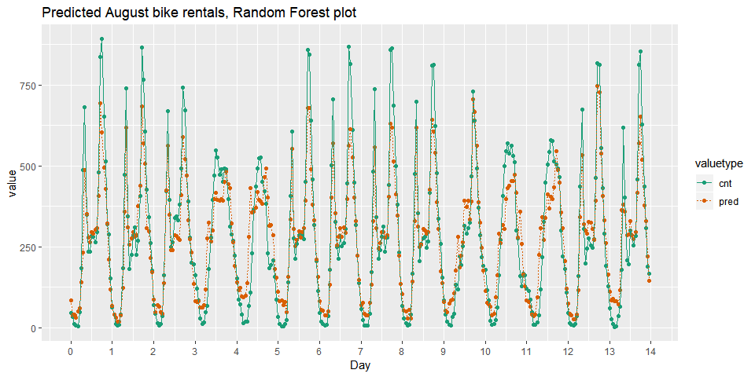

ch005(Tree-Based Method)
================
jakinpilla
2019-12-23

  - [Build a random forest model for bike
    rentals](#build-a-random-forest-model-for-bike-rentals)
  - [Visualize random forest bike model
    predictions](#visualize-random-forest-bike-model-predictions)

``` r
library(tidyverse)
library(broom)
library(gridExtra)
library(psych)
library(WVPlots)
library(mgcv)
library(ranger)
```

### Build a random forest model for bike rentals

You will use the ranger package to fit the random forest model. For this
exercise, the key arguments to the ranger() call are: –formula

–data

  - num.trees: the number of trees in the forest.

  - respect.unordered.factors : Specifies how to treat unordered factor
    variables. We recommend setting this to “order” for regression.

  - seed: because this is a random algorithm, you will set the seed to
    get reproducible results

<!-- end list -->

``` r
load('./data/Bikes.RData')
str(bikesJuly)
```

    ## 'data.frame':    744 obs. of  12 variables:
    ##  $ hr        : Factor w/ 24 levels "0","1","2","3",..: 1 2 3 4 5 6 7 8 9 10 ...
    ##  $ holiday   : logi  FALSE FALSE FALSE FALSE FALSE FALSE ...
    ##  $ workingday: logi  FALSE FALSE FALSE FALSE FALSE FALSE ...
    ##  $ weathersit: chr  "Clear to partly cloudy" "Clear to partly cloudy" "Clear to partly cloudy" "Clear to partly cloudy" ...
    ##  $ temp      : num  0.76 0.74 0.72 0.72 0.7 0.68 0.7 0.74 0.78 0.82 ...
    ##  $ atemp     : num  0.727 0.697 0.697 0.712 0.667 ...
    ##  $ hum       : num  0.66 0.7 0.74 0.84 0.79 0.79 0.79 0.7 0.62 0.56 ...
    ##  $ windspeed : num  0 0.1343 0.0896 0.1343 0.194 ...
    ##  $ cnt       : int  149 93 90 33 4 10 27 50 142 219 ...
    ##  $ instant   : int  13004 13005 13006 13007 13008 13009 13010 13011 13012 13013 ...
    ##  $ mnth      : int  7 7 7 7 7 7 7 7 7 7 ...
    ##  $ yr        : int  1 1 1 1 1 1 1 1 1 1 ...

Random seed to reproduce results

``` r
seed <- 2019
```

The outcome column

``` r
(outcome <- "cnt")
```

    ## [1] "cnt"

The input variables

``` r
(vars <- c("hr", "holiday", "workingday", "weathersit", "temp", "atemp", "hum", "windspeed"))
```

    ## [1] "hr"         "holiday"    "workingday" "weathersit" "temp"      
    ## [6] "atemp"      "hum"        "windspeed"

Create the formula string for bikes rented as a function of the inputs

``` r
(fmla <- paste(outcome, "~", paste(vars, collapse = " + ")))
```

    ## [1] "cnt ~ hr + holiday + workingday + weathersit + temp + atemp + hum + windspeed"

Fit and print the random forest model

``` r
(bike_model_rf <- ranger(fmla, #'formula 
                            bikesJuly, #'data
                            num.trees = 500, 
                            respect.unordered.factors = 'order', 
                            seed = seed))
```

    ## Ranger result
    ## 
    ## Call:
    ##  ranger(fmla, bikesJuly, num.trees = 500, respect.unordered.factors = "order",      seed = seed) 
    ## 
    ## Type:                             Regression 
    ## Number of trees:                  500 
    ## Sample size:                      744 
    ## Number of independent variables:  8 
    ## Mtry:                             2 
    ## Target node size:                 5 
    ## Variable importance mode:         none 
    ## Splitrule:                        variance 
    ## OOB prediction error (MSE):       8293.874 
    ## R squared (OOB):                  0.8191631

Check bikesAugust data

``` r
str(bikesAugust)
```

    ## 'data.frame':    744 obs. of  12 variables:
    ##  $ hr        : Factor w/ 24 levels "0","1","2","3",..: 1 2 3 4 5 6 7 8 9 10 ...
    ##  $ holiday   : logi  FALSE FALSE FALSE FALSE FALSE FALSE ...
    ##  $ workingday: logi  TRUE TRUE TRUE TRUE TRUE TRUE ...
    ##  $ weathersit: chr  "Clear to partly cloudy" "Clear to partly cloudy" "Clear to partly cloudy" "Clear to partly cloudy" ...
    ##  $ temp      : num  0.68 0.66 0.64 0.64 0.64 0.64 0.64 0.64 0.66 0.68 ...
    ##  $ atemp     : num  0.636 0.606 0.576 0.576 0.591 ...
    ##  $ hum       : num  0.79 0.83 0.83 0.83 0.78 0.78 0.78 0.83 0.78 0.74 ...
    ##  $ windspeed : num  0.1642 0.0896 0.1045 0.1045 0.1343 ...
    ##  $ cnt       : int  47 33 13 7 4 49 185 487 681 350 ...
    ##  $ instant   : int  13748 13749 13750 13751 13752 13753 13754 13755 13756 13757 ...
    ##  $ mnth      : int  8 8 8 8 8 8 8 8 8 8 ...
    ##  $ yr        : int  1 1 1 1 1 1 1 1 1 1 ...

bike\_model\_rf is in the workspace

``` r
bike_model_rf
```

    ## Ranger result
    ## 
    ## Call:
    ##  ranger(fmla, bikesJuly, num.trees = 500, respect.unordered.factors = "order",      seed = seed) 
    ## 
    ## Type:                             Regression 
    ## Number of trees:                  500 
    ## Sample size:                      744 
    ## Number of independent variables:  8 
    ## Mtry:                             2 
    ## Target node size:                 5 
    ## Variable importance mode:         none 
    ## Splitrule:                        variance 
    ## OOB prediction error (MSE):       8293.874 
    ## R squared (OOB):                  0.8191631

``` r
predict(bike_model_rf, bikesAugust) %>% str()
```

    ## List of 5
    ##  $ predictions              : num [1:744] 85.1 39 41.3 31.8 50.5 ...
    ##  $ num.trees                : num 500
    ##  $ num.independent.variables: num 8
    ##  $ num.samples              : int 744
    ##  $ treetype                 : chr "Regression"
    ##  - attr(*, "class")= chr "ranger.prediction"

Make predictions on the August data

``` r
bikesAugust$pred <- predict(bike_model_rf, bikesAugust)$predictions
```

Calculate the RMSE of the predictions

``` r
bikesAugust %>% 
  mutate(residual = pred - cnt)  %>% #'calculate the residual
  summarize(rmse  = sqrt(mean(residual^2)))      #'calculate rmse
```

    ##       rmse
    ## 1 97.94339

Plot actual outcome vs predictions (predictions on x-axis)

``` r
ggplot(bikesAugust, aes(x = pred, y = cnt)) + 
  geom_point() + 
  geom_abline()
```

<!-- -->

### Visualize random forest bike model predictions

``` r
first_two_weeks <- bikesAugust %>% 
  # Set start to 0, convert unit to days
  mutate(instant = (instant - min(instant)) / 24) %>% 
  # Gather cnt and pred into a column named value with key valuetype
  gather(key = valuetype, value = value, cnt, pred) %>%
  # Filter for rows in the first two
  filter(instant < 14) 
```

Plot predictions and cnt by date/time

``` r
ggplot(first_two_weeks, aes(x = instant, y = value, color = valuetype, linetype = valuetype)) + 
  geom_point() + 
  geom_line() + 
  scale_x_continuous("Day", breaks = 0:14, labels = 0:14) + 
  scale_color_brewer(palette = "Dark2") + 
  ggtitle("Predicted August bike rentals, Random Forest plot")
```

<!-- -->
