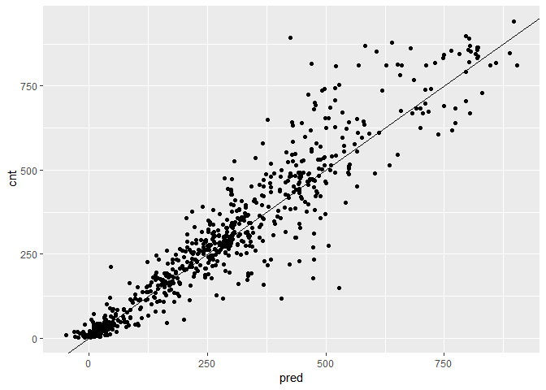
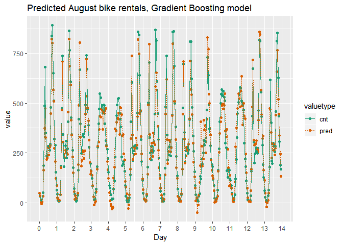

ch005(Tree-Based Method)
================
jakinpilla
2019-12-28

``` r
library(tidyverse)
library(broom)
library(gridExtra)
library(psych)
library(WVPlots)
library(mgcv)
library(ranger)
```

\#\#\#’Build a random forest model for bike rentals

You will use the ranger package to fit the random forest model. For this
exercise, the key arguments to the ranger() call are: –formula

–data

  - num.trees: the number of trees in the forest.

  - respect.unordered.factors : Specifies how to treat unordered factor
    variables. We recommend setting this to “order” for regression.

  - seed: because this is a random algorithm, you will set the seed to
    get reproducible results

<!-- end list -->

``` r
load('./data/Bikes.RData')
str(bikesJuly)
```

    ## 'data.frame':    744 obs. of  12 variables:
    ##  $ hr        : Factor w/ 24 levels "0","1","2","3",..: 1 2 3 4 5 6 7 8 9 10 ...
    ##  $ holiday   : logi  FALSE FALSE FALSE FALSE FALSE FALSE ...
    ##  $ workingday: logi  FALSE FALSE FALSE FALSE FALSE FALSE ...
    ##  $ weathersit: chr  "Clear to partly cloudy" "Clear to partly cloudy" "Clear to partly cloudy" "Clear to partly cloudy" ...
    ##  $ temp      : num  0.76 0.74 0.72 0.72 0.7 0.68 0.7 0.74 0.78 0.82 ...
    ##  $ atemp     : num  0.727 0.697 0.697 0.712 0.667 ...
    ##  $ hum       : num  0.66 0.7 0.74 0.84 0.79 0.79 0.79 0.7 0.62 0.56 ...
    ##  $ windspeed : num  0 0.1343 0.0896 0.1343 0.194 ...
    ##  $ cnt       : int  149 93 90 33 4 10 27 50 142 219 ...
    ##  $ instant   : int  13004 13005 13006 13007 13008 13009 13010 13011 13012 13013 ...
    ##  $ mnth      : int  7 7 7 7 7 7 7 7 7 7 ...
    ##  $ yr        : int  1 1 1 1 1 1 1 1 1 1 ...

Random seed to reproduce results

``` r
seed <- 2019
```

The outcome column

``` r
(outcome <- "cnt")
```

    ## [1] "cnt"

The input variables

``` r
(vars <- c("hr", "holiday", "workingday", "weathersit", "temp", "atemp", "hum", "windspeed"))
```

    ## [1] "hr"         "holiday"    "workingday" "weathersit" "temp"      
    ## [6] "atemp"      "hum"        "windspeed"

Create the formula string for bikes rented as a function of the inputs

``` r
(fmla <- paste(outcome, "~", paste(vars, collapse = " + ")))
```

    ## [1] "cnt ~ hr + holiday + workingday + weathersit + temp + atemp + hum + windspeed"

Fit and print the random forest model

``` r
(bike_model_rf <- ranger(fmla, #'formula 
                            bikesJuly, #'data
                            num.trees = 500, 
                            respect.unordered.factors = 'order', 
                            seed = seed))
```

    ## Ranger result
    ## 
    ## Call:
    ##  ranger(fmla, bikesJuly, num.trees = 500, respect.unordered.factors = "order",      seed = seed) 
    ## 
    ## Type:                             Regression 
    ## Number of trees:                  500 
    ## Sample size:                      744 
    ## Number of independent variables:  8 
    ## Mtry:                             2 
    ## Target node size:                 5 
    ## Variable importance mode:         none 
    ## Splitrule:                        variance 
    ## OOB prediction error (MSE):       8293.874 
    ## R squared (OOB):                  0.8191631

Check bikesAugust data

``` r
str(bikesAugust)
```

    ## 'data.frame':    744 obs. of  12 variables:
    ##  $ hr        : Factor w/ 24 levels "0","1","2","3",..: 1 2 3 4 5 6 7 8 9 10 ...
    ##  $ holiday   : logi  FALSE FALSE FALSE FALSE FALSE FALSE ...
    ##  $ workingday: logi  TRUE TRUE TRUE TRUE TRUE TRUE ...
    ##  $ weathersit: chr  "Clear to partly cloudy" "Clear to partly cloudy" "Clear to partly cloudy" "Clear to partly cloudy" ...
    ##  $ temp      : num  0.68 0.66 0.64 0.64 0.64 0.64 0.64 0.64 0.66 0.68 ...
    ##  $ atemp     : num  0.636 0.606 0.576 0.576 0.591 ...
    ##  $ hum       : num  0.79 0.83 0.83 0.83 0.78 0.78 0.78 0.83 0.78 0.74 ...
    ##  $ windspeed : num  0.1642 0.0896 0.1045 0.1045 0.1343 ...
    ##  $ cnt       : int  47 33 13 7 4 49 185 487 681 350 ...
    ##  $ instant   : int  13748 13749 13750 13751 13752 13753 13754 13755 13756 13757 ...
    ##  $ mnth      : int  8 8 8 8 8 8 8 8 8 8 ...
    ##  $ yr        : int  1 1 1 1 1 1 1 1 1 1 ...

bike\_model\_rf is in the workspace

``` r
bike_model_rf
```

    ## Ranger result
    ## 
    ## Call:
    ##  ranger(fmla, bikesJuly, num.trees = 500, respect.unordered.factors = "order",      seed = seed) 
    ## 
    ## Type:                             Regression 
    ## Number of trees:                  500 
    ## Sample size:                      744 
    ## Number of independent variables:  8 
    ## Mtry:                             2 
    ## Target node size:                 5 
    ## Variable importance mode:         none 
    ## Splitrule:                        variance 
    ## OOB prediction error (MSE):       8293.874 
    ## R squared (OOB):                  0.8191631

``` r
predict(bike_model_rf, bikesAugust) %>% str()
```

    ## List of 5
    ##  $ predictions              : num [1:744] 85.1 39 41.3 31.8 50.5 ...
    ##  $ num.trees                : num 500
    ##  $ num.independent.variables: num 8
    ##  $ num.samples              : int 744
    ##  $ treetype                 : chr "Regression"
    ##  - attr(*, "class")= chr "ranger.prediction"

Make predictions on the August data

``` r
bikesAugust$pred <- predict(bike_model_rf, bikesAugust)$predictions
```

Calculate the RMSE of the predictions

``` r
bikesAugust %>% 
  mutate(residual = pred - cnt)  %>% #'calculate the residual
  summarize(rmse  = sqrt(mean(residual^2)))      #'calculate rmse
```

    ##       rmse
    ## 1 97.94339

Plot actual outcome vs predictions (predictions on x-axis)

``` r
ggplot(bikesAugust, aes(x = pred, y = cnt)) + 
  geom_point() + 
  geom_abline()
```

<!-- -->

\#\#\#’Visualize random forest bike model predictions

``` r
first_two_weeks <- bikesAugust %>% 
  #'Set start to 0, convert unit to days
  mutate(instant = (instant - min(instant)) / 24) %>% 
  #'Gather cnt and pred into a column named value with key valuetype
  gather(key = valuetype, value = value, cnt, pred) %>%
  #'Filter for rows in the first two
  filter(instant < 14) 
```

Plot predictions and cnt by date/time

``` r
ggplot(first_two_weeks, aes(x = instant, y = value, color = valuetype, linetype = valuetype)) + 
  geom_point() + 
  geom_line() + 
  scale_x_continuous("Day", breaks = 0:14, labels = 0:14) + 
  scale_color_brewer(palette = "Dark2") + 
  ggtitle("Predicted August bike rentals, Random Forest plot")
```

<!-- -->

The random forest model captured the day-to-day variations in peak
demand better than the quasipoisson model, but it still underestmates
peak demand, and also overestimates minimum demand. So there is still
room for improvement.

dframe …

``` r
popularity <- rnorm(10, 1, .4)
color <- c('b', 'r', 'r', 'r', 'r', 'b', 'r', 'g', 'b', 'b')
size <- c(13, 11, 15, 14, 13, 11, 9, 12, 7, 12)

dframe <- data.frame(
  color = color, 
  size= size,
  popularity = popularity
)

dframe
```

    ##    color size popularity
    ## 1      b   13  1.2288269
    ## 2      r   11  0.8593575
    ## 3      r   15  1.0325833
    ## 4      r   14  0.7522794
    ## 5      r   13  1.0946288
    ## 6      b   11  0.8019864
    ## 7      r    9  0.8905707
    ## 8      g   12  0.8208742
    ## 9      b    7  1.3350487
    ## 10     b   12  1.1495311

Create and print a vector of variable names

``` r
(vars <- c('color', 'size'))
```

    ## [1] "color" "size"

Load the package vtreat

``` r
library(vtreat)
```

    ## Warning: package 'vtreat' was built under R version 3.5.3

``` r
library(magrittr)
```

    ## 
    ## Attaching package: 'magrittr'

    ## The following object is masked from 'package:purrr':
    ## 
    ##     set_names

    ## The following object is masked from 'package:tidyr':
    ## 
    ##     extract

Create the treatment plan

``` r
treatplan <- designTreatmentsZ(dframe, vars)
```

    ## [1] "vtreat 1.4.8 inspecting inputs Sat Dec 28 08:57:22 2019"
    ## [1] "designing treatments Sat Dec 28 08:57:22 2019"
    ## [1] " have initial level statistics Sat Dec 28 08:57:22 2019"
    ## [1] " scoring treatments Sat Dec 28 08:57:22 2019"
    ## [1] "have treatment plan Sat Dec 28 08:57:22 2019"

``` r
treatplan %>% str()
```

    ## List of 8
    ##  $ treatments   :List of 3
    ##   ..$ :List of 12
    ##   .. ..$ origvar          : chr "color"
    ##   .. ..$ newvars          : chr [1:3] "color_lev_x_b" "color_lev_x_g" "color_lev_x_r"
    ##   .. ..$ f                :function (col, args, doCollar)  
    ##   .. ..$ args             :List of 2
    ##   .. .. ..$ tracked       : chr [1:3] "x b" "x g" "x r"
    ##   .. .. ..$ levRestriction:List of 3
    ##   .. .. .. ..$ safeLevs     : chr [1:3] "x b" "x g" "x r"
    ##   .. .. .. ..$ supressedLevs: chr(0) 
    ##   .. .. .. ..$ tracked      : chr [1:3] "x b" "x g" "x r"
    ##   .. ..$ treatmentName    : chr "Categoric Indicators"
    ##   .. ..$ treatmentCode    : chr "lev"
    ##   .. ..$ needsSplit       : logi FALSE
    ##   .. ..$ extraModelDegrees: num 0
    ##   .. ..$ origType         : chr "integer"
    ##   .. ..$ origClass        : chr "factor"
    ##   .. ..$ convertedColClass: chr "character"
    ##   .. ..$ scales           :'data.frame': 3 obs. of  5 variables:
    ##   .. .. ..$ varName: chr [1:3] "color_lev_x_b" "color_lev_x_g" "color_lev_x_r"
    ##   .. .. ..$ a      : num [1:3] 0 0 0
    ##   .. .. ..$ b      : num [1:3] 0 0 0
    ##   .. .. ..$ rsq    : num [1:3] 0 0 0
    ##   .. .. ..$ sig    : num [1:3] 1 1 1
    ##   .. ..- attr(*, "class")= chr [1:2] "vtreat_cat_ind" "vtreatment"
    ##   ..$ :List of 12
    ##   .. ..$ origvar          : chr "color"
    ##   .. ..$ newvars          : chr "color_catP"
    ##   .. ..$ f                :function (col, args, doCollar)  
    ##   .. ..$ args             :List of 3
    ##   .. .. ..$ scores        :List of 3
    ##   .. .. .. ..$ x b: num 0.4
    ##   .. .. .. ..$ x g: num 0.1
    ##   .. .. .. ..$ x r: num 0.5
    ##   .. .. ..$ levRestriction:List of 3
    ##   .. .. .. ..$ safeLevs     : chr [1:3] "x b" "x g" "x r"
    ##   .. .. .. ..$ supressedLevs: chr(0) 
    ##   .. .. .. ..$ tracked      : chr [1:3] "x b" "x g" "x r"
    ##   .. .. ..$ rare_score    : num 0.05
    ##   .. ..$ treatmentName    : chr "Prevalence Code"
    ##   .. ..$ treatmentCode    : chr "catP"
    ##   .. ..$ needsSplit       : logi TRUE
    ##   .. ..$ extraModelDegrees: num 2
    ##   .. ..$ scales           :'data.frame': 1 obs. of  5 variables:
    ##   .. .. ..$ varName: chr "color_catP"
    ##   .. .. ..$ a      : num 0
    ##   .. .. ..$ b      : num 0
    ##   .. .. ..$ rsq    : num 0
    ##   .. .. ..$ sig    : num 1
    ##   .. ..$ origType         : chr "integer"
    ##   .. ..$ origClass        : chr "factor"
    ##   .. ..$ convertedColClass: chr "character"
    ##   .. ..- attr(*, "class")= chr [1:2] "vtreat_cat_p" "vtreatment"
    ##   ..$ :List of 12
    ##   .. ..$ origvar          : chr "size"
    ##   .. ..$ newvars          : chr "size"
    ##   .. ..$ f                :function (col, args, doCollar)  
    ##   .. ..$ args             :List of 2
    ##   .. .. ..$ nadist: num 11.7
    ##   .. .. ..$ cuts  : num [1:2] 7 15
    ##   .. ..$ treatmentName    : chr "Scalable pass through"
    ##   .. ..$ treatmentCode    : chr "clean"
    ##   .. ..$ needsSplit       : logi FALSE
    ##   .. ..$ extraModelDegrees: num 0
    ##   .. ..$ scales           :'data.frame': 1 obs. of  5 variables:
    ##   .. .. ..$ varName: chr "size"
    ##   .. .. ..$ a      : num 0
    ##   .. .. ..$ b      : num 0
    ##   .. .. ..$ rsq    : num 0
    ##   .. .. ..$ sig    : num 1
    ##   .. ..$ origType         : chr "double"
    ##   .. ..$ origClass        : chr "numeric"
    ##   .. ..$ convertedColClass: chr "numeric"
    ##   .. ..- attr(*, "class")= chr [1:2] "vtreat_pass_through" "vtreatment"
    ##  $ scoreFrame   :'data.frame':   5 obs. of  8 variables:
    ##   ..$ varName          : chr [1:5] "color_catP" "size" "color_lev_x_b" "color_lev_x_g" ...
    ##   ..$ varMoves         : logi [1:5] TRUE TRUE TRUE TRUE TRUE
    ##   ..$ rsq              : num [1:5] 0 0 0 0 0
    ##   ..$ sig              : num [1:5] 1 1 1 1 1
    ##   ..$ needsSplit       : logi [1:5] TRUE FALSE FALSE FALSE FALSE
    ##   ..$ extraModelDegrees: num [1:5] 2 0 0 0 0
    ##   ..$ origName         : chr [1:5] "color" "size" "color" "color" ...
    ##   ..$ code             : chr [1:5] "catP" "clean" "lev" "lev" ...
    ##  $ outcomename  : chr "VTREATTEMPCOL_1"
    ##  $ vtreatVersion:Classes 'package_version', 'numeric_version'  hidden list of 1
    ##   ..$ : int [1:3] 1 4 8
    ##  $ outcomeType  : chr "None"
    ##  $ outcomeTarget: chr "VTREATTEMPCOL_1"
    ##  $ meanY        : logi NA
    ##  $ splitmethod  : chr "Notcross"
    ##  - attr(*, "class")= chr "treatmentplan"

``` r
treatplan %>%
  magrittr::use_series(scoreFrame) # use_series() is an alias for $ that you can pipe...
```

    ##         varName varMoves rsq sig needsSplit extraModelDegrees origName
    ## 1    color_catP     TRUE   0   1       TRUE                 2    color
    ## 2          size     TRUE   0   1      FALSE                 0     size
    ## 3 color_lev_x_b     TRUE   0   1      FALSE                 0    color
    ## 4 color_lev_x_g     TRUE   0   1      FALSE                 0    color
    ## 5 color_lev_x_r     TRUE   0   1      FALSE                 0    color
    ##    code
    ## 1  catP
    ## 2 clean
    ## 3   lev
    ## 4   lev
    ## 5   lev

Examine the scoreFrame

``` r
(scoreFrame <- treatplan %>%
    magrittr::use_series(scoreFrame) %>%
    select(varName, origName, code))
```

    ##         varName origName  code
    ## 1    color_catP    color  catP
    ## 2          size     size clean
    ## 3 color_lev_x_b    color   lev
    ## 4 color_lev_x_g    color   lev
    ## 5 color_lev_x_r    color   lev

We only want the rows with codes “clean” or “lev”

``` r
(newvars <- scoreFrame %>%
    filter(code %in% c('clean', 'lev')) %>%
    use_series(varName))
```

    ## [1] "size"          "color_lev_x_b" "color_lev_x_g" "color_lev_x_r"

Create the treated training data

``` r
(dframe.treat <- prepare(treatplan, dframe, varRestriction = newvars))
```

    ##    size color_lev_x_b color_lev_x_g color_lev_x_r
    ## 1    13             1             0             0
    ## 2    11             0             0             1
    ## 3    15             0             0             1
    ## 4    14             0             0             1
    ## 5    13             0             0             1
    ## 6    11             1             0             0
    ## 7     9             0             0             1
    ## 8    12             0             1             0
    ## 9     7             1             0             0
    ## 10   12             1             0             0

practice data preprocessing with

``` r
library(RMySQL)
```

    ## Loading required package: DBI

``` r
library(DBI)

rm(con)
```

    ## Warning in rm(con): 객체 'con'를 찾을 수 없습니다

``` r
con <- dbConnect(
  RMySQL::MySQL(),
  user = "root", 
  password = "chr0n3!7!",
  dbname = 'adult'
)


# https://stackoverflow.com/questions/50745431/trying-to-use-r-with-mysql-the-used-command-is-not-allowed-with-this-mysql-vers?rq=1

# The following steps should fix the dbWritetable() error in R:
#   
#   Login MySQL terminal by typing "MySQL -u user -p*" (followed by user password if you set one).
# 
# Type "SET GLOBAL local_infile = true;" in the MySQL terminal command.
# 
# Lastly, type "SHOW GLOBAL VARIABLES LIKE 'local_infile';" into the terminal and check the command line output for the ON status.
# 
# I'm not sure why the database function fails from MySQL 5.6 to 8.0, however, "local_infile" enables user access to data loads from local sources--- this solution should work for all database interference stacks (R, Python, etc)!

# dbWriteTable(con, "adult", adult, overwrite = TRUE)


adult <- dbSendQuery(con, "SELECT * FROM adult")

dbClearResult(dbListResults(con)[[1]])
```

    ## [1] TRUE

``` r
tbl(con, "adult") %>%
  select(age, education, race, capital_gain) %>%
  group_by(race) %>%
  summarise(sum_capital_gain = sum(capital_gain)) -> ql

show_query(ql)
```

    ## <SQL>

    ## Warning: `overscope_eval_next()` is deprecated as of rlang 0.2.0.
    ## Please use `eval_tidy()` with a data mask instead.
    ## This warning is displayed once per session.

    ## Warning: Missing values are always removed in SQL.
    ## Use `SUM(x, na.rm = TRUE)` to silence this warning
    ## This warning is displayed only once per session.

    ## Warning: `overscope_clean()` is deprecated as of rlang 0.2.0.
    ## This warning is displayed once per session.

    ## SELECT `race`, SUM(`capital_gain`) AS `sum_capital_gain`
    ## FROM (SELECT `age`, `education`, `race`, `capital_gain`
    ## FROM `adult`) `dbplyr_001`
    ## GROUP BY `race`

``` r
tbl(con, "adult") %>%
  select(-row_names) -> adult

adult %>% as_tibble() -> adult_data

adult_data %>% head
```

    ## # A tibble: 6 x 15
    ##     age workclass fnlwgt education education_num marital_status occupation
    ##   <dbl> <chr>      <dbl> <chr>             <dbl> <chr>          <chr>     
    ## 1    39 State-gov  77516 Bachelors            13 Never-married  Adm-cleri~
    ## 2    50 Self-emp~  83311 Bachelors            13 Married-civ-s~ Exec-mana~
    ## 3    38 Private   215646 HS-grad               9 Divorced       Handlers-~
    ## 4    53 Private   234721 11th                  7 Married-civ-s~ Handlers-~
    ## 5    28 Private   338409 Bachelors            13 Married-civ-s~ Prof-spec~
    ## 6    37 Private   284582 Masters              14 Married-civ-s~ Exec-mana~
    ## # ... with 8 more variables: relationship <chr>, race <chr>, sex <chr>,
    ## #   capital_gain <dbl>, capital_loss <dbl>, hours_per_week <dbl>,
    ## #   native_country <chr>, wage <chr>

``` r
adult_data %>% str()
```

    ## Classes 'tbl_df', 'tbl' and 'data.frame':    32561 obs. of  15 variables:
    ##  $ age           : num  39 50 38 53 28 37 49 52 31 42 ...
    ##  $ workclass     : chr  "State-gov" "Self-emp-not-inc" "Private" "Private" ...
    ##  $ fnlwgt        : num  77516 83311 215646 234721 338409 ...
    ##  $ education     : chr  "Bachelors" "Bachelors" "HS-grad" "11th" ...
    ##  $ education_num : num  13 13 9 7 13 14 5 9 14 13 ...
    ##  $ marital_status: chr  "Never-married" "Married-civ-spouse" "Divorced" "Married-civ-spouse" ...
    ##  $ occupation    : chr  "Adm-clerical" "Exec-managerial" "Handlers-cleaners" "Handlers-cleaners" ...
    ##  $ relationship  : chr  "Not-in-family" "Husband" "Not-in-family" "Husband" ...
    ##  $ race          : chr  "White" "White" "White" "Black" ...
    ##  $ sex           : chr  "Male" "Male" "Male" "Male" ...
    ##  $ capital_gain  : num  2174 0 0 0 0 ...
    ##  $ capital_loss  : num  0 0 0 0 0 0 0 0 0 0 ...
    ##  $ hours_per_week: num  40 13 40 40 40 40 16 45 50 40 ...
    ##  $ native_country: chr  "United-States" "United-States" "United-States" "United-States" ...
    ##  $ wage          : chr  "<=50K" "<=50K" "<=50K" "<=50K" ...

treatplan is in the workspace

``` r
summary(treatplan)
```

    ##               Length Class           Mode     
    ## treatments    3      -none-          list     
    ## scoreFrame    8      data.frame      list     
    ## outcomename   1      -none-          character
    ## vtreatVersion 1      package_version list     
    ## outcomeType   1      -none-          character
    ## outcomeTarget 1      -none-          character
    ## meanY         1      -none-          logical  
    ## splitmethod   1      -none-          character

newvars is in the workspace

``` r
newvars
```

    ## [1] "size"          "color_lev_x_b" "color_lev_x_g" "color_lev_x_r"

``` r
popularity <- rnorm(10, 1, .4)
color <- c('g', 'g', 'y', 'g', 'g', 'y', 'b', 'g', 'g', 'r')
size <- c(7, 8, 10, 12, 6, 8, 12, 12, 12, 8)

data.frame(
  color = color, 
  size = size, 
  popularity = popularity
) -> testframe
```

Print dframe and testframe

``` r
print(dframe)
```

    ##    color size popularity
    ## 1      b   13  1.2288269
    ## 2      r   11  0.8593575
    ## 3      r   15  1.0325833
    ## 4      r   14  0.7522794
    ## 5      r   13  1.0946288
    ## 6      b   11  0.8019864
    ## 7      r    9  0.8905707
    ## 8      g   12  0.8208742
    ## 9      b    7  1.3350487
    ## 10     b   12  1.1495311

``` r
print(testframe)
```

    ##    color size popularity
    ## 1      g    7 1.64823607
    ## 2      g    8 1.27882794
    ## 3      y   10 0.08188231
    ## 4      g   12 0.54631304
    ## 5      g    6 1.51173517
    ## 6      y    8 1.32172144
    ## 7      b   12 0.72086578
    ## 8      g   12 1.13571560
    ## 9      g   12 1.28788255
    ## 10     r    8 0.82011038

Use prepare() to one-hot-encode testframe

``` r
(testframe.treat <- prepare(treatplan, testframe, varRestriction = newvars))
```

    ##    size color_lev_x_b color_lev_x_g color_lev_x_r
    ## 1     7             0             1             0
    ## 2     8             0             1             0
    ## 3    10             0             0             0
    ## 4    12             0             1             0
    ## 5     6             0             1             0
    ## 6     8             0             0             0
    ## 7    12             1             0             0
    ## 8    12             0             1             0
    ## 9    12             0             1             0
    ## 10    8             0             0             1

The outcome column

``` r
(outcome <- "cnt")
```

    ## [1] "cnt"

The input columns

``` r
(vars <- c("hr", "holiday", "workingday", "weathersit", "temp", "atemp", "hum", "windspeed"))
```

    ## [1] "hr"         "holiday"    "workingday" "weathersit" "temp"      
    ## [6] "atemp"      "hum"        "windspeed"

Load the package vtreat

``` r
library(vtreat)
```

Create the treatment plan from bikesJuly (the training data)

``` r
treatplan <- designTreatmentsZ(bikesJuly, vars, verbose = FALSE)
```

Get the “clean” and “lev” variables from the scoreFrame

``` r
(newvars <- treatplan %>%
    use_series(scoreFrame) %>%        
    filter(code %in% c('clean', 'lev')) %>%  #' get the rows you care about
    use_series(varName))           #' get the varName column
```

    ##  [1] "holiday"                                
    ##  [2] "workingday"                             
    ##  [3] "temp"                                   
    ##  [4] "atemp"                                  
    ##  [5] "hum"                                    
    ##  [6] "windspeed"                              
    ##  [7] "hr_lev_x_0"                             
    ##  [8] "hr_lev_x_1"                             
    ##  [9] "hr_lev_x_10"                            
    ## [10] "hr_lev_x_11"                            
    ## [11] "hr_lev_x_12"                            
    ## [12] "hr_lev_x_13"                            
    ## [13] "hr_lev_x_14"                            
    ## [14] "hr_lev_x_15"                            
    ## [15] "hr_lev_x_16"                            
    ## [16] "hr_lev_x_17"                            
    ## [17] "hr_lev_x_18"                            
    ## [18] "hr_lev_x_19"                            
    ## [19] "hr_lev_x_2"                             
    ## [20] "hr_lev_x_20"                            
    ## [21] "hr_lev_x_21"                            
    ## [22] "hr_lev_x_22"                            
    ## [23] "hr_lev_x_23"                            
    ## [24] "hr_lev_x_3"                             
    ## [25] "hr_lev_x_4"                             
    ## [26] "hr_lev_x_5"                             
    ## [27] "hr_lev_x_6"                             
    ## [28] "hr_lev_x_7"                             
    ## [29] "hr_lev_x_8"                             
    ## [30] "hr_lev_x_9"                             
    ## [31] "weathersit_lev_x_Clear_to_partly_cloudy"
    ## [32] "weathersit_lev_x_Light_Precipitation"   
    ## [33] "weathersit_lev_x_Misty"

Prepare the training data

``` r
bikesJuly.treat <- prepare(treatplan, bikesJuly,  varRestriction = newvars)
```

Prepare the test data

``` r
bikesAugust.treat <- prepare(treatplan, bikesAugust,  varRestriction = newvars)
```

Call str() on the treated data

``` r
str(bikesJuly.treat)
```

    ## 'data.frame':    744 obs. of  33 variables:
    ##  $ holiday                                : num  0 0 0 0 0 0 0 0 0 0 ...
    ##  $ workingday                             : num  0 0 0 0 0 0 0 0 0 0 ...
    ##  $ temp                                   : num  0.76 0.74 0.72 0.72 0.7 0.68 0.7 0.74 0.78 0.82 ...
    ##  $ atemp                                  : num  0.727 0.697 0.697 0.712 0.667 ...
    ##  $ hum                                    : num  0.66 0.7 0.74 0.84 0.79 0.79 0.79 0.7 0.62 0.56 ...
    ##  $ windspeed                              : num  0 0.1343 0.0896 0.1343 0.194 ...
    ##  $ hr_lev_x_0                             : num  1 0 0 0 0 0 0 0 0 0 ...
    ##  $ hr_lev_x_1                             : num  0 1 0 0 0 0 0 0 0 0 ...
    ##  $ hr_lev_x_10                            : num  0 0 0 0 0 0 0 0 0 0 ...
    ##  $ hr_lev_x_11                            : num  0 0 0 0 0 0 0 0 0 0 ...
    ##  $ hr_lev_x_12                            : num  0 0 0 0 0 0 0 0 0 0 ...
    ##  $ hr_lev_x_13                            : num  0 0 0 0 0 0 0 0 0 0 ...
    ##  $ hr_lev_x_14                            : num  0 0 0 0 0 0 0 0 0 0 ...
    ##  $ hr_lev_x_15                            : num  0 0 0 0 0 0 0 0 0 0 ...
    ##  $ hr_lev_x_16                            : num  0 0 0 0 0 0 0 0 0 0 ...
    ##  $ hr_lev_x_17                            : num  0 0 0 0 0 0 0 0 0 0 ...
    ##  $ hr_lev_x_18                            : num  0 0 0 0 0 0 0 0 0 0 ...
    ##  $ hr_lev_x_19                            : num  0 0 0 0 0 0 0 0 0 0 ...
    ##  $ hr_lev_x_2                             : num  0 0 1 0 0 0 0 0 0 0 ...
    ##  $ hr_lev_x_20                            : num  0 0 0 0 0 0 0 0 0 0 ...
    ##  $ hr_lev_x_21                            : num  0 0 0 0 0 0 0 0 0 0 ...
    ##  $ hr_lev_x_22                            : num  0 0 0 0 0 0 0 0 0 0 ...
    ##  $ hr_lev_x_23                            : num  0 0 0 0 0 0 0 0 0 0 ...
    ##  $ hr_lev_x_3                             : num  0 0 0 1 0 0 0 0 0 0 ...
    ##  $ hr_lev_x_4                             : num  0 0 0 0 1 0 0 0 0 0 ...
    ##  $ hr_lev_x_5                             : num  0 0 0 0 0 1 0 0 0 0 ...
    ##  $ hr_lev_x_6                             : num  0 0 0 0 0 0 1 0 0 0 ...
    ##  $ hr_lev_x_7                             : num  0 0 0 0 0 0 0 1 0 0 ...
    ##  $ hr_lev_x_8                             : num  0 0 0 0 0 0 0 0 1 0 ...
    ##  $ hr_lev_x_9                             : num  0 0 0 0 0 0 0 0 0 1 ...
    ##  $ weathersit_lev_x_Clear_to_partly_cloudy: num  1 1 1 1 1 1 1 1 1 1 ...
    ##  $ weathersit_lev_x_Light_Precipitation   : num  0 0 0 0 0 0 0 0 0 0 ...
    ##  $ weathersit_lev_x_Misty                 : num  0 0 0 0 0 0 0 0 0 0 ...

``` r
str(bikesAugust.treat)
```

    ## 'data.frame':    744 obs. of  33 variables:
    ##  $ holiday                                : num  0 0 0 0 0 0 0 0 0 0 ...
    ##  $ workingday                             : num  1 1 1 1 1 1 1 1 1 1 ...
    ##  $ temp                                   : num  0.68 0.66 0.64 0.64 0.64 0.64 0.64 0.64 0.66 0.68 ...
    ##  $ atemp                                  : num  0.636 0.606 0.576 0.576 0.591 ...
    ##  $ hum                                    : num  0.79 0.83 0.83 0.83 0.78 0.78 0.78 0.83 0.78 0.74 ...
    ##  $ windspeed                              : num  0.1642 0.0896 0.1045 0.1045 0.1343 ...
    ##  $ hr_lev_x_0                             : num  1 0 0 0 0 0 0 0 0 0 ...
    ##  $ hr_lev_x_1                             : num  0 1 0 0 0 0 0 0 0 0 ...
    ##  $ hr_lev_x_10                            : num  0 0 0 0 0 0 0 0 0 0 ...
    ##  $ hr_lev_x_11                            : num  0 0 0 0 0 0 0 0 0 0 ...
    ##  $ hr_lev_x_12                            : num  0 0 0 0 0 0 0 0 0 0 ...
    ##  $ hr_lev_x_13                            : num  0 0 0 0 0 0 0 0 0 0 ...
    ##  $ hr_lev_x_14                            : num  0 0 0 0 0 0 0 0 0 0 ...
    ##  $ hr_lev_x_15                            : num  0 0 0 0 0 0 0 0 0 0 ...
    ##  $ hr_lev_x_16                            : num  0 0 0 0 0 0 0 0 0 0 ...
    ##  $ hr_lev_x_17                            : num  0 0 0 0 0 0 0 0 0 0 ...
    ##  $ hr_lev_x_18                            : num  0 0 0 0 0 0 0 0 0 0 ...
    ##  $ hr_lev_x_19                            : num  0 0 0 0 0 0 0 0 0 0 ...
    ##  $ hr_lev_x_2                             : num  0 0 1 0 0 0 0 0 0 0 ...
    ##  $ hr_lev_x_20                            : num  0 0 0 0 0 0 0 0 0 0 ...
    ##  $ hr_lev_x_21                            : num  0 0 0 0 0 0 0 0 0 0 ...
    ##  $ hr_lev_x_22                            : num  0 0 0 0 0 0 0 0 0 0 ...
    ##  $ hr_lev_x_23                            : num  0 0 0 0 0 0 0 0 0 0 ...
    ##  $ hr_lev_x_3                             : num  0 0 0 1 0 0 0 0 0 0 ...
    ##  $ hr_lev_x_4                             : num  0 0 0 0 1 0 0 0 0 0 ...
    ##  $ hr_lev_x_5                             : num  0 0 0 0 0 1 0 0 0 0 ...
    ##  $ hr_lev_x_6                             : num  0 0 0 0 0 0 1 0 0 0 ...
    ##  $ hr_lev_x_7                             : num  0 0 0 0 0 0 0 1 0 0 ...
    ##  $ hr_lev_x_8                             : num  0 0 0 0 0 0 0 0 1 0 ...
    ##  $ hr_lev_x_9                             : num  0 0 0 0 0 0 0 0 0 1 ...
    ##  $ weathersit_lev_x_Clear_to_partly_cloudy: num  1 1 1 1 0 0 1 0 0 0 ...
    ##  $ weathersit_lev_x_Light_Precipitation   : num  0 0 0 0 0 0 0 0 0 0 ...
    ##  $ weathersit_lev_x_Misty                 : num  0 0 0 0 1 1 0 1 1 1 ...

GBM

The July data is in the workspace

``` r
ls()
```

    ##  [1] "adult"             "adult_data"        "bike_model_rf"    
    ##  [4] "bikesAugust"       "bikesAugust.treat" "bikesJuly"        
    ##  [7] "bikesJuly.treat"   "color"             "con"              
    ## [10] "dframe"            "dframe.treat"      "first_two_weeks"  
    ## [13] "fmla"              "newvars"           "outcome"          
    ## [16] "popularity"        "ql"                "scoreFrame"       
    ## [19] "seed"              "size"              "testframe"        
    ## [22] "testframe.treat"   "treatplan"         "vars"

Load the package xgboost

``` r
library(xgboost)
```

    ## Warning: package 'xgboost' was built under R version 3.5.3

    ## 
    ## Attaching package: 'xgboost'

    ## The following object is masked from 'package:dplyr':
    ## 
    ##     slice

Run xgb.cv

``` r
cv <- xgb.cv(data = as.matrix(bikesJuly.treat), 
             label = bikesJuly$cnt,
             nrounds = 100,
             nfold = 5,
             objective = "reg:linear",
             eta = .3,
             max_depth = 6,
             early_stopping_rounds = 10,
             verbose = 0    #' silent
)
```

Get the evaluation log

``` r
elog <- cv$evaluation_log
```

Determine and print how many trees minimize training and test error

``` r
elog %>% 
  summarize(ntrees.train = which.min(train_rmse_mean),   #' find the index of min(train_rmse_mean)
            ntrees.test  = which.min(test_rmse_mean))   #' find the index of min(test_rmse_mean)
```

    ##   ntrees.train ntrees.test
    ## 1           87          77

Examine the workspace

``` r
ls()
```

    ##  [1] "adult"             "adult_data"        "bike_model_rf"    
    ##  [4] "bikesAugust"       "bikesAugust.treat" "bikesJuly"        
    ##  [7] "bikesJuly.treat"   "color"             "con"              
    ## [10] "cv"                "dframe"            "dframe.treat"     
    ## [13] "elog"              "first_two_weeks"   "fmla"             
    ## [16] "newvars"           "outcome"           "popularity"       
    ## [19] "ql"                "scoreFrame"        "seed"             
    ## [22] "size"              "testframe"         "testframe.treat"  
    ## [25] "treatplan"         "vars"

The number of trees to use, as determined by xgb.cv

``` r
ntrees <- 84

head(bikesJuly.treat)
```

    ##   holiday workingday temp  atemp  hum windspeed hr_lev_x_0 hr_lev_x_1
    ## 1       0          0 0.76 0.7273 0.66    0.0000          1          0
    ## 2       0          0 0.74 0.6970 0.70    0.1343          0          1
    ## 3       0          0 0.72 0.6970 0.74    0.0896          0          0
    ## 4       0          0 0.72 0.7121 0.84    0.1343          0          0
    ## 5       0          0 0.70 0.6667 0.79    0.1940          0          0
    ## 6       0          0 0.68 0.6364 0.79    0.1045          0          0
    ##   hr_lev_x_10 hr_lev_x_11 hr_lev_x_12 hr_lev_x_13 hr_lev_x_14 hr_lev_x_15
    ## 1           0           0           0           0           0           0
    ## 2           0           0           0           0           0           0
    ## 3           0           0           0           0           0           0
    ## 4           0           0           0           0           0           0
    ## 5           0           0           0           0           0           0
    ## 6           0           0           0           0           0           0
    ##   hr_lev_x_16 hr_lev_x_17 hr_lev_x_18 hr_lev_x_19 hr_lev_x_2 hr_lev_x_20
    ## 1           0           0           0           0          0           0
    ## 2           0           0           0           0          0           0
    ## 3           0           0           0           0          1           0
    ## 4           0           0           0           0          0           0
    ## 5           0           0           0           0          0           0
    ## 6           0           0           0           0          0           0
    ##   hr_lev_x_21 hr_lev_x_22 hr_lev_x_23 hr_lev_x_3 hr_lev_x_4 hr_lev_x_5
    ## 1           0           0           0          0          0          0
    ## 2           0           0           0          0          0          0
    ## 3           0           0           0          0          0          0
    ## 4           0           0           0          1          0          0
    ## 5           0           0           0          0          1          0
    ## 6           0           0           0          0          0          1
    ##   hr_lev_x_6 hr_lev_x_7 hr_lev_x_8 hr_lev_x_9
    ## 1          0          0          0          0
    ## 2          0          0          0          0
    ## 3          0          0          0          0
    ## 4          0          0          0          0
    ## 5          0          0          0          0
    ## 6          0          0          0          0
    ##   weathersit_lev_x_Clear_to_partly_cloudy
    ## 1                                       1
    ## 2                                       1
    ## 3                                       1
    ## 4                                       1
    ## 5                                       1
    ## 6                                       1
    ##   weathersit_lev_x_Light_Precipitation weathersit_lev_x_Misty
    ## 1                                    0                      0
    ## 2                                    0                      0
    ## 3                                    0                      0
    ## 4                                    0                      0
    ## 5                                    0                      0
    ## 6                                    0                      0

Run xgboost

``` r
bike_model_xgb <- xgboost(data = as.matrix(bikesJuly.treat), #' training data as matrix
                          label = bikesJuly$cnt,  #' column of outcomes
                   nrounds = ntrees,       #' number of trees to build
                   objective = 'reg:linear', #' objective
                   eta = .3,
                   depth = 6,
                   verbose = 0  #' silent
)
```

Make predictions

``` r
bikesAugust$pred <- predict(bike_model_xgb, as.matrix(bikesAugust.treat))
```

Plot predictions (on x axis) vs actual bike rental count

``` r
ggplot(bikesAugust, aes(x = pred, y = cnt)) + 
  geom_point() + 
  geom_abline()
```

<!-- -->

bikesAugust is in the workspace

``` r
str(bikesAugust)
```

    ## 'data.frame':    744 obs. of  13 variables:
    ##  $ hr        : Factor w/ 24 levels "0","1","2","3",..: 1 2 3 4 5 6 7 8 9 10 ...
    ##  $ holiday   : logi  FALSE FALSE FALSE FALSE FALSE FALSE ...
    ##  $ workingday: logi  TRUE TRUE TRUE TRUE TRUE TRUE ...
    ##  $ weathersit: chr  "Clear to partly cloudy" "Clear to partly cloudy" "Clear to partly cloudy" "Clear to partly cloudy" ...
    ##  $ temp      : num  0.68 0.66 0.64 0.64 0.64 0.64 0.64 0.64 0.66 0.68 ...
    ##  $ atemp     : num  0.636 0.606 0.576 0.576 0.591 ...
    ##  $ hum       : num  0.79 0.83 0.83 0.83 0.78 0.78 0.78 0.83 0.78 0.74 ...
    ##  $ windspeed : num  0.1642 0.0896 0.1045 0.1045 0.1343 ...
    ##  $ cnt       : int  47 33 13 7 4 49 185 487 681 350 ...
    ##  $ instant   : int  13748 13749 13750 13751 13752 13753 13754 13755 13756 13757 ...
    ##  $ mnth      : int  8 8 8 8 8 8 8 8 8 8 ...
    ##  $ yr        : int  1 1 1 1 1 1 1 1 1 1 ...
    ##  $ pred      : num  48.548 35.349 0.625 -6.652 3.92 ...

Calculate RMSE

``` r
bikesAugust %>%
  mutate(residuals = cnt - pred) %>%
  summarize(rmse = sqrt(mean(residuals^2)))
```

    ##       rmse
    ## 1 76.73242

Plot predictions and actual bike rentals as a function of time (days)

``` r
bikesAugust %>% 
  mutate(instant = (instant - min(instant))/24) %>%  #' set start to 0, convert unit to days
  gather(key = valuetype, value = value, cnt, pred) %>%
  filter(instant < 14) %>% #' first two weeks
  ggplot(aes(x = instant, y = value, color = valuetype, linetype = valuetype)) + 
  geom_point() + 
  geom_line() + 
  scale_x_continuous("Day", breaks = 0:14, labels = 0:14) + 
  scale_color_brewer(palette = "Dark2") + 
  ggtitle("Predicted August bike rentals, Gradient Boosting model")
```

<!-- -->
