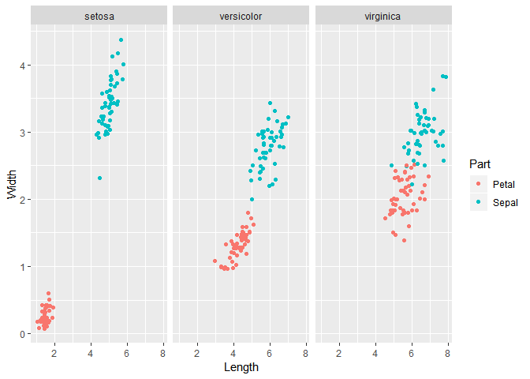
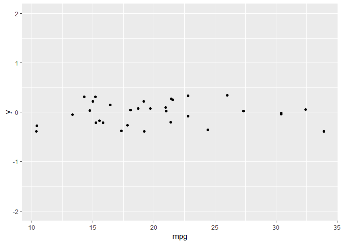

ggplot\_1
================
Daniel\_Kim
2019 8 15

``` python
import numpy as np
import pandas as pd

iris = r.iris
iris.plot()
```

<!-- -->

``` r
iris %>%
  as_tibble() %>%
  rowid_to_column() %>%
  gather(Sepal.Length, Sepal.Width, Petal.Length, Petal.Width, key = "Featrures", value = "value") %>%
  head()
```

    ## # A tibble: 6 x 4
    ##   rowid Species Featrures    value
    ##   <int> <fct>   <chr>        <dbl>
    ## 1     1 setosa  Sepal.Length   5.1
    ## 2     2 setosa  Sepal.Length   4.9
    ## 3     3 setosa  Sepal.Length   4.7
    ## 4     4 setosa  Sepal.Length   4.6
    ## 5     5 setosa  Sepal.Length   5  
    ## 6     6 setosa  Sepal.Length   5.4

``` r
iris %>%
  as_tibble() %>%
  rowid_to_column() %>%
  gather(Sepal.Length, Sepal.Width, Petal.Length, Petal.Width, key = "Features", value = "value") %>%
  separate(Features, sep = "\\.", into = c("Part", "Measure")) %>%
  spread(Measure, value) %>%
  select(-rowid) -> iris_wide

iris_wide %>% head()
```

    ## # A tibble: 6 x 4
    ##   Species Part  Length Width
    ##   <fct>   <chr>  <dbl> <dbl>
    ## 1 setosa  Petal    1.4   0.2
    ## 2 setosa  Sepal    5.1   3.5
    ## 3 setosa  Petal    1.4   0.2
    ## 4 setosa  Sepal    4.9   3  
    ## 5 setosa  Petal    1.3   0.2
    ## 6 setosa  Sepal    4.7   3.2

``` r
iris %>%
  mutate(Flower = (1:nrow(iris))) %>%
  gather(key, value, -Species, -Flower) %>%
  separate(key, c("Part", "Measure"), "\\.") %>%
  spread(Measure, value) -> iris.wide

iris.wide %>% head()
```

    ##   Species Flower  Part Length Width
    ## 1  setosa      1 Petal    1.4   0.2
    ## 2  setosa      1 Sepal    5.1   3.5
    ## 3  setosa      2 Petal    1.4   0.2
    ## 4  setosa      2 Sepal    4.9   3.0
    ## 5  setosa      3 Petal    1.3   0.2
    ## 6  setosa      3 Sepal    4.7   3.2

``` python
iris_wide = r.iris_wide
iris_wide['Part'].value_counts()
```

    ## Sepal    150
    ## Petal    150
    ## Name: Part, dtype: int64

``` python
iris_wide.head()
```

    ##   Species   Part  Length  Width
    ## 0  setosa  Petal     1.4    0.2
    ## 1  setosa  Sepal     5.1    3.5
    ## 2  setosa  Petal     1.4    0.2
    ## 3  setosa  Sepal     4.9    3.0
    ## 4  setosa  Petal     1.3    0.2

``` python
import matplotlib.pyplot as plt
plt.scatter(iris_wide['Length'], iris_wide['Width'], alpha=.5)
```

<!-- -->

``` r
iris %>%
  rowid_to_column() %>%
  gather(Sepal.Length, Sepal.Width, Petal.Length, Petal.Width, key = "Features", value = "value") %>%
  separate(Features, sep = "\\.", into = c("Part", "Measure")) %>%
  spread(Species, value) -> iris_tmp

iris_tmp %>% filter(!is.na(setosa)) %>% select(-versicolor, -virginica) -> iris_tmp_1
iris_tmp %>% filter(!is.na(versicolor)) %>% select(versicolor) -> iris_tmp_2
iris_tmp %>% filter(!is.na(virginica)) %>% select(virginica) -> iris_tmp_3

iris_tmp_1 %>%
  bind_cols(iris_tmp_2, iris_tmp_3) %>%
  select(-rowid) -> iris_wide_2

iris_wide_2 %>% head()
```

    ##    Part Measure setosa versicolor virginica
    ## 1 Petal  Length    1.4        4.7       6.0
    ## 2 Petal   Width    0.2        1.4       2.5
    ## 3 Sepal  Length    5.1        7.0       6.3
    ## 4 Sepal   Width    3.5        3.2       3.3
    ## 5 Petal  Length    1.4        4.5       5.1
    ## 6 Petal   Width    0.2        1.5       1.9

``` r
iris %>%
  rowid_to_column() %>%
  gather(Sepal.Length, Sepal.Width, Petal.Length, Petal.Width, key = "Features", value = "value") %>%
  separate(Features, sep = "\\.", into = c("Part", "Measure")) %>%
  select(-rowid) -> iris_tidy

iris_tidy %>% head()
```

    ##   Species  Part Measure value
    ## 1  setosa Sepal  Length   5.1
    ## 2  setosa Sepal  Length   4.9
    ## 3  setosa Sepal  Length   4.7
    ## 4  setosa Sepal  Length   4.6
    ## 5  setosa Sepal  Length   5.0
    ## 6  setosa Sepal  Length   5.4

``` r
iris %>%
  gather(key, Value, -Species) %>%
  separate(key, c("Part", "Measure"), "\\.") -> iris_tidy; iris_tidy %>% head()
```

    ##   Species  Part Measure Value
    ## 1  setosa Sepal  Length   5.1
    ## 2  setosa Sepal  Length   4.9
    ## 3  setosa Sepal  Length   4.7
    ## 4  setosa Sepal  Length   4.6
    ## 5  setosa Sepal  Length   5.0
    ## 6  setosa Sepal  Length   5.4

``` r
str(iris)
```

    ## 'data.frame':    150 obs. of  5 variables:
    ##  $ Sepal.Length: num  5.1 4.9 4.7 4.6 5 5.4 4.6 5 4.4 4.9 ...
    ##  $ Sepal.Width : num  3.5 3 3.2 3.1 3.6 3.9 3.4 3.4 2.9 3.1 ...
    ##  $ Petal.Length: num  1.4 1.4 1.3 1.5 1.4 1.7 1.4 1.5 1.4 1.5 ...
    ##  $ Petal.Width : num  0.2 0.2 0.2 0.2 0.2 0.4 0.3 0.2 0.2 0.1 ...
    ##  $ Species     : Factor w/ 3 levels "setosa","versicolor",..: 1 1 1 1 1 1 1 1 1 1 ...

``` r
str(iris_wide)
```

    ## Classes 'tbl_df', 'tbl' and 'data.frame':    300 obs. of  4 variables:
    ##  $ Species: Factor w/ 3 levels "setosa","versicolor",..: 1 1 1 1 1 1 1 1 1 1 ...
    ##  $ Part   : chr  "Petal" "Sepal" "Petal" "Sepal" ...
    ##  $ Length : num  1.4 5.1 1.4 4.9 1.3 4.7 1.5 4.6 1.4 5 ...
    ##  $ Width  : num  0.2 3.5 0.2 3 0.2 3.2 0.2 3.1 0.2 3.6 ...

``` r
str(iris_tidy)
```

    ## 'data.frame':    600 obs. of  4 variables:
    ##  $ Species: Factor w/ 3 levels "setosa","versicolor",..: 1 1 1 1 1 1 1 1 1 1 ...
    ##  $ Part   : chr  "Sepal" "Sepal" "Sepal" "Sepal" ...
    ##  $ Measure: chr  "Length" "Length" "Length" "Length" ...
    ##  $ Value  : num  5.1 4.9 4.7 4.6 5 5.4 4.6 5 4.4 4.9 ...

``` r
ggplot(iris_tidy, aes(x = Species, y = Value, col = Part)) + 
  geom_jitter() + 
  facet_grid(. ~ Measure)
```

<!-- -->

``` r
ggplot(iris_wide, aes(Length, Width, color = Part)) + geom_jitter() + facet_grid(. ~ Species)
```

<!-- -->

``` r
ggplot(mtcars, aes(x= wt, y = mpg, fill = cyl)) + geom_point(shape = 21, size = 4, alpha = .6) -> p1
ggplot(mtcars, aes(mpg, qsec, 
                   col = factor(cyl),
                   shape = factor(am),
                   size = (hp/wt))) + geom_point() -> p2
grid.arrange(p1, p2, ncol = 1)
```

<!-- -->

``` r
cyl.am <- ggplot(mtcars, aes(x = factor(cyl), fill = factor(am)))
```

``` r
library(gridExtra)
cyl.am + geom_bar(position = "stack") + ggtitle("stack") + 
  scale_x_discrete("Cylinders") + scale_y_continuous("Number") + 
  scale_fill_manual("Transmission", values = c('red', 'steelblue'), labels = c("Manual", "Automatic")) -> p1
cyl.am + geom_bar(position = "fill") + ggtitle("fill") -> p2
cyl.am + geom_bar(position = "dodge") + ggtitle("dodge") +
  scale_x_discrete("Cylinders") + scale_y_continuous("Number") + 
  scale_fill_manual("Transmission", values = c('red', 'steelblue'), labels = c("Manual", "Automatic")) -> p3
cyl.am + geom_bar() + ggtitle("default") -> p4

grid.arrange(p1, p2, p3, p4, ncol = 2)
```

<!-- -->

``` r
ggplot(mtcars, aes(x = mpg, y = 0)) +
  geom_jitter() +
  scale_y_continuous(limits=c(-2, 2))
```

<!-- -->

``` r
ggplot(diamonds, aes(carat, price, col = clarity)) + geom_point() -> p1
ggplot(diamonds, aes(carat, price, col = clarity)) + geom_point(alpha = .3) -> p2

grid.arrange(p1, p2, ncol = 2)
```

<!-- -->

``` r
ggplot(diamonds, aes(clarity, carat, col = price)) + geom_point(alpha = .5) -> p1
ggplot(diamonds, aes(clarity, carat, col = price)) + geom_point(alpha = .5, position='jitter') -> p2

grid.arrange(p1, p2, ncol = 2)
```

<!-- -->
