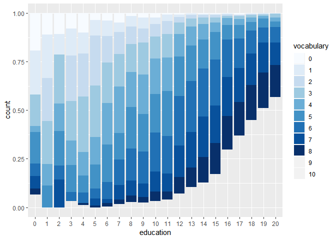
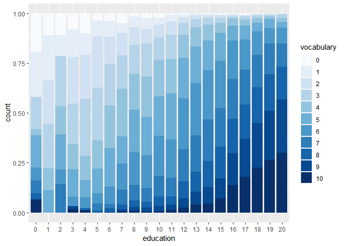
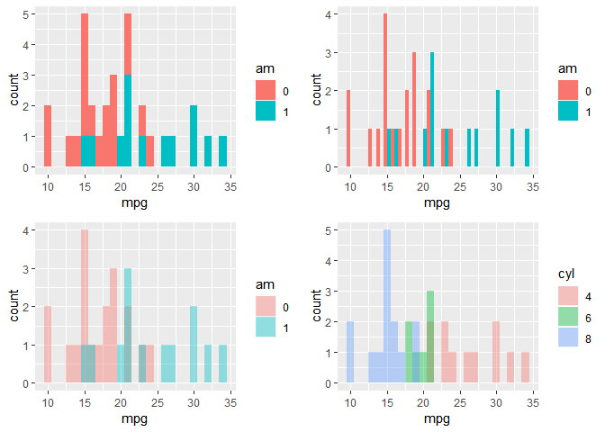
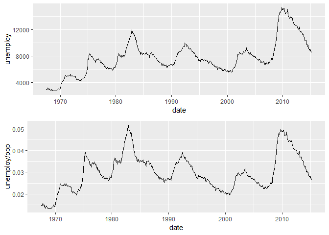
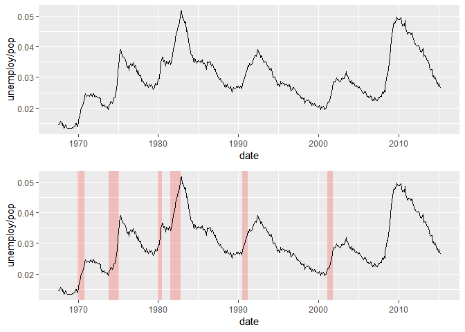
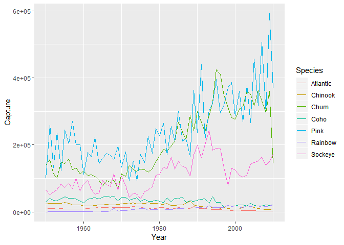

ggplot\_2
================
Daniel\_Kim
2019 8 15

#### Bar plots with color ramp

``` r
vocab <- read_csv("vocab.csv")
vocab$year <- as.integer(vocab$year)
vocab$sex <- as.factor(vocab$sex)
vocab$education <- as.factor(vocab$education)
vocab$vocabulary <- as.factor(vocab$vocabulary)
head(vocab)
```

    ## # A tibble: 6 x 4
    ##    year sex    education vocabulary
    ##   <int> <fct>  <fct>     <fct>     
    ## 1  2004 Female 9         3         
    ## 2  2004 Female 14        6         
    ## 3  2004 Male   14        9         
    ## 4  2004 Female 17        8         
    ## 5  2004 Male   14        1         
    ## 6  2004 Male   14        7

``` r
ggplot(vocab, aes(x = education, fill = vocabulary)) +
  geom_bar(position = "fill") +
  scale_fill_brewer()
```

    ## Warning in RColorBrewer::brewer.pal(n, pal): n too large, allowed maximum for palette Blues is 9
    ## Returning the palette you asked for with that many colors

<!-- -->

  - to solve the palette limitation problem …

<!-- end list -->

``` r
blues <- RColorBrewer::brewer.pal(9, "Blues")
blue_range <- colorRampPalette(blues) 
```

  - the `blue_range` is function…

<!-- end list -->

``` r
ggplot(vocab, aes(x = education, fill = vocabulary)) +
  geom_bar(position = "fill") + 
  scale_fill_manual(values = blue_range(11))
```

<!-- -->

``` r
mtcars$am <- as.factor(mtcars$am)
mtcars$cyl <- as.factor(mtcars$cyl)

ggplot(mtcars, aes(mpg, fill = am)) +
  geom_histogram(binwidth = 1) -> p1

ggplot(mtcars, aes(mpg, fill = am)) +
  geom_histogram(binwidth = 1,
  position = "dodge") -> p2

ggplot(mtcars, aes(mpg, fill = am)) +
  geom_histogram(binwidth = 1,
  position = "identity", alpha = .4) -> p3

ggplot(mtcars, aes(mpg, fill = cyl)) +
  geom_histogram(binwidth = 1,
  position = "identity", alpha = .4) -> p4

grid.arrange(p1, p2, p3, p4, ncol = 2)
```

<!-- -->

### Line Plots

``` r
data("economics")
head(economics)
```

    ## # A tibble: 6 x 6
    ##   date         pce    pop psavert uempmed unemploy
    ##   <date>     <dbl>  <int>   <dbl>   <dbl>    <int>
    ## 1 1967-07-01  507. 198712    12.5     4.5     2944
    ## 2 1967-08-01  510. 198911    12.5     4.7     2945
    ## 3 1967-09-01  516. 199113    11.7     4.6     2958
    ## 4 1967-10-01  513. 199311    12.5     4.9     3143
    ## 5 1967-11-01  518. 199498    12.5     4.7     3066
    ## 6 1967-12-01  526. 199657    12.1     4.8     3018

``` r
ggplot(economics, aes(date, unemploy)) + geom_line() -> p1
ggplot(economics, aes(date, unemploy/pop)) + geom_line() -> p2

gridExtra::grid.arrange(p1, p2)
```

<!-- -->

``` r
load(file="~/datacamp/ggplot/recess.RData")
head(recess)
```

    ##        begin        end
    ## 1 1969-12-01 1970-11-01
    ## 2 1973-11-01 1975-03-01
    ## 3 1980-01-01 1980-07-01
    ## 4 1981-07-01 1982-11-01
    ## 5 1990-07-01 1991-03-01
    ## 6 2001-03-01 2001-11-01

``` r
# Basic line plot
ggplot(economics, aes(x = date, y = unemploy/pop)) +
  geom_line() -> p1

# Expand the following command with geom_rect() to draw the recess periods
ggplot(economics, aes(x = date, y = unemploy/pop)) +
  geom_rect(data = recess,
         aes(xmax = begin, xmin = end, ymin = -Inf, ymax = Inf),
         inherit.aes = FALSE, fill = "red", alpha = 0.2) +
  geom_line() -> p2

grid.arrange(p1, p2)
```

<!-- -->

``` r
load("./fish.RData")
# head(fish.species)

fish.species %>%
  gather("Species", "Capture", -Year) -> fish.tidy

head(fish.tidy)
```

    ##   Year Species Capture
    ## 1 1950    Pink  100600
    ## 2 1951    Pink  259000
    ## 3 1952    Pink  132600
    ## 4 1953    Pink  235900
    ## 5 1954    Pink  123400
    ## 6 1955    Pink  244400

``` r
ggplot(fish.tidy, aes(Year, Capture, col = Species)) + geom_line()
```

<!-- -->
