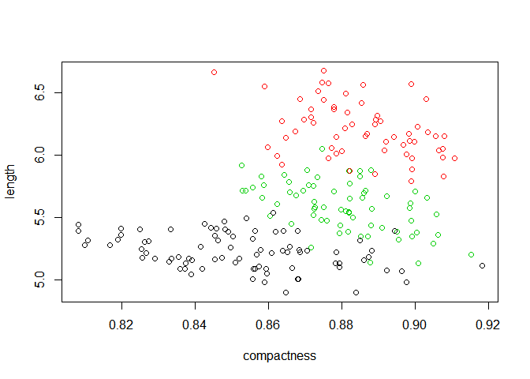
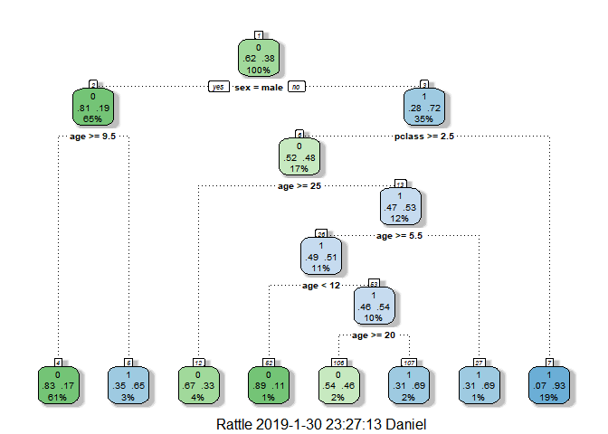
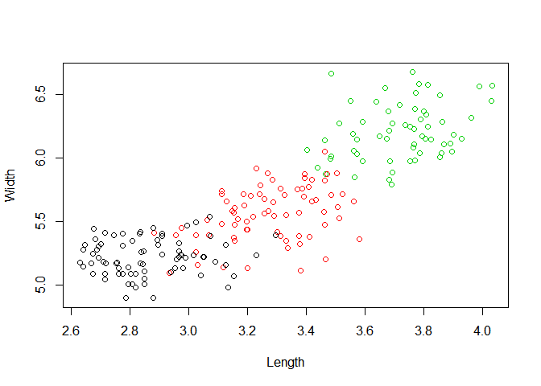
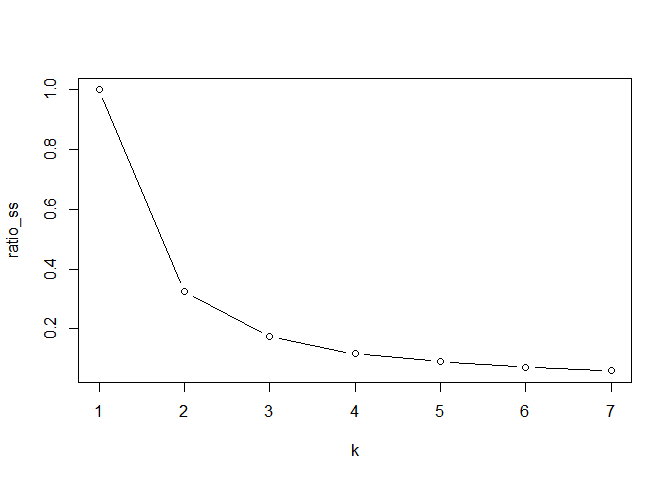

Introduction to ML learning with R(DataCamp)
================
jakinpilla
Wed Jan 30 23:27:05 2019

``` r
Packages <- c('plyr', 'dplyr', 'tidyverse', 'data.table', 'reshape2', 'caret', 'rpart', 'GGally', 'ROCR', 'party', 'randomForest', 'dummies', 'curl', 'gridExtra', 'cluster.datasets')
```

Loading datesets from Web

``` r
h <- new_handle(copypostfields = "moo=moomooo")
handle_setheaders(h,
                  "Content-Type" = "text/moo",
                  "Cache-Control" = "no-cache",
                  "User-Agent" = "A cow")
tmp <- tempfile()
curl_download('https://archive.ics.uci.edu/ml/machine-learning-databases/00291/airfoil_self_noise.dat', tmp, handle=h)
data <-read.table(tmp, header=F)
head(data)
```

    ##     V1 V2     V3   V4         V5      V6
    ## 1  800  0 0.3048 71.3 0.00266337 126.201
    ## 2 1000  0 0.3048 71.3 0.00266337 125.201
    ## 3 1250  0 0.3048 71.3 0.00266337 125.951
    ## 4 1600  0 0.3048 71.3 0.00266337 127.591
    ## 5 2000  0 0.3048 71.3 0.00266337 127.461
    ## 6 2500  0 0.3048 71.3 0.00266337 125.571

``` r
feature_names <- c('freq', 'angle', 'ch_length',
                   'velocity', 'thickness', 'dec')

colnames(data) <- feature_names
head(data)
```

    ##   freq angle ch_length velocity  thickness     dec
    ## 1  800     0    0.3048     71.3 0.00266337 126.201
    ## 2 1000     0    0.3048     71.3 0.00266337 125.201
    ## 3 1250     0    0.3048     71.3 0.00266337 125.951
    ## 4 1600     0    0.3048     71.3 0.00266337 127.591
    ## 5 2000     0    0.3048     71.3 0.00266337 127.461
    ## 6 2500     0    0.3048     71.3 0.00266337 125.571

``` r
summary(data)
```

    ##       freq           angle          ch_length         velocity    
    ##  Min.   :  200   Min.   : 0.000   Min.   :0.0254   Min.   :31.70  
    ##  1st Qu.:  800   1st Qu.: 2.000   1st Qu.:0.0508   1st Qu.:39.60  
    ##  Median : 1600   Median : 5.400   Median :0.1016   Median :39.60  
    ##  Mean   : 2886   Mean   : 6.782   Mean   :0.1365   Mean   :50.86  
    ##  3rd Qu.: 4000   3rd Qu.: 9.900   3rd Qu.:0.2286   3rd Qu.:71.30  
    ##  Max.   :20000   Max.   :22.200   Max.   :0.3048   Max.   :71.30  
    ##    thickness              dec       
    ##  Min.   :0.0004007   Min.   :103.4  
    ##  1st Qu.:0.0025351   1st Qu.:120.2  
    ##  Median :0.0049574   Median :125.7  
    ##  Mean   :0.0111399   Mean   :124.8  
    ##  3rd Qu.:0.0155759   3rd Qu.:130.0  
    ##  Max.   :0.0584113   Max.   :141.0

``` r
air <- data
fit <- lm(dec ~ freq + angle + ch_length, data =air)
air %>%
  select(freq, angle, ch_length) -> new.data

pred <- predict(fit, new.data)
rsme <- sqrt((1/nrow(air)) * sum( (air$dec - pred) ^ 2))
```

Previous model

``` r
fit <- lm(dec ~ freq + angle + ch_length, data = air)
pred <- predict(fit)
rmse <- sqrt(sum( (air$dec - pred) ^ 2) / nrow(air))
rmse
```

    ## [1] 5.215778

Your colleague's more complex model

``` r
fit2 <- lm(dec ~ freq + angle + ch_length + velocity + thickness, data = air)
```

Use the model to predict for all values: pred2

``` r
pred2 <- predict(fit2)
```

Calculate rmse2

``` r
rmse2 <- sqrt(sum( (air$dec - pred2) ^ 2) / nrow(air))
```

Print out rmse2

``` r
rmse2
```

    ## [1] 4.799244

taking data from web

``` r
h <- new_handle(copypostfields = "moo=moomooo")
handle_setheaders(h,
                  "Content-Type" = "text/moo",
                  "Cache-Control" = "no-cache",
                  "User-Agent" = "A cow")

tmp <- tempfile()
curl_download('https://archive.ics.uci.edu/ml/machine-learning-databases/00236/seeds_dataset.txt', tmp, handle=h)
data <-read.table(tmp, header=F)
data <- data[, -ncol(data)]

feature_names <- c('area', 'perimeter', 'compactness',
                   'length', 'width', 'asymmetry',
                   'groove_length')

colnames(data) <- feature_names
head(data)
```

    ##    area perimeter compactness length width asymmetry groove_length
    ## 1 15.26     14.84      0.8710  5.763 3.312     2.221         5.220
    ## 2 14.88     14.57      0.8811  5.554 3.333     1.018         4.956
    ## 3 14.29     14.09      0.9050  5.291 3.337     2.699         4.825
    ## 4 13.84     13.94      0.8955  5.324 3.379     2.259         4.805
    ## 5 16.14     14.99      0.9034  5.658 3.562     1.355         5.175
    ## 6 14.38     14.21      0.8951  5.386 3.312     2.462         4.956

``` r
summary(data)
```

    ##       area         perimeter      compactness         length     
    ##  Min.   :10.59   Min.   :12.41   Min.   :0.8081   Min.   :4.899  
    ##  1st Qu.:12.27   1st Qu.:13.45   1st Qu.:0.8569   1st Qu.:5.262  
    ##  Median :14.36   Median :14.32   Median :0.8734   Median :5.524  
    ##  Mean   :14.85   Mean   :14.56   Mean   :0.8710   Mean   :5.629  
    ##  3rd Qu.:17.30   3rd Qu.:15.71   3rd Qu.:0.8878   3rd Qu.:5.980  
    ##  Max.   :21.18   Max.   :17.25   Max.   :0.9183   Max.   :6.675  
    ##      width         asymmetry      groove_length  
    ##  Min.   :2.630   Min.   :0.7651   Min.   :4.519  
    ##  1st Qu.:2.944   1st Qu.:2.5615   1st Qu.:5.045  
    ##  Median :3.237   Median :3.5990   Median :5.223  
    ##  Mean   :3.259   Mean   :3.7002   Mean   :5.408  
    ##  3rd Qu.:3.562   3rd Qu.:4.7687   3rd Qu.:5.877  
    ##  Max.   :4.033   Max.   :8.4560   Max.   :6.550

``` r
seeds <- data

set.seed(1)
str(seeds)
```

    ## 'data.frame':    210 obs. of  7 variables:
    ##  $ area         : num  15.3 14.9 14.3 13.8 16.1 ...
    ##  $ perimeter    : num  14.8 14.6 14.1 13.9 15 ...
    ##  $ compactness  : num  0.871 0.881 0.905 0.895 0.903 ...
    ##  $ length       : num  5.76 5.55 5.29 5.32 5.66 ...
    ##  $ width        : num  3.31 3.33 3.34 3.38 3.56 ...
    ##  $ asymmetry    : num  2.22 1.02 2.7 2.26 1.35 ...
    ##  $ groove_length: num  5.22 4.96 4.83 4.8 5.17 ...

``` r
km_seeds <- kmeans(seeds, 3)
plot(length ~ compactness, data = seeds, col = km_seeds$cluster)
```



``` r
km_seeds$tot.withinss / km_seeds$betweenss 
```

    ## [1] 0.2762846

### Decision Tree

Loading Data

``` r
titanic <- read.csv("./data/titanic3.csv")
head(titanic)
```

    ##   pclass survived                                            name    sex
    ## 1      1        1                   Allen, Miss. Elisabeth Walton female
    ## 2      1        1                  Allison, Master. Hudson Trevor   male
    ## 3      1        0                    Allison, Miss. Helen Loraine female
    ## 4      1        0            Allison, Mr. Hudson Joshua Creighton   male
    ## 5      1        0 Allison, Mrs. Hudson J C (Bessie Waldo Daniels) female
    ## 6      1        1                             Anderson, Mr. Harry   male
    ##     age sibsp parch ticket     fare   cabin embarked boat body
    ## 1 29.00     0     0  24160 211.3375      B5        S    2   NA
    ## 2  0.92     1     2 113781 151.5500 C22 C26        S   11   NA
    ## 3  2.00     1     2 113781 151.5500 C22 C26        S        NA
    ## 4 30.00     1     2 113781 151.5500 C22 C26        S       135
    ## 5 25.00     1     2 113781 151.5500 C22 C26        S        NA
    ## 6 48.00     0     0  19952  26.5500     E12        S    3   NA
    ##                         home.dest
    ## 1                    St Louis, MO
    ## 2 Montreal, PQ / Chesterville, ON
    ## 3 Montreal, PQ / Chesterville, ON
    ## 4 Montreal, PQ / Chesterville, ON
    ## 5 Montreal, PQ / Chesterville, ON
    ## 6                    New York, NY

``` r
set.seed(1)
str(titanic)
```

    ## 'data.frame':    1309 obs. of  14 variables:
    ##  $ pclass   : int  1 1 1 1 1 1 1 1 1 1 ...
    ##  $ survived : int  1 1 0 0 0 1 1 0 1 0 ...
    ##  $ name     : Factor w/ 1307 levels "Abbing, Mr. Anthony",..: 22 24 25 26 27 31 46 47 51 55 ...
    ##  $ sex      : Factor w/ 2 levels "female","male": 1 2 1 2 1 2 1 2 1 2 ...
    ##  $ age      : num  29 0.92 2 30 25 48 63 39 53 71 ...
    ##  $ sibsp    : int  0 1 1 1 1 0 1 0 2 0 ...
    ##  $ parch    : int  0 2 2 2 2 0 0 0 0 0 ...
    ##  $ ticket   : Factor w/ 929 levels "110152","110413",..: 188 50 50 50 50 125 93 16 77 826 ...
    ##  $ fare     : num  211 152 152 152 152 ...
    ##  $ cabin    : Factor w/ 187 levels "","A10","A11",..: 45 81 81 81 81 151 147 17 63 1 ...
    ##  $ embarked : Factor w/ 4 levels "","C","Q","S": 4 4 4 4 4 4 4 4 4 2 ...
    ##  $ boat     : Factor w/ 28 levels "","1","10","11",..: 13 4 1 1 1 14 3 1 28 1 ...
    ##  $ body     : int  NA NA NA 135 NA NA NA NA NA 22 ...
    ##  $ home.dest: Factor w/ 370 levels "","?Havana, Cuba",..: 310 232 232 232 232 238 163 25 23 230 ...

``` r
titanic %>%
  select(pclass, survived, sex, age) -> titanic


tree <- rpart(survived ~., data = titanic,
              method = "class")

pred <- predict(tree, titanic, type = "class")

table(titanic$survived, pred) %>%
  as.matrix() -> conf
```

split the sets

``` r
set.seed(1)
head(titanic)
```

    ##   pclass survived    sex   age
    ## 1      1        1 female 29.00
    ## 2      1        1   male  0.92
    ## 3      1        0 female  2.00
    ## 4      1        0   male 30.00
    ## 5      1        0 female 25.00
    ## 6      1        1   male 48.00

``` r
n <- nrow(titanic)
shuffled <- titanic[sample(n), ]

train_indice <- 1:round(.7*n)
test_indice <- (round(.7*n) + 1) : n

train <- shuffled[train_indice, ]
test <- shuffled[test_indice, ]

str(train)
```

    ## 'data.frame':    916 obs. of  4 variables:
    ##  $ pclass  : int  2 2 3 3 1 3 3 3 3 1 ...
    ##  $ survived: int  0 0 0 0 1 0 0 1 1 0 ...
    ##  $ sex     : Factor w/ 2 levels "female","male": 2 2 2 2 1 2 1 1 1 2 ...
    ##  $ age     : num  42 24 34 NA 39 14.5 2 26 16 NA ...

``` r
str(test)
```

    ## 'data.frame':    393 obs. of  4 variables:
    ##  $ pclass  : int  3 2 3 3 3 3 3 3 2 3 ...
    ##  $ survived: int  0 1 0 0 0 0 0 0 1 0 ...
    ##  $ sex     : Factor w/ 2 levels "female","male": 1 2 2 2 2 1 2 1 1 1 ...
    ##  $ age     : num  NA NA 44 42 39 18 36 16 19 6 ...

``` r
library(rpart)
tree <- rpart(survived ~., train, method = 'class')
pred <- predict(tree, test, type = "class")

conf <- table(test$survived, pred)

conf
```

    ##    pred
    ##       0   1
    ##   0 223  32
    ##   1  53  85

using cross validation

``` r
set.seed(1)
```

initialize the accs vector

``` r
accs <- rep(0, 6)

for (i in 1:6) {
  # these indices indicate the interval of the test
  indices <- (((i- 1)*round((1/6)*nrow(shuffled))) + 1 :
                ((i*round((1/6) * nrow(shuffled)))))
  # print(indices)
  # print(length(indices))
  
  # exclude them from the train set
  train <- shuffled[-indices, ]
  
  # include them in the test set
  test <- shuffled[indices, ]
  
  # A model is learned using each training set
  tree <- rpart(survived ~ ., train, method= "class")
  
  # Make a prediction on the test set using tree
  pred <- predict(tree, test, type = "class")
  
  # assign the confusion matrix to conf
  conf <- table(test$survived, pred)
  
  # assign the accuracy of this model to the ith index in accs
  accs[i] <- sum(diag(conf)) / sum(conf)
  
}
```

print out the mean of accs

``` r
print(mean(accs))
```

    ## [1] 0.7733835

Bias and Variance

Decision Tree

``` r
set.seed(1)
library(rpart)
library(rattle)
```

    ## Rattle: A free graphical interface for data science with R.
    ## Version 5.2.0 Copyright (c) 2006-2018 Togaware Pty Ltd.
    ## Type 'rattle()' to shake, rattle, and roll your data.

    ## 
    ## Attaching package: 'rattle'

    ## The following object is masked from 'package:randomForest':
    ## 
    ##     importance

``` r
library(rpart.plot)
library(RColorBrewer)

tree <- rpart(survived ~., train, method = "class")

fancyRpartPlot(tree)
```



### Clustering

Cluster: collection of objets

Similar within cluster

Dissimilar between clusters

WSS : Within Cluster Sums of Squares (Meassure of compactness)

BSS : Between Cluster Sums of Squares (Measure of separation)

Choosing k

-   Goal : Find k that minimizes WSS

-   Problems : WSS keeps decreasing as k increase

-   Solution : WSS starts decreasing slowly
    *W**S**S*/*T**S**S* &lt; 0.2(*T**S**S* = *W**S**S* + *B**S**S*)

Scree Plot, elbow...

`my_km <- kmeans(data, centers, nstarts)`

-   centers : Starting centroid \#clusters

-   nstart : \#times R restarts with different centroids

-   \`my\_km$tot.withinss\`\` &lt;-- WSS

-   `my_km$betweenss` &lt;-- BSS

taking the seed data from web

``` r
h <- new_handle(copypostfields = "moo=moomooo")
handle_setheaders(h,
                  "Content-Type" = "text/moo",
                  "Cache-Control" = "no-cache",
                  "User-Agent" = "A cow"
)

tmp <- tempfile()

curl_download('https://archive.ics.uci.edu/ml/machine-learning-databases/00236/seeds_dataset.txt', tmp, handle=h)
data <-read.table(tmp, header=F)
head(data)
```

    ##      V1    V2     V3    V4    V5    V6    V7 V8
    ## 1 15.26 14.84 0.8710 5.763 3.312 2.221 5.220  1
    ## 2 14.88 14.57 0.8811 5.554 3.333 1.018 4.956  1
    ## 3 14.29 14.09 0.9050 5.291 3.337 2.699 4.825  1
    ## 4 13.84 13.94 0.8955 5.324 3.379 2.259 4.805  1
    ## 5 16.14 14.99 0.9034 5.658 3.562 1.355 5.175  1
    ## 6 14.38 14.21 0.8951 5.386 3.312 2.462 4.956  1

``` r
ncol(data)
```

    ## [1] 8

defining data feature names and save the data as an csv file

``` r
feature_names <- c('area', 'perimeter', 'compactness','length', 'width', 'asymmetry',
                   'groove_length', 'seed_type')
colnames(data) <- feature_names
data %>% write.csv("./data/seed_data.csv", row.names = F)
seeds <- data
```

Set random seed.

``` r
set.seed(100)
```

Do k\_means clustering with three clusters, repeat 20 times: seed\_km

``` r
seeds_km <- kmeans(seeds, centers = 3, nstart = 20)
```

Compare clusters with actual seed types. Set k-means clusters as rows

``` r
table(seeds_km$cluster, seeds$seed_type)
```

    ##    
    ##      1  2  3
    ##   1  5  0 70
    ##   2 64 10  0
    ##   3  1 60  0

Plot the length as function of width. Color by cluster

``` r
plot(seeds$width, seeds$length, 
     xlab = "Length", ylab ="Width",
     col = seeds_km$cluster)
```



Apply kmeans to seeds twice : seeds\_km\_1 and seeds\_km\_2

``` r
set.seed(2019)
seeds_km_1 <- kmeans(seeds, centers = 5, nstart = 1)
seeds_km_2 <- kmeans(seeds, centers = 5, nstart = 1)
```

Return the ratio of the within cluster sum of squares

``` r
seeds_km_1$tot.withinss  /seeds_km_2$tot.withinss
```

    ## [1] 0.992613

Compare the resulting clusters

``` r
table(seeds_km_1$cluster, seeds_km_2$cluster)
```

    ##    
    ##      1  2  3  4  5
    ##   1  1 38  0  0  0
    ##   2  0 24  0 12  0
    ##   3  0  0 39 17  0
    ##   4  0  0  0  0 48
    ##   5 24  0  7  0  0

cluster 4 from `seeds_km_1` completely contains cluster 5 from seeds\_km\_2

``` r
library(cluster.datasets)
data("new.haven.school.scores")
new.haven.school.scores %>% head
```

    ##    school reading.4 arithmetic.4 reading.6 arithmetic.6
    ## 1 Baldwin       2.7          3.2       4.5          4.8
    ## 2 Barnard       3.9          3.8       5.9          6.2
    ## 3 Beecher       4.8          4.1       6.8          5.5
    ## 4 Brennan       3.1          3.5       4.3          4.6
    ## 5 Clinton       3.4          3.7       5.1          5.6
    ## 6   Conte       3.1          3.4       4.1          4.7

``` r
school_result <- new.haven.school.scores[, -1]
str(school_result)
```

    ## 'data.frame':    25 obs. of  4 variables:
    ##  $ reading.4   : num  2.7 3.9 4.8 3.1 3.4 3.1 4.6 3.1 3.8 5.2 ...
    ##  $ arithmetic.4: num  3.2 3.8 4.1 3.5 3.7 3.4 4.4 3.3 3.7 4.9 ...
    ##  $ reading.6   : num  4.5 5.9 6.8 4.3 5.1 4.1 6.6 4 4.7 8.2 ...
    ##  $ arithmetic.6: num  4.8 6.2 5.5 4.6 5.6 4.7 6.1 4.9 4.9 6.9 ...

``` r
set.seed(2019)
str(school_result)
```

    ## 'data.frame':    25 obs. of  4 variables:
    ##  $ reading.4   : num  2.7 3.9 4.8 3.1 3.4 3.1 4.6 3.1 3.8 5.2 ...
    ##  $ arithmetic.4: num  3.2 3.8 4.1 3.5 3.7 3.4 4.4 3.3 3.7 4.9 ...
    ##  $ reading.6   : num  4.5 5.9 6.8 4.3 5.1 4.1 6.6 4 4.7 8.2 ...
    ##  $ arithmetic.6: num  4.8 6.2 5.5 4.6 5.6 4.7 6.1 4.9 4.9 6.9 ...

``` r
ratio_ss <- rep(0, 7)
for (k in 1:7) {
  
  # Apply k-means to school_result: school_km
  school_km <- kmeans(school_result, k, nstart = 20)
  
  # Save the ratio between of WSS to TSS in kth element of ratio_ss
  ratio_ss[k] <- school_km$tot.withinss / school_km$totss
  
}
```

Make scree plot s with type "b" and xlab "k"

``` r
plot(ratio_ss, type = "b", xlab = "k")
```



Cluser Evaluation Not trivial! There is no truth

-   No true labels

-   No true response

Underlying idea :: Variance within clusters, Seperation between clusters

Alternative:: Diameter, Intercluster Distance

Dunnn's Index

Higher Dunn :: Better seperated / more compact

-   High computational cost

Internal Validation : based on intrinsic knowledge

-   BIC Index

-   Silhouette's Index

External Validation : based on previous knowledge
