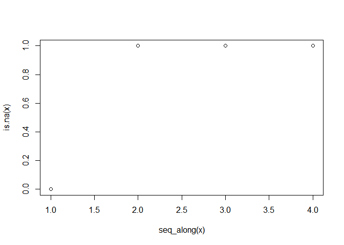

Write func in R
================
Daniel
Wed Jan 02 21:41:18 2019

``` r
f <- function(x) {
  y <- 5
  x + y
}

f(5)
```

    ## [1] 10

``` r
# install.packages("purrrlyr")
# install.packages('yaml')
library(purrrlyr)
library(tidyverse)
```

    ## -- Attaching packages ------------------------------------------------- tidyverse 1.2.1 --

    ## √ ggplot2 3.1.0     √ purrr   0.2.5
    ## √ tibble  1.4.2     √ dplyr   0.7.8
    ## √ tidyr   0.8.2     √ stringr 1.3.1
    ## √ readr   1.3.1     √ forcats 0.3.0

    ## -- Conflicts ---------------------------------------------------- tidyverse_conflicts() --
    ## x dplyr::filter() masks stats::filter()
    ## x dplyr::lag()    masks stats::lag()

``` r
data("mtcars")
head(mtcars)
```

    ##                    mpg cyl disp  hp drat    wt  qsec vs am gear carb
    ## Mazda RX4         21.0   6  160 110 3.90 2.620 16.46  0  1    4    4
    ## Mazda RX4 Wag     21.0   6  160 110 3.90 2.875 17.02  0  1    4    4
    ## Datsun 710        22.8   4  108  93 3.85 2.320 18.61  1  1    4    1
    ## Hornet 4 Drive    21.4   6  258 110 3.08 3.215 19.44  1  0    3    1
    ## Hornet Sportabout 18.7   8  360 175 3.15 3.440 17.02  0  0    3    2
    ## Valiant           18.1   6  225 105 2.76 3.460 20.22  1  0    3    1

``` r
mtcars %>%
  group_by(mpg) %>%
  by_slice(.collate = "list",
           ..f = function(x) {
             mtcars %>%
               filter(between(disp, 
                              mean(x$disp) - 100,
                              mean(x$disp) + 100))
           }) -> tmp
 tmp$.out
```

    ## [[1]]
    ##    mpg cyl disp  hp drat    wt  qsec vs am gear carb
    ## 1 10.4   8  472 205 2.93 5.250 17.98  0  0    3    4
    ## 2 10.4   8  460 215 3.00 5.424 17.82  0  0    3    4
    ## 3 14.7   8  440 230 3.23 5.345 17.42  0  0    3    4
    ## 4 19.2   8  400 175 3.08 3.845 17.05  0  0    3    2
    ## 
    ## [[2]]
    ##     mpg cyl  disp  hp drat    wt  qsec vs am gear carb
    ## 1  21.4   6 258.0 110 3.08 3.215 19.44  1  0    3    1
    ## 2  18.7   8 360.0 175 3.15 3.440 17.02  0  0    3    2
    ## 3  14.3   8 360.0 245 3.21 3.570 15.84  0  0    3    4
    ## 4  16.4   8 275.8 180 3.07 4.070 17.40  0  0    3    3
    ## 5  17.3   8 275.8 180 3.07 3.730 17.60  0  0    3    3
    ## 6  15.2   8 275.8 180 3.07 3.780 18.00  0  0    3    3
    ## 7  14.7   8 440.0 230 3.23 5.345 17.42  0  0    3    4
    ## 8  15.5   8 318.0 150 2.76 3.520 16.87  0  0    3    2
    ## 9  15.2   8 304.0 150 3.15 3.435 17.30  0  0    3    2
    ## 10 13.3   8 350.0 245 3.73 3.840 15.41  0  0    3    4
    ## 11 19.2   8 400.0 175 3.08 3.845 17.05  0  0    3    2
    ## 12 15.8   8 351.0 264 4.22 3.170 14.50  0  1    5    4
    ## 13 15.0   8 301.0 335 3.54 3.570 14.60  0  1    5    8
    ## 
    ## [[3]]
    ##     mpg cyl  disp  hp drat    wt  qsec vs am gear carb
    ## 1  18.7   8 360.0 175 3.15 3.440 17.02  0  0    3    2
    ## 2  14.3   8 360.0 245 3.21 3.570 15.84  0  0    3    4
    ## 3  16.4   8 275.8 180 3.07 4.070 17.40  0  0    3    3
    ## 4  17.3   8 275.8 180 3.07 3.730 17.60  0  0    3    3
    ## 5  15.2   8 275.8 180 3.07 3.780 18.00  0  0    3    3
    ## 6  10.4   8 460.0 215 3.00 5.424 17.82  0  0    3    4
    ## 7  14.7   8 440.0 230 3.23 5.345 17.42  0  0    3    4
    ## 8  15.5   8 318.0 150 2.76 3.520 16.87  0  0    3    2
    ## 9  15.2   8 304.0 150 3.15 3.435 17.30  0  0    3    2
    ## 10 13.3   8 350.0 245 3.73 3.840 15.41  0  0    3    4
    ## 11 19.2   8 400.0 175 3.08 3.845 17.05  0  0    3    2
    ## 12 15.8   8 351.0 264 4.22 3.170 14.50  0  1    5    4
    ## 13 15.0   8 301.0 335 3.54 3.570 14.60  0  1    5    8
    ## 
    ## [[4]]
    ##    mpg cyl disp  hp drat    wt  qsec vs am gear carb
    ## 1 18.7   8  360 175 3.15 3.440 17.02  0  0    3    2
    ## 2 14.3   8  360 245 3.21 3.570 15.84  0  0    3    4
    ## 3 10.4   8  472 205 2.93 5.250 17.98  0  0    3    4
    ## 4 10.4   8  460 215 3.00 5.424 17.82  0  0    3    4
    ## 5 14.7   8  440 230 3.23 5.345 17.42  0  0    3    4
    ## 6 13.3   8  350 245 3.73 3.840 15.41  0  0    3    4
    ## 7 19.2   8  400 175 3.08 3.845 17.05  0  0    3    2
    ## 8 15.8   8  351 264 4.22 3.170 14.50  0  1    5    4
    ## 
    ## [[5]]
    ##     mpg cyl  disp  hp drat    wt  qsec vs am gear carb
    ## 1  21.4   6 258.0 110 3.08 3.215 19.44  1  0    3    1
    ## 2  18.7   8 360.0 175 3.15 3.440 17.02  0  0    3    2
    ## 3  18.1   6 225.0 105 2.76 3.460 20.22  1  0    3    1
    ## 4  14.3   8 360.0 245 3.21 3.570 15.84  0  0    3    4
    ## 5  16.4   8 275.8 180 3.07 4.070 17.40  0  0    3    3
    ## 6  17.3   8 275.8 180 3.07 3.730 17.60  0  0    3    3
    ## 7  15.2   8 275.8 180 3.07 3.780 18.00  0  0    3    3
    ## 8  15.5   8 318.0 150 2.76 3.520 16.87  0  0    3    2
    ## 9  15.2   8 304.0 150 3.15 3.435 17.30  0  0    3    2
    ## 10 13.3   8 350.0 245 3.73 3.840 15.41  0  0    3    4
    ## 11 19.2   8 400.0 175 3.08 3.845 17.05  0  0    3    2
    ## 12 15.8   8 351.0 264 4.22 3.170 14.50  0  1    5    4
    ## 13 15.0   8 301.0 335 3.54 3.570 14.60  0  1    5    8
    ## 
    ## [[6]]
    ##     mpg cyl  disp  hp drat    wt  qsec vs am gear carb
    ## 1  21.4   6 258.0 110 3.08 3.215 19.44  1  0    3    1
    ## 2  18.7   8 360.0 175 3.15 3.440 17.02  0  0    3    2
    ## 3  18.1   6 225.0 105 2.76 3.460 20.22  1  0    3    1
    ## 4  14.3   8 360.0 245 3.21 3.570 15.84  0  0    3    4
    ## 5  16.4   8 275.8 180 3.07 4.070 17.40  0  0    3    3
    ## 6  17.3   8 275.8 180 3.07 3.730 17.60  0  0    3    3
    ## 7  15.2   8 275.8 180 3.07 3.780 18.00  0  0    3    3
    ## 8  15.5   8 318.0 150 2.76 3.520 16.87  0  0    3    2
    ## 9  15.2   8 304.0 150 3.15 3.435 17.30  0  0    3    2
    ## 10 13.3   8 350.0 245 3.73 3.840 15.41  0  0    3    4
    ## 11 15.8   8 351.0 264 4.22 3.170 14.50  0  1    5    4
    ## 12 15.0   8 301.0 335 3.54 3.570 14.60  0  1    5    8
    ## 
    ## [[7]]
    ##     mpg cyl  disp  hp drat    wt  qsec vs am gear carb
    ## 1  21.4   6 258.0 110 3.08 3.215 19.44  1  0    3    1
    ## 2  18.7   8 360.0 175 3.15 3.440 17.02  0  0    3    2
    ## 3  18.1   6 225.0 105 2.76 3.460 20.22  1  0    3    1
    ## 4  14.3   8 360.0 245 3.21 3.570 15.84  0  0    3    4
    ## 5  16.4   8 275.8 180 3.07 4.070 17.40  0  0    3    3
    ## 6  17.3   8 275.8 180 3.07 3.730 17.60  0  0    3    3
    ## 7  15.2   8 275.8 180 3.07 3.780 18.00  0  0    3    3
    ## 8  15.5   8 318.0 150 2.76 3.520 16.87  0  0    3    2
    ## 9  15.2   8 304.0 150 3.15 3.435 17.30  0  0    3    2
    ## 10 13.3   8 350.0 245 3.73 3.840 15.41  0  0    3    4
    ## 11 19.2   8 400.0 175 3.08 3.845 17.05  0  0    3    2
    ## 12 15.8   8 351.0 264 4.22 3.170 14.50  0  1    5    4
    ## 13 15.0   8 301.0 335 3.54 3.570 14.60  0  1    5    8
    ## 
    ## [[8]]
    ##     mpg cyl  disp  hp drat    wt  qsec vs am gear carb
    ## 1  21.4   6 258.0 110 3.08 3.215 19.44  1  0    3    1
    ## 2  18.7   8 360.0 175 3.15 3.440 17.02  0  0    3    2
    ## 3  14.3   8 360.0 245 3.21 3.570 15.84  0  0    3    4
    ## 4  16.4   8 275.8 180 3.07 4.070 17.40  0  0    3    3
    ## 5  17.3   8 275.8 180 3.07 3.730 17.60  0  0    3    3
    ## 6  15.2   8 275.8 180 3.07 3.780 18.00  0  0    3    3
    ## 7  14.7   8 440.0 230 3.23 5.345 17.42  0  0    3    4
    ## 8  15.5   8 318.0 150 2.76 3.520 16.87  0  0    3    2
    ## 9  15.2   8 304.0 150 3.15 3.435 17.30  0  0    3    2
    ## 10 13.3   8 350.0 245 3.73 3.840 15.41  0  0    3    4
    ## 11 19.2   8 400.0 175 3.08 3.845 17.05  0  0    3    2
    ## 12 15.8   8 351.0 264 4.22 3.170 14.50  0  1    5    4
    ## 13 15.0   8 301.0 335 3.54 3.570 14.60  0  1    5    8
    ## 
    ## [[9]]
    ##     mpg cyl  disp  hp drat    wt  qsec vs am gear carb
    ## 1  21.4   6 258.0 110 3.08 3.215 19.44  1  0    3    1
    ## 2  18.7   8 360.0 175 3.15 3.440 17.02  0  0    3    2
    ## 3  18.1   6 225.0 105 2.76 3.460 20.22  1  0    3    1
    ## 4  14.3   8 360.0 245 3.21 3.570 15.84  0  0    3    4
    ## 5  16.4   8 275.8 180 3.07 4.070 17.40  0  0    3    3
    ## 6  17.3   8 275.8 180 3.07 3.730 17.60  0  0    3    3
    ## 7  15.2   8 275.8 180 3.07 3.780 18.00  0  0    3    3
    ## 8  15.5   8 318.0 150 2.76 3.520 16.87  0  0    3    2
    ## 9  15.2   8 304.0 150 3.15 3.435 17.30  0  0    3    2
    ## 10 13.3   8 350.0 245 3.73 3.840 15.41  0  0    3    4
    ## 11 15.8   8 351.0 264 4.22 3.170 14.50  0  1    5    4
    ## 12 15.0   8 301.0 335 3.54 3.570 14.60  0  1    5    8
    ## 
    ## [[10]]
    ##     mpg cyl  disp  hp drat    wt  qsec vs am gear carb
    ## 1  21.4   6 258.0 110 3.08 3.215 19.44  1  0    3    1
    ## 2  18.7   8 360.0 175 3.15 3.440 17.02  0  0    3    2
    ## 3  18.1   6 225.0 105 2.76 3.460 20.22  1  0    3    1
    ## 4  14.3   8 360.0 245 3.21 3.570 15.84  0  0    3    4
    ## 5  16.4   8 275.8 180 3.07 4.070 17.40  0  0    3    3
    ## 6  17.3   8 275.8 180 3.07 3.730 17.60  0  0    3    3
    ## 7  15.2   8 275.8 180 3.07 3.780 18.00  0  0    3    3
    ## 8  15.5   8 318.0 150 2.76 3.520 16.87  0  0    3    2
    ## 9  15.2   8 304.0 150 3.15 3.435 17.30  0  0    3    2
    ## 10 13.3   8 350.0 245 3.73 3.840 15.41  0  0    3    4
    ## 11 15.8   8 351.0 264 4.22 3.170 14.50  0  1    5    4
    ## 12 15.0   8 301.0 335 3.54 3.570 14.60  0  1    5    8
    ## 
    ## [[11]]
    ##     mpg cyl  disp  hp drat    wt  qsec vs am gear carb
    ## 1  21.0   6 160.0 110 3.90 2.620 16.46  0  1    4    4
    ## 2  21.0   6 160.0 110 3.90 2.875 17.02  0  1    4    4
    ## 3  22.8   4 108.0  93 3.85 2.320 18.61  1  1    4    1
    ## 4  21.4   6 258.0 110 3.08 3.215 19.44  1  0    3    1
    ## 5  18.1   6 225.0 105 2.76 3.460 20.22  1  0    3    1
    ## 6  24.4   4 146.7  62 3.69 3.190 20.00  1  0    4    2
    ## 7  22.8   4 140.8  95 3.92 3.150 22.90  1  0    4    2
    ## 8  19.2   6 167.6 123 3.92 3.440 18.30  1  0    4    4
    ## 9  17.8   6 167.6 123 3.92 3.440 18.90  1  0    4    4
    ## 10 32.4   4  78.7  66 4.08 2.200 19.47  1  1    4    1
    ## 11 30.4   4  75.7  52 4.93 1.615 18.52  1  1    4    2
    ## 12 33.9   4  71.1  65 4.22 1.835 19.90  1  1    4    1
    ## 13 21.5   4 120.1  97 3.70 2.465 20.01  1  0    3    1
    ## 14 27.3   4  79.0  66 4.08 1.935 18.90  1  1    4    1
    ## 15 26.0   4 120.3  91 4.43 2.140 16.70  0  1    5    2
    ## 16 30.4   4  95.1 113 3.77 1.513 16.90  1  1    5    2
    ## 17 19.7   6 145.0 175 3.62 2.770 15.50  0  1    5    6
    ## 18 21.4   4 121.0 109 4.11 2.780 18.60  1  1    4    2
    ## 
    ## [[12]]
    ##     mpg cyl  disp  hp drat    wt  qsec vs am gear carb
    ## 1  21.0   6 160.0 110 3.90 2.620 16.46  0  1    4    4
    ## 2  21.0   6 160.0 110 3.90 2.875 17.02  0  1    4    4
    ## 3  21.4   6 258.0 110 3.08 3.215 19.44  1  0    3    1
    ## 4  18.1   6 225.0 105 2.76 3.460 20.22  1  0    3    1
    ## 5  24.4   4 146.7  62 3.69 3.190 20.00  1  0    4    2
    ## 6  22.8   4 140.8  95 3.92 3.150 22.90  1  0    4    2
    ## 7  19.2   6 167.6 123 3.92 3.440 18.30  1  0    4    4
    ## 8  17.8   6 167.6 123 3.92 3.440 18.90  1  0    4    4
    ## 9  16.4   8 275.8 180 3.07 4.070 17.40  0  0    3    3
    ## 10 17.3   8 275.8 180 3.07 3.730 17.60  0  0    3    3
    ## 11 15.2   8 275.8 180 3.07 3.780 18.00  0  0    3    3
    ## 12 15.5   8 318.0 150 2.76 3.520 16.87  0  0    3    2
    ## 13 15.2   8 304.0 150 3.15 3.435 17.30  0  0    3    2
    ## 14 19.7   6 145.0 175 3.62 2.770 15.50  0  1    5    6
    ## 15 15.0   8 301.0 335 3.54 3.570 14.60  0  1    5    8
    ## 
    ## [[13]]
    ##     mpg cyl  disp  hp drat    wt  qsec vs am gear carb
    ## 1  18.7   8 360.0 175 3.15 3.440 17.02  0  0    3    2
    ## 2  14.3   8 360.0 245 3.21 3.570 15.84  0  0    3    4
    ## 3  16.4   8 275.8 180 3.07 4.070 17.40  0  0    3    3
    ## 4  17.3   8 275.8 180 3.07 3.730 17.60  0  0    3    3
    ## 5  15.2   8 275.8 180 3.07 3.780 18.00  0  0    3    3
    ## 6  10.4   8 460.0 215 3.00 5.424 17.82  0  0    3    4
    ## 7  14.7   8 440.0 230 3.23 5.345 17.42  0  0    3    4
    ## 8  15.5   8 318.0 150 2.76 3.520 16.87  0  0    3    2
    ## 9  15.2   8 304.0 150 3.15 3.435 17.30  0  0    3    2
    ## 10 13.3   8 350.0 245 3.73 3.840 15.41  0  0    3    4
    ## 11 19.2   8 400.0 175 3.08 3.845 17.05  0  0    3    2
    ## 12 15.8   8 351.0 264 4.22 3.170 14.50  0  1    5    4
    ## 13 15.0   8 301.0 335 3.54 3.570 14.60  0  1    5    8
    ## 
    ## [[14]]
    ##     mpg cyl  disp  hp drat    wt  qsec vs am gear carb
    ## 1  21.4   6 258.0 110 3.08 3.215 19.44  1  0    3    1
    ## 2  18.7   8 360.0 175 3.15 3.440 17.02  0  0    3    2
    ## 3  18.1   6 225.0 105 2.76 3.460 20.22  1  0    3    1
    ## 4  14.3   8 360.0 245 3.21 3.570 15.84  0  0    3    4
    ## 5  16.4   8 275.8 180 3.07 4.070 17.40  0  0    3    3
    ## 6  17.3   8 275.8 180 3.07 3.730 17.60  0  0    3    3
    ## 7  15.2   8 275.8 180 3.07 3.780 18.00  0  0    3    3
    ## 8  15.5   8 318.0 150 2.76 3.520 16.87  0  0    3    2
    ## 9  15.2   8 304.0 150 3.15 3.435 17.30  0  0    3    2
    ## 10 13.3   8 350.0 245 3.73 3.840 15.41  0  0    3    4
    ## 11 15.8   8 351.0 264 4.22 3.170 14.50  0  1    5    4
    ## 12 15.0   8 301.0 335 3.54 3.570 14.60  0  1    5    8
    ## 
    ## [[15]]
    ##     mpg cyl  disp  hp drat    wt  qsec vs am gear carb
    ## 1  21.0   6 160.0 110 3.90 2.620 16.46  0  1    4    4
    ## 2  21.0   6 160.0 110 3.90 2.875 17.02  0  1    4    4
    ## 3  22.8   4 108.0  93 3.85 2.320 18.61  1  1    4    1
    ## 4  18.1   6 225.0 105 2.76 3.460 20.22  1  0    3    1
    ## 5  24.4   4 146.7  62 3.69 3.190 20.00  1  0    4    2
    ## 6  22.8   4 140.8  95 3.92 3.150 22.90  1  0    4    2
    ## 7  19.2   6 167.6 123 3.92 3.440 18.30  1  0    4    4
    ## 8  17.8   6 167.6 123 3.92 3.440 18.90  1  0    4    4
    ## 9  32.4   4  78.7  66 4.08 2.200 19.47  1  1    4    1
    ## 10 30.4   4  75.7  52 4.93 1.615 18.52  1  1    4    2
    ## 11 33.9   4  71.1  65 4.22 1.835 19.90  1  1    4    1
    ## 12 21.5   4 120.1  97 3.70 2.465 20.01  1  0    3    1
    ## 13 27.3   4  79.0  66 4.08 1.935 18.90  1  1    4    1
    ## 14 26.0   4 120.3  91 4.43 2.140 16.70  0  1    5    2
    ## 15 30.4   4  95.1 113 3.77 1.513 16.90  1  1    5    2
    ## 16 19.7   6 145.0 175 3.62 2.770 15.50  0  1    5    6
    ## 17 21.4   4 121.0 109 4.11 2.780 18.60  1  1    4    2
    ## 
    ## [[16]]
    ##     mpg cyl  disp  hp drat    wt  qsec vs am gear carb
    ## 1  21.0   6 160.0 110 3.90 2.620 16.46  0  1    4    4
    ## 2  21.0   6 160.0 110 3.90 2.875 17.02  0  1    4    4
    ## 3  22.8   4 108.0  93 3.85 2.320 18.61  1  1    4    1
    ## 4  21.4   6 258.0 110 3.08 3.215 19.44  1  0    3    1
    ## 5  18.1   6 225.0 105 2.76 3.460 20.22  1  0    3    1
    ## 6  24.4   4 146.7  62 3.69 3.190 20.00  1  0    4    2
    ## 7  22.8   4 140.8  95 3.92 3.150 22.90  1  0    4    2
    ## 8  19.2   6 167.6 123 3.92 3.440 18.30  1  0    4    4
    ## 9  17.8   6 167.6 123 3.92 3.440 18.90  1  0    4    4
    ## 10 32.4   4  78.7  66 4.08 2.200 19.47  1  1    4    1
    ## 11 30.4   4  75.7  52 4.93 1.615 18.52  1  1    4    2
    ## 12 33.9   4  71.1  65 4.22 1.835 19.90  1  1    4    1
    ## 13 21.5   4 120.1  97 3.70 2.465 20.01  1  0    3    1
    ## 14 27.3   4  79.0  66 4.08 1.935 18.90  1  1    4    1
    ## 15 26.0   4 120.3  91 4.43 2.140 16.70  0  1    5    2
    ## 16 30.4   4  95.1 113 3.77 1.513 16.90  1  1    5    2
    ## 17 19.7   6 145.0 175 3.62 2.770 15.50  0  1    5    6
    ## 18 21.4   4 121.0 109 4.11 2.780 18.60  1  1    4    2
    ## 
    ## [[17]]
    ##     mpg cyl  disp  hp drat    wt  qsec vs am gear carb
    ## 1  21.0   6 160.0 110 3.90 2.620 16.46  0  1    4    4
    ## 2  21.0   6 160.0 110 3.90 2.875 17.02  0  1    4    4
    ## 3  22.8   4 108.0  93 3.85 2.320 18.61  1  1    4    1
    ## 4  21.4   6 258.0 110 3.08 3.215 19.44  1  0    3    1
    ## 5  18.1   6 225.0 105 2.76 3.460 20.22  1  0    3    1
    ## 6  24.4   4 146.7  62 3.69 3.190 20.00  1  0    4    2
    ## 7  22.8   4 140.8  95 3.92 3.150 22.90  1  0    4    2
    ## 8  19.2   6 167.6 123 3.92 3.440 18.30  1  0    4    4
    ## 9  17.8   6 167.6 123 3.92 3.440 18.90  1  0    4    4
    ## 10 16.4   8 275.8 180 3.07 4.070 17.40  0  0    3    3
    ## 11 17.3   8 275.8 180 3.07 3.730 17.60  0  0    3    3
    ## 12 15.2   8 275.8 180 3.07 3.780 18.00  0  0    3    3
    ## 13 21.5   4 120.1  97 3.70 2.465 20.01  1  0    3    1
    ## 14 26.0   4 120.3  91 4.43 2.140 16.70  0  1    5    2
    ## 15 30.4   4  95.1 113 3.77 1.513 16.90  1  1    5    2
    ## 16 19.7   6 145.0 175 3.62 2.770 15.50  0  1    5    6
    ## 17 21.4   4 121.0 109 4.11 2.780 18.60  1  1    4    2
    ## 
    ## [[18]]
    ##     mpg cyl  disp  hp drat    wt  qsec vs am gear carb
    ## 1  21.0   6 160.0 110 3.90 2.620 16.46  0  1    4    4
    ## 2  21.0   6 160.0 110 3.90 2.875 17.02  0  1    4    4
    ## 3  22.8   4 108.0  93 3.85 2.320 18.61  1  1    4    1
    ## 4  24.4   4 146.7  62 3.69 3.190 20.00  1  0    4    2
    ## 5  22.8   4 140.8  95 3.92 3.150 22.90  1  0    4    2
    ## 6  19.2   6 167.6 123 3.92 3.440 18.30  1  0    4    4
    ## 7  17.8   6 167.6 123 3.92 3.440 18.90  1  0    4    4
    ## 8  32.4   4  78.7  66 4.08 2.200 19.47  1  1    4    1
    ## 9  30.4   4  75.7  52 4.93 1.615 18.52  1  1    4    2
    ## 10 33.9   4  71.1  65 4.22 1.835 19.90  1  1    4    1
    ## 11 21.5   4 120.1  97 3.70 2.465 20.01  1  0    3    1
    ## 12 27.3   4  79.0  66 4.08 1.935 18.90  1  1    4    1
    ## 13 26.0   4 120.3  91 4.43 2.140 16.70  0  1    5    2
    ## 14 30.4   4  95.1 113 3.77 1.513 16.90  1  1    5    2
    ## 15 19.7   6 145.0 175 3.62 2.770 15.50  0  1    5    6
    ## 16 21.4   4 121.0 109 4.11 2.780 18.60  1  1    4    2
    ## 
    ## [[19]]
    ##     mpg cyl  disp  hp drat    wt  qsec vs am gear carb
    ## 1  21.0   6 160.0 110 3.90 2.620 16.46  0  1    4    4
    ## 2  21.0   6 160.0 110 3.90 2.875 17.02  0  1    4    4
    ## 3  22.8   4 108.0  93 3.85 2.320 18.61  1  1    4    1
    ## 4  24.4   4 146.7  62 3.69 3.190 20.00  1  0    4    2
    ## 5  22.8   4 140.8  95 3.92 3.150 22.90  1  0    4    2
    ## 6  19.2   6 167.6 123 3.92 3.440 18.30  1  0    4    4
    ## 7  17.8   6 167.6 123 3.92 3.440 18.90  1  0    4    4
    ## 8  32.4   4  78.7  66 4.08 2.200 19.47  1  1    4    1
    ## 9  30.4   4  75.7  52 4.93 1.615 18.52  1  1    4    2
    ## 10 33.9   4  71.1  65 4.22 1.835 19.90  1  1    4    1
    ## 11 21.5   4 120.1  97 3.70 2.465 20.01  1  0    3    1
    ## 12 27.3   4  79.0  66 4.08 1.935 18.90  1  1    4    1
    ## 13 26.0   4 120.3  91 4.43 2.140 16.70  0  1    5    2
    ## 14 30.4   4  95.1 113 3.77 1.513 16.90  1  1    5    2
    ## 15 19.7   6 145.0 175 3.62 2.770 15.50  0  1    5    6
    ## 16 21.4   4 121.0 109 4.11 2.780 18.60  1  1    4    2
    ## 
    ## [[20]]
    ##     mpg cyl  disp  hp drat    wt  qsec vs am gear carb
    ## 1  21.0   6 160.0 110 3.90 2.620 16.46  0  1    4    4
    ## 2  21.0   6 160.0 110 3.90 2.875 17.02  0  1    4    4
    ## 3  22.8   4 108.0  93 3.85 2.320 18.61  1  1    4    1
    ## 4  18.1   6 225.0 105 2.76 3.460 20.22  1  0    3    1
    ## 5  24.4   4 146.7  62 3.69 3.190 20.00  1  0    4    2
    ## 6  22.8   4 140.8  95 3.92 3.150 22.90  1  0    4    2
    ## 7  19.2   6 167.6 123 3.92 3.440 18.30  1  0    4    4
    ## 8  17.8   6 167.6 123 3.92 3.440 18.90  1  0    4    4
    ## 9  32.4   4  78.7  66 4.08 2.200 19.47  1  1    4    1
    ## 10 30.4   4  75.7  52 4.93 1.615 18.52  1  1    4    2
    ## 11 33.9   4  71.1  65 4.22 1.835 19.90  1  1    4    1
    ## 12 21.5   4 120.1  97 3.70 2.465 20.01  1  0    3    1
    ## 13 27.3   4  79.0  66 4.08 1.935 18.90  1  1    4    1
    ## 14 26.0   4 120.3  91 4.43 2.140 16.70  0  1    5    2
    ## 15 30.4   4  95.1 113 3.77 1.513 16.90  1  1    5    2
    ## 16 19.7   6 145.0 175 3.62 2.770 15.50  0  1    5    6
    ## 17 21.4   4 121.0 109 4.11 2.780 18.60  1  1    4    2
    ## 
    ## [[21]]
    ##     mpg cyl  disp  hp drat    wt  qsec vs am gear carb
    ## 1  21.0   6 160.0 110 3.90 2.620 16.46  0  1    4    4
    ## 2  21.0   6 160.0 110 3.90 2.875 17.02  0  1    4    4
    ## 3  22.8   4 108.0  93 3.85 2.320 18.61  1  1    4    1
    ## 4  24.4   4 146.7  62 3.69 3.190 20.00  1  0    4    2
    ## 5  22.8   4 140.8  95 3.92 3.150 22.90  1  0    4    2
    ## 6  19.2   6 167.6 123 3.92 3.440 18.30  1  0    4    4
    ## 7  17.8   6 167.6 123 3.92 3.440 18.90  1  0    4    4
    ## 8  32.4   4  78.7  66 4.08 2.200 19.47  1  1    4    1
    ## 9  30.4   4  75.7  52 4.93 1.615 18.52  1  1    4    2
    ## 10 33.9   4  71.1  65 4.22 1.835 19.90  1  1    4    1
    ## 11 21.5   4 120.1  97 3.70 2.465 20.01  1  0    3    1
    ## 12 27.3   4  79.0  66 4.08 1.935 18.90  1  1    4    1
    ## 13 26.0   4 120.3  91 4.43 2.140 16.70  0  1    5    2
    ## 14 30.4   4  95.1 113 3.77 1.513 16.90  1  1    5    2
    ## 15 19.7   6 145.0 175 3.62 2.770 15.50  0  1    5    6
    ## 16 21.4   4 121.0 109 4.11 2.780 18.60  1  1    4    2
    ## 
    ## [[22]]
    ##     mpg cyl  disp  hp drat    wt  qsec vs am gear carb
    ## 1  21.0   6 160.0 110 3.90 2.620 16.46  0  1    4    4
    ## 2  21.0   6 160.0 110 3.90 2.875 17.02  0  1    4    4
    ## 3  22.8   4 108.0  93 3.85 2.320 18.61  1  1    4    1
    ## 4  24.4   4 146.7  62 3.69 3.190 20.00  1  0    4    2
    ## 5  22.8   4 140.8  95 3.92 3.150 22.90  1  0    4    2
    ## 6  19.2   6 167.6 123 3.92 3.440 18.30  1  0    4    4
    ## 7  17.8   6 167.6 123 3.92 3.440 18.90  1  0    4    4
    ## 8  32.4   4  78.7  66 4.08 2.200 19.47  1  1    4    1
    ## 9  30.4   4  75.7  52 4.93 1.615 18.52  1  1    4    2
    ## 10 33.9   4  71.1  65 4.22 1.835 19.90  1  1    4    1
    ## 11 21.5   4 120.1  97 3.70 2.465 20.01  1  0    3    1
    ## 12 27.3   4  79.0  66 4.08 1.935 18.90  1  1    4    1
    ## 13 26.0   4 120.3  91 4.43 2.140 16.70  0  1    5    2
    ## 14 30.4   4  95.1 113 3.77 1.513 16.90  1  1    5    2
    ## 15 19.7   6 145.0 175 3.62 2.770 15.50  0  1    5    6
    ## 16 21.4   4 121.0 109 4.11 2.780 18.60  1  1    4    2
    ## 
    ## [[23]]
    ##     mpg cyl  disp  hp drat    wt  qsec vs am gear carb
    ## 1  21.0   6 160.0 110 3.90 2.620 16.46  0  1    4    4
    ## 2  21.0   6 160.0 110 3.90 2.875 17.02  0  1    4    4
    ## 3  22.8   4 108.0  93 3.85 2.320 18.61  1  1    4    1
    ## 4  24.4   4 146.7  62 3.69 3.190 20.00  1  0    4    2
    ## 5  22.8   4 140.8  95 3.92 3.150 22.90  1  0    4    2
    ## 6  19.2   6 167.6 123 3.92 3.440 18.30  1  0    4    4
    ## 7  17.8   6 167.6 123 3.92 3.440 18.90  1  0    4    4
    ## 8  32.4   4  78.7  66 4.08 2.200 19.47  1  1    4    1
    ## 9  30.4   4  75.7  52 4.93 1.615 18.52  1  1    4    2
    ## 10 33.9   4  71.1  65 4.22 1.835 19.90  1  1    4    1
    ## 11 21.5   4 120.1  97 3.70 2.465 20.01  1  0    3    1
    ## 12 27.3   4  79.0  66 4.08 1.935 18.90  1  1    4    1
    ## 13 26.0   4 120.3  91 4.43 2.140 16.70  0  1    5    2
    ## 14 30.4   4  95.1 113 3.77 1.513 16.90  1  1    5    2
    ## 15 19.7   6 145.0 175 3.62 2.770 15.50  0  1    5    6
    ## 16 21.4   4 121.0 109 4.11 2.780 18.60  1  1    4    2
    ## 
    ## [[24]]
    ##     mpg cyl  disp  hp drat    wt  qsec vs am gear carb
    ## 1  21.0   6 160.0 110 3.90 2.620 16.46  0  1    4    4
    ## 2  21.0   6 160.0 110 3.90 2.875 17.02  0  1    4    4
    ## 3  22.8   4 108.0  93 3.85 2.320 18.61  1  1    4    1
    ## 4  24.4   4 146.7  62 3.69 3.190 20.00  1  0    4    2
    ## 5  22.8   4 140.8  95 3.92 3.150 22.90  1  0    4    2
    ## 6  19.2   6 167.6 123 3.92 3.440 18.30  1  0    4    4
    ## 7  17.8   6 167.6 123 3.92 3.440 18.90  1  0    4    4
    ## 8  32.4   4  78.7  66 4.08 2.200 19.47  1  1    4    1
    ## 9  30.4   4  75.7  52 4.93 1.615 18.52  1  1    4    2
    ## 10 33.9   4  71.1  65 4.22 1.835 19.90  1  1    4    1
    ## 11 21.5   4 120.1  97 3.70 2.465 20.01  1  0    3    1
    ## 12 27.3   4  79.0  66 4.08 1.935 18.90  1  1    4    1
    ## 13 26.0   4 120.3  91 4.43 2.140 16.70  0  1    5    2
    ## 14 30.4   4  95.1 113 3.77 1.513 16.90  1  1    5    2
    ## 15 19.7   6 145.0 175 3.62 2.770 15.50  0  1    5    6
    ## 16 21.4   4 121.0 109 4.11 2.780 18.60  1  1    4    2
    ## 
    ## [[25]]
    ##     mpg cyl  disp  hp drat    wt  qsec vs am gear carb
    ## 1  21.0   6 160.0 110 3.90 2.620 16.46  0  1    4    4
    ## 2  21.0   6 160.0 110 3.90 2.875 17.02  0  1    4    4
    ## 3  22.8   4 108.0  93 3.85 2.320 18.61  1  1    4    1
    ## 4  24.4   4 146.7  62 3.69 3.190 20.00  1  0    4    2
    ## 5  22.8   4 140.8  95 3.92 3.150 22.90  1  0    4    2
    ## 6  19.2   6 167.6 123 3.92 3.440 18.30  1  0    4    4
    ## 7  17.8   6 167.6 123 3.92 3.440 18.90  1  0    4    4
    ## 8  32.4   4  78.7  66 4.08 2.200 19.47  1  1    4    1
    ## 9  30.4   4  75.7  52 4.93 1.615 18.52  1  1    4    2
    ## 10 33.9   4  71.1  65 4.22 1.835 19.90  1  1    4    1
    ## 11 21.5   4 120.1  97 3.70 2.465 20.01  1  0    3    1
    ## 12 27.3   4  79.0  66 4.08 1.935 18.90  1  1    4    1
    ## 13 26.0   4 120.3  91 4.43 2.140 16.70  0  1    5    2
    ## 14 30.4   4  95.1 113 3.77 1.513 16.90  1  1    5    2
    ## 15 19.7   6 145.0 175 3.62 2.770 15.50  0  1    5    6
    ## 16 21.4   4 121.0 109 4.11 2.780 18.60  1  1    4    2

``` r
# install.packages("installr")
# installr::updateR()
R.home()
```

    ## [1] "C:/PROGRA~1/R/R-35~1.2"

``` r
Sys.getenv("Home")
```

    ## [1] "C:/Users/Daniel/Documents"

``` r
Sys.getenv("R_LIBS_USER")
```

    ## [1] "C:/Users/Daniel/Documents/R/win-library/3.5"

``` r
getwd()
```

    ## [1] "C:/Users/Daniel/datacamp"

``` r
file.edit("~/.Rprofile")
file.edit("~/.Renviron")

x <- c(1, NA, NA, NA)

show_missings <- function(x) {
  n <- sum(is.na(x))
  cat("Missing values : ", n, "\n", sep = "")
  x
}

show_missings(x)
```

    ## Missing values : 3

    ## [1]  1 NA NA NA

``` r
seq_along(c(1, NA, NA))
```

    ## [1] 1 2 3

``` r
plot_missing <- function(x) {
  plot(seq_along(x), is.na(x))
  x
}

plot_missing(x)
```



    ## [1]  1 NA NA NA

``` r
replace_missing <- function(x, replacement) {
  x[is.na(x)] <- replacement
  x
}

replace_missing(x, 0)
```

    ## [1] 1 0 0 0

``` r
x
```

    ## [1]  1 NA NA NA

``` r
exclude_missings <- function() {
  options(na.action = "na.exclude")
}

df <- data.frame(
  a = 1L,
  b = 1.5,
  y = Sys.time(),
  z = ordered(1)
)

A <- sapply(df[1:4], class)
B <- sapply(df[3:4], class)

df
```

    ##   a   b                   y z
    ## 1 1 1.5 2019-01-02 21:41:20 1

``` r
library(purrr)
class_list <- map(df, class)

map_dbl(class_list, length)
```

    ## a b y z 
    ## 1 1 2 2

``` r
any(map_dbl(class_list, length) > 1)
```

    ## [1] TRUE

``` r
# http://rpubs.com/hadley/157957
# Non-standard evaluation
my_label <- function(x) deparse(substitute(x))
my_label(x)
```

    ## [1] "x"

``` r
my_label(x+y)
```

    ## [1] "x + y"

``` r
my_label({
  a+b
  c+d
})
```

    ## [1] "{"         "    a + b" "    c + d" "}"

``` r
my_label2 <- function(x) my_label(x)
my_label2(a+b)
```

    ## [1] "x"

``` r
library(lazyeval)
```

    ## 
    ## Attaching package: 'lazyeval'

    ## The following objects are masked from 'package:purrr':
    ## 
    ##     is_atomic, is_formula

``` r
my_label <- function(x) expr_text(x)
my_label2 <- function(x) my_label(x)

my_label({
  a+b
  c+d
})
```

    ## [1] "{\n    a + b\n    c + d\n}"

``` r
expr_label(x)
```

    ## [1] "`x`"

``` r
expr_label(a+b+c)
```

    ## [1] "`a + b + c`"

``` r
expr_label(foo({
  x+y
}))
```

    ## [1] "`foo(...)`"

``` r
f <- ~x+y+z
typeof(f)
```

    ## [1] "language"

``` r
attributes(f)
```

    ## $class
    ## [1] "formula"
    ## 
    ## $.Environment
    ## <environment: R_GlobalEnv>

``` r
length(f)
```

    ## [1] 2

``` r
f[[1]]
```

    ## `~`

``` r
f[[2]]
```

    ## x + y + z

``` r
g <- y~x+z
length(g)
```

    ## [1] 3

``` r
g[[1]]
```

    ## `~`

``` r
g[[2]]
```

    ## y

``` r
g[[3]]
```

    ## x + z

``` r
f_rhs(f)
```

    ## x + y + z

``` r
f_lhs(f)
```

    ## NULL

``` r
f_env(f)
```

    ## <environment: R_GlobalEnv>

``` r
f_rhs(g)
```

    ## x + z

``` r
f_lhs(g)
```

    ## y

``` r
f_env(g)
```

    ## <environment: R_GlobalEnv>

``` r
f <- ~ 1+2+3
f
```

    ## ~1 + 2 + 3

``` r
f_eval(f)
```

    ## [1] 6

``` r
x <- 1
add_1000 <- function(x) {
  ~ 1000 + x
}

add_1000(3)
```

    ## ~1000 + x
    ## <environment: 0x000000001c002bc0>

``` r
f_eval(add_1000(3))
```

    ## [1] 1003

``` r
f_unwrap(add_1000(3))
```

    ## ~1000 + 3

``` r
# Non-standard scoping
y <- 100
f_eval(~y)
```

    ## [1] 100

``` r
f_eval(~y, data = list(y = 10))
```

    ## [1] 10

``` r
# can mix variables in environment and data argument
f_eval(~ x+y, data = list(x = 10))
```

    ## [1] 110

``` r
# can even supply functions
f_eval(~ f(y), data = list(f=function(x) x*3))
```

    ## [1] 300

``` r
f_eval(~mean(cyl), data = mtcars)
```

    ## [1] 6.1875

``` r
# f_eval(~x, data= mydata)

mydata <- data.frame(x=100, y=1)
x <- 10

f_eval(~.env$x, data = mydata)
```

    ## [1] 10

``` r
f_eval(~.data$x, data = mydata)
```

    ## [1] 100

``` r
# f_eval(~.env$z, data= mydata)
# f_eval(~.data$z, data= mydata)

df_mean <- function(df, variable) {
  f_eval(~mean(uq(variable)), data=df)
}

df_mean(mtcars, ~ cyl)
```

    ## [1] 6.1875

``` r
df_mean(mtcars, ~ disp * 0.01638)
```

    ## [1] 3.779224

``` r
df_mean(mtcars, ~ sqrt(mpg))
```

    ## [1] 4.43477

``` r
variable <- ~cyl
f_interp(~mean(uq(variable)))
```

    ## ~mean(cyl)

``` r
variable <- ~disp * 0.01638
f_interp(~mean(uq(variable)))
```

    ## ~mean(disp * 0.01638)

``` r
formula <- y~x
f_interp(~lm(uq(formula), data = df))
```

    ## ~lm(x, data = df)

``` r
f_interp(~lm(uqf(formula), data = df))
```

    ## ~lm(y ~ x, data = df)

``` r
variable <- ~x
extra_args <- list(na.rm= T, trim= .9)
f_interp((~mean(uq(variable), uqs(extra_args))))
```

    ## ~mean(x, na.rm = TRUE, trim = 0.9)
